⟶ E-BOOK


Introduction to the

# **Universal Render Pipeline for advanced Unity creators**


## **Contents**

| Introduction 7                                                               |
|------------------------------------------------------------------------------|
| Author and contributors 9                                                    |
| URP: The successor to the Built-In Render Pipeline 10                        |
| The solution: Scriptable Render Pipelines 10                                 |
| Why choose URP 11                                                            |
| Around 90% of Unity games on PC/console<br>are using SRPs 13                 |
| How to open a new URP project 13                                             |
| How to add URP to an existing Built-In<br>Render Pipeline project 16         |
| Converting the scenes of an existing project 20                              |
| Converting custom shaders 21                                                 |
| Comparing Quality options between the Built-In<br>Render Pipeline and URP 22 |
| Built-In Render Pipeline to URP: Low settings 23                             |
| Built-In Render Pipeline to URP: High settings 25                            |
| Anti-aliasing 27                                                             |
| How to work with Quality settings 27                                         |
| Quality settings when using URP 28                                           |
| Modifying a URP Asset 30                                                     |
| GPU Resident Drawer and GPU occlusion culling 31                             |
| Lighting in URP 33                                                           |
| Choose your renderer 33                                                      |
| Light settings 36                                                            |
| URP shaders for lit scenes 37                                                |
| Lit or Simple Lit? 38                                                        |

| Lighting overview 39                         |
|----------------------------------------------|
| Light Inspector 39                           |
| Lighting a new scene 40                      |
| Ambient or Environment lighting 41           |
| Shadows 42                                   |
| Main Light shadow resolution 42              |
| Main Light: Shadow Max Distance 44           |
| Shadow Cascades 45                           |
| Additional Light Shadows 46                  |
| Light modes 48                               |
| Rendering Layers 55                          |
| Light probes 58                              |
| Light probes 58                              |
| Adaptive Probe Volumes 62                    |
| Lighting Scenario asset 65                   |
| Fixing issues with Adaptive Probe Volumes 68 |
| Light leaks 70                               |
| Rendering Layers 71                          |
| Streaming APVs 74                            |
| Sky occlusion 75                             |
| Light probes vs APVs 78                      |
| Reflection probes 79                         |
| Reflection probe blending 81                 |
| Box Projection 81                            |
| Lens flares 82                               |
| Screen space lens flare 84                   |
| Light halos 87                               |

|                     | Screen Space Ambient Occlusion 88                       |  |  |
|---------------------|---------------------------------------------------------|--|--|
|                     | Decals 90                                               |  |  |
|                     | Shaders 93                                              |  |  |
|                     | Comparing URP and Built-In Render Pipeline shaders . 94 |  |  |
|                     | Custom shaders 94                                       |  |  |
|                     | Unlit 95                                                |  |  |
|                     | Unlit Color 97                                          |  |  |
|                     | Unlit Textured 98                                       |  |  |
|                     | Lit Simple 100                                          |  |  |
|                     | Shadows 102                                             |  |  |
|                     | Pipeline callbacks 105                                  |  |  |
|                     | Render Objects 106                                      |  |  |
|                     | The render graph system 109                             |  |  |
|                     | Main principles 109                                     |  |  |
|                     | Resource management 109                                 |  |  |
|                     | Render graph execution overview 110                     |  |  |
|                     | Renderer Feature 111                                    |  |  |
|                     | Post-processing 122                                     |  |  |
|                     | Using the URP post-processing framework 124             |  |  |
|                     | Adding a Local Volume component 126                     |  |  |
|                     | Motion Blur 129                                         |  |  |
|                     | Using Motion Blur 130                                   |  |  |
|                     | Troubleshooting performance issues 130                  |  |  |
|                     | Controlling post-processing with code 131               |  |  |
| Camera Stacking 132 |                                                         |  |  |
|                     | Controlling a stack with code 134                       |  |  |

| The SubmitRenderRequest API 135                              |  |
|--------------------------------------------------------------|--|
| Coding a screengrab 135                                      |  |
| Additional tools compatible with URP 138                     |  |
| Shader Graph 138                                             |  |
| Fullscreen Shader Graph 145                                  |  |
| Six Way Shader Graph 147                                     |  |
| VFX Graph 148                                                |  |
| 2D Renderer and 2D lights 150                                |  |
| 2D game development resources from Unity 153                 |  |
| 2D sample projects from Unity 153                            |  |
| More Unity 6 features for URP 156                            |  |
| Spatial-Temporal Post-Processing (STP) 156                   |  |
| High Dynamic Range display output<br>for PC and consoles 158 |  |
| Using a Pipeline State Object 159                            |  |
| PSO creation and caching 159                                 |  |
| Tracing a new PSO collection 161                             |  |
| Precooking a PSO collection 161                              |  |
| Platform support 162                                         |  |
| Performance 163                                              |  |
| Optimizing lighting and rendering in URP 165                 |  |
| Light probes 167                                             |  |
| Reflection probes 167                                        |  |
| Camera settings 168                                          |  |
| Occlusion culling 168                                        |  |
| Pipeline settings 170                                        |  |
| Frame Debugger 171                                           |  |
| Unity Profiler 172                                           |  |

| The URP 3D Sample 175                             |
|---------------------------------------------------|
| The garden 176                                    |
| The oasis 176                                     |
| The cockpit 177                                   |
| The terminal 177                                  |
| Moving between the scenes 178                     |
| Scalability 182                                   |
| Running the sample project on a mobile device 185 |
| Conclusion 188                                    |

## <span id="page-6-0"></span>Introduction

This guide can help experienced Unity developers and technical artists develop as efficiently as possible with the [Universal Render Pipeline](https://docs.unity3d.com/Packages/com.unity.render-pipelines.universal@17.0/manual/index.html) (URP) in Unity 6.

URP and the [High Definition Render Pipeline \(HDRP\)](https://docs.unity3d.com/Packages/com.unity.render-pipelines.high-definition@17.0/manual/index.html) are two rendering solutions provided by Unity that are built on top of the [Scriptable Render Pipeline](https://docs.unity3d.com/6000.0/Documentation/Manual/srp-custom.html?) (SRP) framework. These SRPs enable you to customize the culling of objects, their drawing, and the post-processing of the frame without having to use low-level programming languages like C++. You can also create your own fully customized SRP.

URP is Unity's default renderer for 2D and 3D games for mobile, XR, and untethered hardware. It's the successor to our Built-In Render Pipeline, designed to be efficient for you to learn, customize, and scale to all Unity-supported platforms. In Unity 6 it offers the same functionality as the Built-In Render Pipeline, and in a number of areas, exceeds its quality levels and performance.

Some of the areas this e-book provides expert guidance and best practices for include how to:

- Set up URP for a new project, or convert an existing Built-In Render Pipeline-based project to URP.
- Work with URP Quality settings.
- Use all lighting tools available in URP including new features like Adaptive Probe Volumes (APVs) for real-time global illumination and lighting scenarios that blend between day and night lighting.


- Use URP shaders for lit scenes and understand the differences between URP and Built-In Render Pipeline shaders.
- Use custom shaders, includes and HLSL includes.
- Use the URP post-processing framework, including adding a Local Volume and controlling post-processing with code.
- Use Rendering layers.
- Apply many kinds of performance optimizations with tools in URP, including the newlyreleased GPU Resident Drawer, GPU occlusion culling, and more.
- Customize the render pipeline using Renderer Features and the render graph system.

Multiplatform deployment is a key factor in the success of many games. Players often play the same game on different devices, such as console and mobile, meaning Unity developers require rendering options that scale up and down for numerous devices, with as few steps and complexity as possible.

With scalability, customizability, and a rich feature set, URP offers you creative freedom in any type of project, from stylized visuals to physically based rendering.

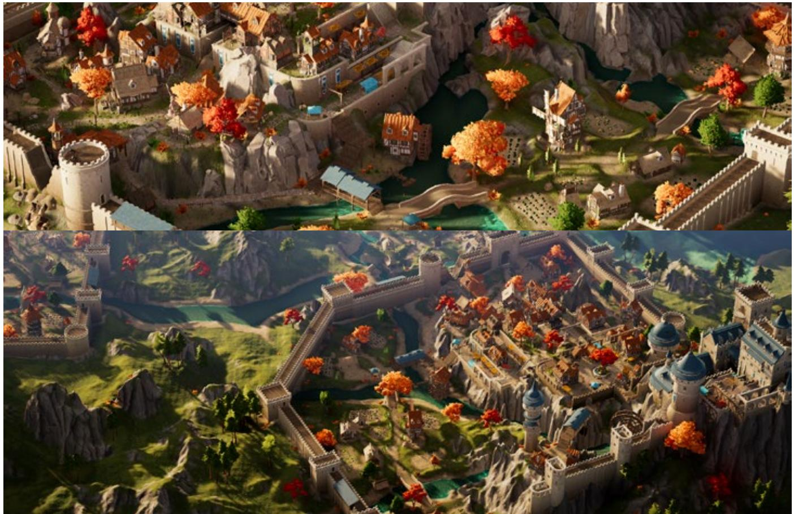

A scene made with URP

<span id="page-8-0"></span>

## Author and contributors

**Nik Lever**, the author of this e-book, has been creating real-time 3D content since the midnineties and using Unity since 2006. For over 30 years he led the small development company, Catalyst Pictures, and has provided courses since 2018 with the aim of helping game developers expand their knowledge in a rapidly evolving industry.

#### **Unity contributors**

**Steven Cannavan** is a senior development consultant on the [Accelerate](https://unity.com/solutions/accelerate-solutions-games) [Solutions Games](https://unity.com/solutions/accelerate-solutions-games) team, specializing in the Scriptable Rendering Pipelines. He has over 16 years of experience in the game development industry.

**Maxime Grange** is a senior technical artist with eight years of experience, starting in VR indie games and advancing to become a light technical artist in Unity. Passionate about rendering techniques, shaders, and developing artist tools, Maxime focuses on achieving stunning visuals while maintaining optimal runtime performance.

**Felipe Lira** has over 14 years of experience as a software engineer in the games industry, and specializes in graphics programming and multiplatform game development.

**Ali Mohebali** has 21 years of experience working in the games industry, and has contributed to hit titles such as *Fruit Ninja* and *Jetpack Joyride*, both by Halfbrick Studios.

**Adrien Moulin** is a senior graphics developer in Unity's render pipeline team. He has over eight years of experience in the simulation and real-time software industry. He is currently focused on delivering the best possible foundations and APIs to the Scriptable Render Pipeline users.

**Mathieu Muller** is the lead product manager for Graphics at Unity. He leads the Graphics product management team and oversees the Graphics roadmap and product vision.

**Damian Nachman** is a senior technical product manager in Unity's graphics team, specializing in low-level graphics development and optimization. He has 10 years of experience with working on real-time graphics engines and benchmarking across multiple industries.

**Oliver Schnabel** is a senior technical product manager in Unity's graphics team, where he integrates customer insights and works with global studios to prioritize the development of a more performant, unified, and scalable rendering stack. He brings extensive experience in computer graphics and real-time development.

<span id="page-9-0"></span>

## URP: The successor to the Built-In Render Pipeline

One of Unity's biggest strengths is its platform reach. The ideal for all game studios is to create once and efficiently deploy their game to their desired range of platforms, from highend PCs to low-end mobile.

The Built-In Render Pipeline was developed to be a turnkey solution for all platforms supported by Unity. It supports a mix of graphics features and is convenient to use with Forward and Deferred pipelines.

However, as Unity continues to add support for more platforms, the shortcomings of the Built-In Render Pipeline have become more pronounced:

- The bulk of the code is written in C++ and can't be modified by developers, making it a blackbox system.
- The render flow and render passes are prestructured.
- The rendering algorithm is hardcoded.
- Unconstrained customization makes achieving good performance on all platforms difficult.
- It exposes callbacks in the rendering code that trigger sync points in the pipeline. Those callbacks prevent multithreaded rendering optimizations, enabling changes for injection of state at any point in the frame dynamically by calling to C#.
- Caching data to manage the persistence state for user injection is difficult.

#### **The solution: Scriptable Render Pipelines**

The SRPs were developed to support an efficient multiplatform workflow by providing:

- Intelligent and reliable scaling for the maximum number of hardware platforms, from high- to low-end devices.
- The ability to customize rendering processes using C#, not C++. Using C# means a new executable does not need to be compiled for every change.
- Flexibility to support architecture evolution.
- Flexibility to create sharp graphics that are performant across many platforms.

<span id="page-10-0"></span>The image below illustrates how SRPs work. With SRPs, you can use C# to control and customize render passes and rendering control, as well as HLSL shaders that can be created using artist-friendly tools such as [Shader Graph.](#page-137-0) Shaders give you access to even the lowerlevel API and engine-layer abstractions.


The graphics programmable model for the Scriptable Render Pipelines

An advanced user can create a new SRP from scratch or modify the HDRP or URP. The graphics stack is open source and available for use on [GitHub](https://github.com/Unity-Technologies/Graphics).

## Why choose URP

- **Accessible to a wide range of users:** URP is configurable by artists and technical artists alike, providing more flexibility for prototyping and refining rendering techniques for full game production.
- **Extendable and customizable:** URP allows users to modify existing capabilities and extend the pipeline with new ones, making it a solid choice for advanced users, including Asset Store and third-party package creators, experienced studios, and advanced teams.

While the low-level rendering API is written in C++ for performance purposes, a URP developer can write a simple C# script to be called during the render pipeline, enabling high-level customization without sacrificing performance.

— **Multiple rendering options:** URP provides a [Universal Renderer](https://docs.unity3d.com/Packages/com.unity.render-pipelines.universal@17.0/manual/urp-universal-renderer.html?) that supports Forward, [Forward+](https://docs.unity3d.com/Packages/com.unity.render-pipelines.universal@17.0/manual/rendering/forward-plus-rendering-path.html) and [Deferred](https://docs.unity3d.com/Packages/com.unity.render-pipelines.universal@17.0/manual/rendering/deferred-rendering-path.html?) rendering paths, as well as a [2D Renderer](https://docs.unity3d.com/Packages/com.unity.render-pipelines.universal@17.0/manual/2d-index.html?).

These renderers can be extended with additional features and Scriptable Render Passes. The [Render Objects](#page-105-0) feature can be used to render objects from a given Layer Mask at

different events in the rendering pipeline. It also allows you to override material and other render states when rendering those objects, making it possible to customize the rendering without code. URP can be extended with custom renderers to suit specific needs.

The [render graph system](https://docs.unity3d.com/Packages/com.unity.render-pipelines.universal@17.0/manual/render-graph-introduction.html) enables you to access and manipulate the various buffers used to render a frame; using the [Renderer Features](https://docs.unity3d.com/Packages/com.unity.render-pipelines.universal@17.0/manual/urp-renderer-feature.html) workflow means this can be injected at any stage in the render pipeline.

- **Excellent performance**: URP provides robust performance and provides many tools for you to adapt the balance between fidelity and frame rate on a wide range of devices. In particular:
	- URP evaluates real-time lighting very efficiently. In Forward rendering it evaluates all lighting in a single pass. Forward+ improves upon standard Forward rendering by culling lights spatially rather than per object. This increases the overall number of lights that can be utilized in rendering a frame. In Deferred rendering it supports the Native RenderPass API, allowing G-buffer and lighting passes to be combined into a single render pass.
	- There are CPU and GPU improvements when drawing meshes. The [SRP Batcher](https://docs.unity3d.com/6000.0/Documentation/Manual/SRPBatcher.html?) helps ensure fewer draw calls and improves on how depth is handled, while [GPU](https://docs.unity3d.com/Packages/com.unity.render-pipelines.universal@17.0/manual/gpu-resident-drawer.html)  [Resident Drawer](https://docs.unity3d.com/Packages/com.unity.render-pipelines.universal@17.0/manual/gpu-resident-drawer.html) and occlusion culling can significantly reduce the draw calls for some scenes.
	- URP makes more efficient use of tile memory on mobile devices, leading to less power consumption, a longer battery life, and therefore, the possibility of longer play sessions.
	- URP comes with an integrated [post-processing](#page-121-1) stack that allows for better performance compared to the Built-In Render Pipeline. Using the [Volume](#page-123-1) framework, you can create post-processing effects that are dependent on the Camera position without writing any code.
- **Compatible with the other key tools:** URP supports artist- and technical artist-friendly tools like [Shader Graph,](https://docs.unity3d.com/Packages/com.unity.shadergraph@17.0/manual/index.html?) [VFX](https://docs.unity3d.com/Packages/com.unity.visualeffectgraph@17.0/manual/index.html) [Graph,](https://docs.unity3d.com/Packages/com.unity.visualeffectgraph@17.0/manual/index.html) and the [Rendering Debugger.](https://docs.unity3d.com/Packages/com.unity.render-pipelines.universal@17.0/manual/features/rendering-debugger.html?)
- **2D rendering:** URP supports advanced 2D lighting, shadows, and post-processing effects, enhancing the visual quality of 2D games without compromising on performance.

<span id="page-12-0"></span>

#### **Around 90% of Unity games on PC/console are using SRPs**

The latest data available to Unity shows that URP is the most popular choice for games using Unity released on PC and console in 2023. The graph below shows that the Built-In Render Pipeline is now only used by a small fraction of development teams.


Proportion of games released using the different pipelines available from Unity

However, while most Unity projects are now being built on URP or HDRP, the Built-In Render Pipeline will remain an available option in Unity 6.

## How to open a new URP project

Open a new project using URP via the Unity Hub. Click on **New** and verify that the Unity version selected at the top of the window is Unity 6 or newer. Choose a name and location for the project, select the **Universal 2D** or **Universal 3D** templates then click **Create**.

|                         | New project<br>Editor Version: 6000.0.1f1 C |                                                                                                                                           |
|-------------------------|---------------------------------------------|-------------------------------------------------------------------------------------------------------------------------------------------|
| 100<br>All templates    | Q Search all templates                      |                                                                                                                                           |
| ල<br>Core<br><br>Sample | Universal 2D<br>589<br>Core                 | SRP                                                                                                                                       |
| 4<br>Learning           | Universal 3D<br>Core                        |                                                                                                                                           |
|                         | High Definition 3D<br>୍ରରତ<br>Core          | Universal 3D<br>This template includes the settings and<br>assets you need to start creating with the<br>Universal Render Pipeline (URP). |
|                         | Universal 3D sample<br>్రాల<br>Sample       | Read more<br>PROJECT SETTINGS                                                                                                             |
|                         | 3D Mobile<br>D<br>0<br>Core                 | Project name<br>My project                                                                                                                |
|                         |                                             | Cancel<br>Create project                                                                                                                  |

When you create a new project with the URP template, you might have to download the template for the first time.


**Note:** The template ensures that your project is set to use a linear color space, which is required for calculating lighting correctly.

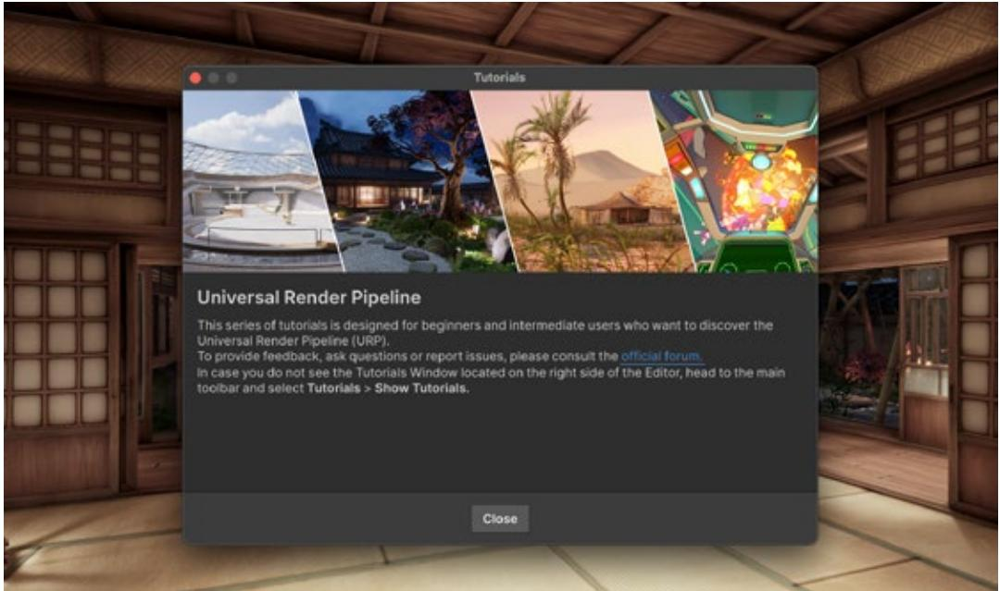

The [URP 3D sample scene,](https://unity.com/demos/urp-3d-sample) which is covered at the end of this book, is available as a downloadable template.

You can create new scenes via **File > New Scene**, with essential GameObjects such as Camera and Directional light, and even create your own scene template with prepopulated objects. Read more in the [URP Scene Templates documentation](https://docs.unity3d.com/Packages/com.unity.render-pipelines.universal@17.0/manual/scene-templates.html).


The New Scene dialog displaying Scene Templates

Go to **Edit > Project Settings** and open the **Graphics** panel. To use URP in-Editor, you must select a [URP Asset](https://docs.unity3d.com/Packages/com.unity.render-pipelines.universal@17.0/manual/universalrp-asset.html?) from the **Scriptable Render Pipeline Settings**. The URP Asset controls the global rendering and Quality settings of a project and creates the rendering pipeline instance. Meanwhile, the rendering pipeline instance contains intermediate resources and the render pipeline implementation.

**PC\_RPAsset** is the default URP Asset selected on a desktop, but you can switch to **Mobile\_ RPAsset**.

| 00                                       | Project Settings                                                                      |                        |     |  |
|------------------------------------------|---------------------------------------------------------------------------------------|------------------------|-----|--|
| Project Settings                         |                                                                                       |                        |     |  |
|                                          |                                                                                       | a                      |     |  |
| Adaptive Performance<br>Audio            | Graphics                                                                              |                        | 0 2 |  |
| Burst AOT Settings                       | Scriptable Render Pipeline Settings                                                   |                        |     |  |
| Editor                                   | 9 UniversalRP (Universal Render Pipeline Asset)                                       |                        | 0   |  |
| Graphics                                 |                                                                                       |                        |     |  |
| URP Global Settings<br>Input Manager     | A Seriptable Render Pipeline is in use, some settings will not be used and are hidden |                        |     |  |
| Memory Settings                          | Built-in Shader Settings                                                              |                        |     |  |
| Package Manager<br>Physics               | Video                                                                                 | Always include         | P   |  |
| Physics 2D                               | Always Included Shaders                                                               |                        |     |  |
| Player                                   | Size                                                                                  | 6                      |     |  |
| Preset Manager                           | Element O                                                                             | Legacy Shaders/Diffuse | 0   |  |
| Quality                                  | Element 1                                                                             | Hidden/CubeBlur        | 0   |  |
| Scene Template<br>Script Execution Order | Element 2                                                                             | Hidden/CubeCopy        | (2) |  |
| V Services                               | Element 3                                                                             | Hidden/CubeBlend       | 0   |  |
| Ads                                      | Element 4                                                                             | Sprites/Default        | 0   |  |
| Analytics<br>Cloud Build                 | Element 5                                                                             | Ul/Default             | 0   |  |
| Cloud Diagnostics                        | Shader Stripping                                                                      |                        |     |  |
| Collaborate                              | Lightmap Modes                                                                        | Automatic              | 4   |  |
| In-App Purchasing                        | Fog Modes                                                                             | Automatic              |     |  |
| ShaderGraph<br>Tags and Layers           | Instancing Variants                                                                   | Strip Unused           |     |  |
| TextMesh Pro                             |                                                                                       |                        |     |  |
| Time                                     | Shader Loading                                                                        |                        |     |  |
| Timeline                                 | Log Shader Compilation                                                                | D                      |     |  |
| Ul Builder                               | Preloaded Shaders                                                                     |                        |     |  |
| Version Control                          | Size                                                                                  | 0                      |     |  |
| Visual Scripting<br>XR Plugin Management | Preload shaders after showing first scene                                             |                        |     |  |
|                                          | Currently tracked: 79 shaders 112 total variants                                      |                        | -   |  |

The Graphics panel in Project Settings

A [later section](#page-29-0) of this guide details how to adjust the settings of a URP Asset.

## <span id="page-15-0"></span>How to add URP to an existing Built-In Render Pipeline project

**Important:** Be sure to backup your project using source control before following the steps in this section. This process will convert assets, and Unity does not provide an undo option. If you use source control, you will be able to revert to previous versions of the assets if necessary.

If you upgrade an existing Built-In Render Pipeline project, you'll need to add the **URP package** to your project as it was not included in Unity before Unity 6.

|                                                                                                          |                                                         | Package Manager                                                                                                                                                                                                                      |
|----------------------------------------------------------------------------------------------------------|---------------------------------------------------------|--------------------------------------------------------------------------------------------------------------------------------------------------------------------------------------------------------------------------------------|
| Package Manager<br>+ ▼ Packages: In Project ▼<br>Sort: Name ↓ ▼                                          |                                                         | <br>0<br>a                                                                                                                                                                                                                           |
| Pac<br>Unity Registry<br>V In Project<br>Je<br>Te<br>4<br>My Assels<br>Te<br>A<br>Built-in<br>> Tillemia | 3.0.7 V<br>1.1.29 V<br>3.0.6 V<br>1.6.2 V               | JetBrains Rider Editor<br>Release<br>Unity Technologies<br>Version 3.0.7 - May 21, 2021<br>Registry Unity<br>View documentation View changelog View licenses                                                                         |
| > Unity UI<br>Version Control<br>Visual Scripting<br>Visual Studio Code Editor<br>Visual Studio Editor   | 1.0.0 V<br>1.9.0 V<br>0<br>1.7.2<br>1.2.4 V<br>2.0.11 V | The JetBrains Rider Editor package provides an integration for using the<br>JetBrains Rider IDE as a code editor for Unity. It adds support for generating<br>.csproj files for code completion and auto-discovery of installations. |
| Last update Oct 11, 11:51                                                                                | C .                                                     | Remove                                                                                                                                                                                                                               |

The Package Manager displaying the Unity Registry packages

Go to **Window > Package Manager** and click the **Packages** drop-down to add URP to your project. Make sure to select the **Unity Registry**, followed by **Universal RP**. Click **Download**  in the lower-right corner of the window if the URP package is not yet installed on your development computer. Then click **Install** once it's downloaded.

| Package Manager                                        |                                        |               |                                                                                                                                                                                                                                                                                                                                                                                                                                                                                                                     |        |
|--------------------------------------------------------|----------------------------------------|---------------|---------------------------------------------------------------------------------------------------------------------------------------------------------------------------------------------------------------------------------------------------------------------------------------------------------------------------------------------------------------------------------------------------------------------------------------------------------------------------------------------------------------------|--------|
| + . Sort: Name (asc) . Filters . Clear Filters         |                                        |               |                                                                                                                                                                                                                                                                                                                                                                                                                                                                                                                     |        |
| In Project<br>O Updates<br>Unity Registry<br>My Assets | Q univer<br>· Packages<br>Universal RP | X<br>17.0.3 G | Universal RP<br>17.0.3 · May 21, 2024   Release<br>From Unity Registry by Unity Technologies Inc.<br>com.unity.render-pipelines.universal<br>Documentation: Changelog Licenses<br>Description Version History Dependencies Samples<br>The Universal Render Pipeline (URP) is a prebuilt Scriptable Render Pipeline, made by<br>Unity. URP provides artist-friendly workflows that let you quickly and easily create<br>optimized graphics across a range of platforms, from mobile to high-end consoles and<br>PCs. | Remove |
| Built-in<br>Services                                   |                                        |               |                                                                                                                                                                                                                                                                                                                                                                                                                                                                                                                     |        |

Installing URP via the Package Manager


To create a URP Asset, right-click in the **Project** window and choose **Create > Rendering > URP Asset (with Universal Renderer)**. Name the asset.

|                                                           |        | Audio Mixer                                                                                                           |   |                                                                                                |         |
|-----------------------------------------------------------|--------|-----------------------------------------------------------------------------------------------------------------------|---|------------------------------------------------------------------------------------------------|---------|
|                                                           |        | Rendering                                                                                                             | A | URP Asset (with 2D Renderer)                                                                   |         |
| Create                                                    |        | Material                                                                                                              |   | URP Asset (with Universal Renderer)                                                            |         |
| Reveal in Finder<br>Open<br>Delete<br>Rename<br>Copy Path | C 36 C | Lens Flare<br>Lens Flare (SRP)<br>Render Texture<br>Lightmap Parameters<br>Lighting Settings<br>Custom Render Texture |   | URP Renderer Feature<br>URP 2D Renderer<br>URP Universal Renderer<br>URP Global Settings Asset | IT 15 ( |
| Open Scene Additive                                       |        | Animator Controller                                                                                                   |   | URP Post-process Data<br>URP XR System Data                                                    |         |
| View in Package Manager                                   |        | Animation                                                                                                             |   | Environment Library (Look Dev)                                                                 |         |
| Import New Asset                                          |        | Animator Override Controller                                                                                          |   |                                                                                                |         |

Creating a URP Asset

**Remember:** If you create a new project using the Universal Render Pipeline or 3D (URP) templates, these URP Assets are already available in the project.

Rather than creating a single URP Asset, URP uses two files, each with an Asset extension.

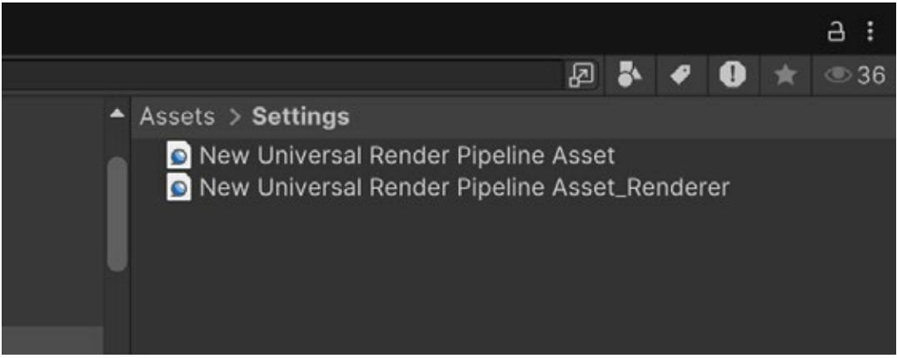

Two assets in URP, one for URP settings and the other for Renderer Data

One is called **UniversalRP\_Renderer**, a **Renderer Data Asset** that you can use to filter the layers the renderer works on, and intercept the rendering pipeline to customize how the scene is rendered. This way, you can facilitate the creation of high-quality effects. See the section on [Pipeline callbacks](#page-104-0) for more information.

Additionally, the UniversalRP\_Renderer controls high-level rendering logic and passes for URP. It supports Forward and Deferred paths, and a 2D Renderer that enables features such as [2D](https://docs.unity3d.com/Packages/com.unity.render-pipelines.universal@17.0/manual/Lights-2D-intro.html?)  [Lights,](https://docs.unity3d.com/Packages/com.unity.render-pipelines.universal@17.0/manual/Lights-2D-intro.html?) [2D Shadows](https://docs.unity3d.com/Packages/com.unity.render-pipelines.universal@17.0/manual/2DShadows.html?), and [Light Blend Styles](https://docs.unity3d.com/Packages/com.unity.render-pipelines.universal@17.0/manual/LightBlendStyles.html?). You can even extend URP to create your own renderers.

|          | O Inspector                 |                                                                        | a :  |
|----------|-----------------------------|------------------------------------------------------------------------|------|
| 20<br>14 |                             | New Universal Render Pipeline Asset_Renderer (Universal Renderer Data) | @    |
|          |                             |                                                                        |      |
|          |                             |                                                                        | Open |
|          | Filtering                   |                                                                        |      |
|          | Opaque Layer Mask           | Everything                                                             |      |
|          | Transparent Layer Mask      | Everything                                                             |      |
|          | Rendering                   |                                                                        |      |
|          | Rendering Path              | Forward                                                                |      |
|          | Depth Priming Mode          | Disabled                                                               |      |
|          | Depth Texture Mode          | After Transparents                                                     |      |
|          | Depth Attachment Format     | Default                                                                |      |
|          | Depth Texture Format        | Default                                                                |      |
|          | Shadows                     |                                                                        |      |
|          | Transparent Receive Shadows | V                                                                      |      |
|          |                             |                                                                        |      |
|          | Post-processing             |                                                                        |      |
|          | Enabled                     | V                                                                      |      |
|          | Data                        | PostProcessData (Post Process Data)                                    | 0    |
|          | Overrides                   |                                                                        |      |
|          | Stencil                     |                                                                        |      |
|          | Compatibility               |                                                                        |      |
|          | Intermediate Texture        | Always                                                                 |      |
|          |                             |                                                                        |      |
|          | Renderer Features           |                                                                        |      |
|          | No Renderer Features added  |                                                                        |      |
|          | Add Renderer Feature        |                                                                        |      |
|          |                             |                                                                        |      |
|          |                             |                                                                        |      |

The Inspector for UniversalRP\_Renderer Data Asset

The other URP Asset provides options for controlling the Quality, Lighting, Shadows and Post-processing settings.. You can use different URP Assets to control the Quality settings, a process [outlined further down](#page-29-1) in this section. This Settings Asset is linked to the Renderer Data Asset via the Renderer List. When you create a new URP Asset, the Settings Asset will have a Renderer List containing a single item – the Renderer Data Asset created at the same time, set as the default. You can add alternative Renderer Data Assets to this list.

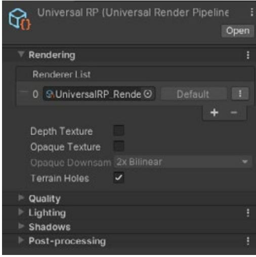

The default renderer is used for all Cameras, including the Scene view. A Camera can override the default renderer by selecting another one from the Renderer List. This can be done through the use of a script, as needed.

A URP Asset in the Inspector

Despite following these steps to create a URP Asset, an open scene in the Scene or Game view will still use the Built-In Render Pipeline. You must complete one last step to make the switch to URP: Go to **Edit > Project Settings** and open the **Graphics** panel. Click the small dot next to **None (Render Pipeline Asset)**. In the open panel, select **UniversalRP**.

| ● @                              |                                        | Project Settings |                                       |                |  |  |
|----------------------------------|----------------------------------------|------------------|---------------------------------------|----------------|--|--|
| Project Settings                 |                                        |                  |                                       |                |  |  |
|                                  |                                        |                  | a                                     |                |  |  |
| Adaptive Performance<br>Audio    | Graphics                               |                  |                                       | 9 花            |  |  |
| Burst AOT Settings               | Scriptable Render Pipeline Settings    |                  | Select RenderPip                      |                |  |  |
| Editor                           | None (Render Pipeline Asset)           |                  |                                       | 0              |  |  |
| Graphics                         | Camera Settings                        |                  | ದ್                                    |                |  |  |
| URP Global Settings              | Transparency Sort Mode                 | Default          | Assets<br>0                           | 9/16           |  |  |
| Input Manager<br>Memory Settings |                                        | × 0              | None<br>Y                             |                |  |  |
| Package Manager                  | Transparency Sort Axis                 |                  | UniversalRP                           |                |  |  |
| Physics                          | T Tier Settings                        |                  |                                       | I Or           |  |  |
| Physics 2D                       |                                        |                  |                                       |                |  |  |
| Player                           | F                                      |                  |                                       |                |  |  |
| Preset Manager                   | Low (Tier 1)                           |                  |                                       | V<br>18        |  |  |
| Quality<br>Scene Template        | Standard Shader Quality                |                  | Hi                                    |                |  |  |
| Script Execution Order           | Reflection Probes Box Projection       |                  | V                                     |                |  |  |
| Services                         | Reflection Probes Blending             |                  | V                                     |                |  |  |
| Ads                              | Detail Normal Map                      |                  | V                                     |                |  |  |
| Analytics                        | Enable Semitransparent Shadows         |                  |                                       | S              |  |  |
| Cloud Build                      | Enable Light Probe Proxy Volume        |                  |                                       | >              |  |  |
| Cloud Diagnostics<br>Collaborate | Cascaded Shadows                       |                  | V                                     |                |  |  |
| In-App Purchasing                |                                        |                  |                                       |                |  |  |
| ShaderGraph                      | Preter 32-bit shadow maps.             |                  |                                       |                |  |  |
| Tags and Layers                  | Use HDR                                |                  | ><br>UniversalRP                      |                |  |  |
| TextMesh Pro                     | HDR Mode                               |                  | EP<br>Jniversal Render Pipeline Asset | P              |  |  |
| Time<br>Timeline                 | Rendering Path                         |                  | isets/Settings/UniversalRP.ass<br>For | A              |  |  |
| UI Builder                       | Realtime Global Illumination CPU Usage |                  | LOV                                   | P              |  |  |
| Version Control                  | Medium (Tier 2)                        |                  |                                       | Use Defaults V |  |  |
| Visual Scripting                 | Standard Shader Quality                |                  |                                       | High           |  |  |
| XR Plugin Management             | Reflection Probes Box Projection       |                  | 1                                     |                |  |  |
|                                  |                                        |                  |                                       | D              |  |  |

Selecting a Scriptable Render Pipeline Asset

<span id="page-19-0"></span>

A warning message will pop up regarding the switch, but just press **Continue**.

As there is no content in your project yet, changing the render pipeline will be almost instantaneous. You're now ready to use URP.

## Converting the scenes of an existing project

After you complete the above steps, you'll find that your beautiful scenes are suddenly colored magenta. This is because the shaders used by the materials in a Built-In Render Pipeline project are not supported in URP. Fortunately, there is a method for restoring your scenes to their original quality.


Materials in a scene appear in magenta because their Built-In Render Pipeline-based shaders must be converted for use in URP.

Go to **Window > Rendering > Render Pipeline Converter**. Choose **Convert Built-In to 2D (URP)** for a 2D project, or **Built-In to URP** for a 3D project. Assuming that your project is 3D, you'll need to select the [appropriate](https://docs.unity3d.com/Packages/com.unity.render-pipelines.universal@17.0/manual/features/rp-converter.html) [converters:](https://docs.unity3d.com/Packages/com.unity.render-pipelines.universal@17.0/manual/features/rp-converter.html)

- **Rendering Settings:** Select this to create multiple Render Pipeline setting assets that will match Built-In Render Pipeline Quality settings as closely as possible. This lets you test different Quality Levels more efficiently. See [the section](#page-21-0) on comparing Built-In Render Pipeline and URP Quality options for more details.
- **Material Upgrade**: Use this to convert materials from the Built-In Render Pipeline to URP.
- **Animation Clip Converter:** This converts animation clips. It runs once the Material Upgrade converter finishes.
- **Read-only Material Converter:** This converts the prebuilt, read-only Materials included in a Unity project. It indexes the project and creates the temporary .index file. Note that it can take significant time.

## <span id="page-20-0"></span>Converting custom shaders

Custom shaders are not converted using the Material Upgrade converter. The [Shaders](#page-92-0) and [Shader Graph s](#page-137-0)ections outline the steps for converting custom Built-In Render Pipeline shaders to URP. Using [Shader Graph](https://docs.unity3d.com/Packages/com.unity.shadergraph@17.0/manual/index.html?) is often the quickest way to update a custom shader to URP.

There are several different URP shaders including:

- **Universal Render Pipeline/Lit**: This physically based render (PBR) shader, similar to the Built-In Standard Shader, can be used to represent most real-life materials. It supports all the Standard Shader features with both metallic and specular workflows.
- **Universal Render Pipeline/Simple Lit**: This uses a Blinn-Phong model, and is suitable for low-end mobile devices or games that don't use PBR workflows.
- **Universal Render Pipeline/Baked Lit**: Use this shader for stylised games or apps that only require [baked lighting](https://docs.unity3d.com/6000.0/Documentation/Manual/LightMode-Baked.html) via [lightmaps](https://docs.unity3d.com/6000.0/Documentation/Manual/Lightmapping.html), [light probes](https://docs.unity3d.com/6000.0/Documentation/Manual/LightProbes.html) and [Adaptive](https://docs.unity3d.com/Packages/com.unity.render-pipelines.universal@17.0/manual/probevolumes-concept.html) [Probe](https://docs.unity3d.com/Packages/com.unity.render-pipelines.universal@17.0/manual/probevolumes-concept.html) [Volumes](https://docs.unity3d.com/Packages/com.unity.render-pipelines.universal@17.0/manual/probevolumes-concept.html) (APVs). This shader is not [Physically Based](https://docs.unity3d.com/Packages/com.unity.render-pipelines.universal@17.0/manual/shading-model.html#physically-based-shading) and has no real-time lighting, so all real-time relevant shader keywords and variants are [stripped](https://docs.unity3d.com/Packages/com.unity.render-pipelines.universal@17.0/manual/shader-stripping.html) from the shader code, making it faster to calculate.
- **Universal Render Pipeline/Complex Lit**: The Complex Lit shader contains all the functionality of the Lit shader and adds advanced material features. Some features in this shader might be more resource-intensive and require [Unity Shader Model 4.5](https://docs.unity3d.com/6000.0/Documentation/Manual/SL-ShaderCompileTargets.html) hardware.
- **Universal Render Pipeline/Unlit**: This is a GPU performant shader that doesn't use lighting equations.
- **Universal Render Pipeline/Terrain/Lit:** This is suitable to use with the Terrain Tools package.
- **Universal Render Pipeline/Particles/Lit:** This particle shader uses a PBR lighting model.
- **Universal Render Pipeline/Particles/Unlit:** This unlit particle shader is light on the GPU.

Although Simple Lit replaces many legacy/mobile shaders, the performance is not the same. Legacy/mobile shaders only partially evaluate lighting, whereas Simple Lit considers all lights as defined by the URP Asset.

Refer to [this table](https://docs.unity3d.com/Packages/com.unity.render-pipelines.universal@17.0/manual/upgrading-your-shaders.html?) in our URP documentation to see how each URP shader maps to its Built-In Render Pipeline equivalent.

<span id="page-21-0"></span>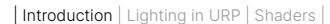

Once you select one or more of the above converters, either click **Initialize Converters** or **Initialize And Convert**. Whichever option you choose, the project will be scanned and those assets that need converting will be added to each of the converter panels. If you choose **Initialize Converters** you can limit the conversions by deselecting the items using the checkbox provided for each one. At this stage, click **Convert Assets** to start the conversion process. If you choose **Initialize And Convert**, the conversion starts automatically after the converters are initialized. Once it's complete you might be asked to reopen the scene that is active in the Editor.

|                                   | Render Pipeline Converter                                                                                                                                                                                       |                  |
|-----------------------------------|-----------------------------------------------------------------------------------------------------------------------------------------------------------------------------------------------------------------|------------------|
| Render Pipeline Converter         |                                                                                                                                                                                                                 |                  |
| Built-in to URP                   | The Render Pipeline Converter performs the following tasks:<br>· Converts project clements from the Built-in Render Pipeline to URP.<br>* Upgrades assets from earlier URP versions to the current URP version. |                  |
|                                   | This process makes irreversible changes to the project. Back up your project before proceeding,                                                                                                                 |                  |
| Built-in to URP                   |                                                                                                                                                                                                                 |                  |
|                                   |                                                                                                                                                                                                                 |                  |
|                                   |                                                                                                                                                                                                                 |                  |
| Material Upgrade<br>S             |                                                                                                                                                                                                                 | 31 items         |
| This will upgrade your materials. |                                                                                                                                                                                                                 |                  |
|                                   |                                                                                                                                                                                                                 | 10<br>-31 A 0 80 |
| V<br>Dacal                        | Packages/com.unity.render-pipelines.universal/Ri                                                                                                                                                                |                  |
| PolygonWestern_Material_02_A      | Assets/PolygonWestern/Materials/PolygonWeste                                                                                                                                                                    | - 9              |
| < PolygonWestern_Material_01_B    | Assets/PolygonWestern/Materials/PolygonWeste                                                                                                                                                                    | - 9              |
| 65819<br>>                        | Assets/PolygonWestern/Materials/Glass.mat                                                                                                                                                                       | - 12             |
| V BackgroundCard_01               | Assets/PolygonWestern/Materials/Misc/Backgrou                                                                                                                                                                   |                  |
|                                   |                                                                                                                                                                                                                 |                  |
|                                   |                                                                                                                                                                                                                 |                  |
| Initialize Converters             |                                                                                                                                                                                                                 | Convert Assets   |

The Render Pipeline Converter

### Comparing Quality options between the Built-In Render Pipeline and URP

There are several default Quality options available in the Built-In Render Pipeline, from Very low to Ultra. The Quality settings impact the fidelity of the scene, including Texture resolution, lighting, shadow rendering, and so on.

<span id="page-22-0"></span>Go to **Edit > Project Settings** and select the **Quality** panel. Here, you can switch between these Quality options by picking the current quality. This will change the render settings used by the Scene and Game views. You can also edit each of the Quality options from this panel.

If you select the **Rendering Settings** option while using the Render Pipeline Converter and switching from the Built-In Render Pipeline to URP, a set of URP Assets that attempt to match the Built-In Render Pipeline Quality options will be created. The first table below shows how the Built-In Render Pipeline maps to URP for Low settings, while the second table displays a comparison for High settings. In both the Built-In Render Pipeline and URP, settings are chosen via the Quality panel. The URP Asset settings are available via the Inspector when selecting a URP Asset. Refer to the [URP documentation](https://docs.unity3d.com/Packages/com.unity.render-pipelines.universal@17.0/manual/universalrp-asset.html?) for more details.

| Setting                                | Built-in Render<br>Pipeline | URP                      | URP Asset settings |
|----------------------------------------|-----------------------------|--------------------------|--------------------|
| Rendering                              |                             |                          |                    |
| Pixel Light Count                      | 0                           | Not applicable<br>(NA) * | NA                 |
| Anti-aliasing                          | Disabled                    | NA                       | Disabled           |
| Render Scale                           | NA                          | NA                       | 1                  |
| Real-time Reflection Probes            | No                          | No                       | NA                 |
| Resolution Scaling Fixed DPI<br>Factor | 1                           | 1                        | NA                 |
| VSync Count                            | Don't sync                  | Don't sync               | NA                 |
| Depth Texture                          | NA                          | NA                       | No                 |
| Opaque Texture                         | NA                          | NA                       | No                 |
| Opaque Downsampling                    | NA                          | NA                       | NA                 |
| Terrain Holes                          | NA                          | NA                       | Yes                |
| HDR                                    | NA                          | NA                       | Yes                |
| Textures                               |                             |                          |                    |
| Texture Quality                        | Half res                    | Half res                 | NA                 |
| Anisotropic Textures                   | Disabled                    | Disabled                 | NA                 |
| Texture Streaming                      | No                          | No                       | NA                 |
| Particles                              |                             |                          |                    |
| Soft Particles                         | No                          | NA                       | NA                 |
| Particle Raycast Budget                | 16                          | 16                       | NA                 |
| Terrain                                |                             |                          |                    |
| Billboards Face Camera<br>Position     | No                          | No                       | NA                 |

#### **Built-In Render Pipeline to URP: Low settings**

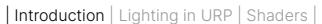

| Shadows                  |                |            |           |
|--------------------------|----------------|------------|-----------|
| Shadowmask Mode          | Shadowmask     | Shadowmask | NA        |
| Shadows                  | Disabled       | NA         | NA        |
| Shadow Resolution        | Low resolution | NA         | NA        |
| Shadow Projection        | Stable fit     | NA         | NA        |
| Shadow Distance          | 20             | NA         | NA        |
| Shadow Near Plane Offset | 3              | NA         | NA        |
| Shadow Cascades          | No Cascades    | NA         | NA        |
| Cascade splits           | NA             | NA         | NA        |
| Working unit             | NA             | NA         | NA        |
| Depth Bias               | NA             | NA         | NA        |
| Normal Bias              | NA             | NA         | NA        |
| Soft Shadows             | NA             | NA         | NA        |
| Async Asset Upload       |                |            |           |
| Time Slice               | 2              | 2          | NA        |
| Buffer Size              | 16             | 16         | NA        |
| Persistent Buffer        | Yes            | Yes        | NA        |
| Level of Detail          |                |            |           |
| LOD Bias                 | 0.4            | 0.4        | NA        |
| Maximum LOD level        | 0              | 0          | NA        |
| Meshes                   |                |            |           |
| Skin Weights             | 4 bones        | 4 bones    | NA        |
| Lighting                 |                |            |           |
| Main Light:              | NA             | NA         | Per pixel |
| Cast Shadows             | NA             | NA         | No        |
| Shadow Resolution        | NA             | NA         | NA        |
| Additional Lights:       | NA             | NA         | Disabled  |
| Per Object Limit         | NA             | NA         | NA        |
| Cast Shadows             | NA             | NA         | NA        |
| Shadow Atlas Resolution  | NA             | NA         | NA        |
| Shadow Resolutiontiers   | NA             | NA         | NA        |
| Cookie AtlasResolution   | NA             | NA         | NA        |
| Cookie AtlasFormat       | NA             | NA         | NA        |
| Reflection probes:       | NA             | NA         | NA        |

<span id="page-24-0"></span>

| Probe Blending              | NA | NA | No                |
|-----------------------------|----|----|-------------------|
| Box Projection              | NA | NA | No                |
| Post-processing             |    |    |                   |
| Grading Mode                | NA | NA | Low Dynamic Range |
|                             | NA | NA | 16                |
| Fast sRGB/Linear conversion | NA | NA | No                |

\* In URP, Pixel Light Count is handled using **Additional Lights > (Per pixel ) > Per Object Limit**.

#### **Built-In Render Pipeline to URP: High settings**

| Setting                                | Built-In Render<br>Pipeline | URP                    | URP Asset settings |  |
|----------------------------------------|-----------------------------|------------------------|--------------------|--|
| Rendering                              |                             |                        |                    |  |
| Pixel Light Count                      | 2                           | Not applicable<br>(NA) | NA                 |  |
| Anti-aliasing                          | Disabled                    | NA                     | 2x                 |  |
| Render Scale                           | NA                          | NA                     | 1                  |  |
| Real-time Reflection<br>Probes         | Yes                         | Yes                    | NA                 |  |
| Resolution Scaling Fixed<br>DPI Factor | 1                           | 1                      | NA                 |  |
| VSync Count                            | Every V Blank               | Every V Blank          | NA                 |  |
| Depth Texture                          | NA                          | NA                     | No                 |  |
| Opaque Texture                         | NA                          | NA                     | No                 |  |
| Opaque Downsampling                    | NA                          | NA                     | NA                 |  |
| Terrain Holes                          | NA                          | NA                     | Yes                |  |
| HDR                                    | NA                          | NA                     | Yes                |  |
| Textures                               |                             |                        |                    |  |
| Texture Quality                        | Full res                    | Full res               | NA                 |  |
| Anisotropic Textures                   | Disabled                    | Disabled               | NA                 |  |
| Texture Streaming                      | No                          | No                     | NA                 |  |
| Particles                              |                             |                        |                    |  |
| Soft Particles                         | No                          | NA                     | NA                 |  |
| Particle Raycast Budget                | 256                         | 256                    | NA                 |  |


| Terrain                            |                          |                        |               |
|------------------------------------|--------------------------|------------------------|---------------|
| Billboards Face Camera<br>Position | Yes                      | Yes                    | NA            |
| Shadows                            |                          |                        |               |
| Shadowmask Mode                    | Distance<br>Shadowmask   | Distance<br>Shadowmask | NA            |
| Shadows                            | Hard and Soft<br>Shadows | NA                     | NA            |
| Shadow Resolution                  | Medium resolution        | NA                     | 2048          |
| Shadow Projection                  | Stable fit               | NA                     | NA            |
| Shadow Distance                    | 40                       | NA                     | 50            |
| Shadow Near Plane Offset           | 3                        | NA                     | NA            |
| Shadow Cascades                    | 2 Cascades               | NA                     | 2             |
| Cascade splits                     | 33/67                    | NA                     | 12.5/33.8/3.8 |
| Working unit                       | Percent                  | Percent                | Metric        |
| Depth Bias                         | NA                       | NA                     | 1             |
| Normal Bias                        | NA                       | NA                     | 1             |
| Soft Shadows                       | NA                       | NA                     | Yes           |
| Async Asset Upload                 |                          |                        |               |
| Time Slice                         | 2                        | 2                      | NA            |
| Buffer Size                        | 16                       | 16                     | NA            |
| Persistent Buffer                  | Yes                      | Yes                    | NA            |
| Level of Detail                    |                          |                        |               |
| LOD Bias                           | 1                        | 1                      | NA            |
| Maximum LOD level                  | 0                        | 0                      | NA            |
| Meshes                             |                          |                        |               |
| Skin Weights                       | Unlimited                | Unlimited              | NA            |
| Lighting                           |                          |                        |               |
| Main Light:                        | NA                       | NA                     | Per pixel     |
| Cast Shadows                       | NA                       | NA                     | Yes           |
| Shadow Resolution                  | NA                       | NA                     | NA            |
| Additional Lights:                 | NA                       | NA                     | Per pixel     |
| Per Object Limit                   | NA                       | NA                     | 4             |
| Cast Shadows                       | NA                       | NA                     | Yes           |
| Shadow Atlas Resolution            | NA                       | NA                     | 2048          |
| Shadow Resolution tiers            | NA                       | NA                     | 512/1024/2048 |
| Cookie AtlasResolution             | NA                       | NA                     | 2048          |

<span id="page-26-0"></span>

| Cookie AtlasFormat             | NA | NA | Color high        |
|--------------------------------|----|----|-------------------|
| Reflection probes:             | NA | NA | NA                |
| Probe Blending                 | NA | NA | Yes               |
| Box Projection                 | NA | NA | No                |
| Post-processing                |    |    |                   |
| Grading Mode                   | NA | NA | Low Dynamic Range |
| LUT size                       | NA | NA | 32                |
| Fast sRGB/Linear<br>conversion | NA | NA | No                |

#### **Anti-aliasing**

In URP in Unity 6 you can select Temporal Anti-aliasing (TAA) as an anti-aliasing option for the Camera, via **Camera > Rendering > Anti-aliasing**.

| Rendering             |                                    | ?) |   |
|-----------------------|------------------------------------|----|---|
| Renderer              | Default Renderer (Haunted Mansio · |    |   |
| Post Processing       |                                    |    |   |
| Anti-aliasing         | Temporal Anti-aliasing (TAA)       |    | D |
| Quality               | High                               |    |   |
| Contrast Adaptive ! ● |                                    | 0  |   |

TAA selected

URP in Unity 6 improves the overall quality of TAA without impacting performance. It provides better edge anti-aliasing (removing odd edge artifacts seen with the previous implementation) and better retention of texture quality. The output quality is now comparable to the low and medium SMAA presets but with better performance.

### How to work with Quality settings

When using URP, quality settings are divided between the Quality panel and those for each URP Asset. The following table shows where each setting can be found.

## <span id="page-27-0"></span>Quality settings when using URP

| Setting                             | Quality panel | URP Asset |
|-------------------------------------|---------------|-----------|
| Rendering                           |               |           |
| Anti-aliasing                       |               | ✅         |
| Render Scale                        |               | ✅         |
| Resolution Scaling Fixed DPI Factor | ✅             |           |
| VSync Count                         | ✅             |           |
| Depth Texture                       |               | ✅         |
| Opaque Texture                      |               | ✅         |
| Opaque Downsampling                 |               | ✅         |
| Terrain Holes                       |               | ✅         |
| HDR                                 |               | ✅         |
| Textures                            |               |           |
| Texture Quality                     | ✅             |           |
| Anisotropic Textures                | ✅             |           |
| Texture Streaming                   | ✅             |           |
| Particles                           |               |           |
| Particle Raycast Budget             | ✅             |           |
| Terrain                             |               |           |
| Billboards Face Camera Position     | ✅             |           |
| Shadows                             |               |           |
| Shadowmask Mode                     | ✅             |           |
| Shadow Resolution                   |               | ✅         |
| Shadow Distance                     |               | ✅         |
| Shadow Cascades                     |               | ✅         |
| Cascade splits                      |               | ✅         |
| Working unit                        |               | ✅         |
| Depth Bias                          |               | ✅         |
| Normal Bias                         |               | ✅         |
| Soft Shadows                        |               | ✅         |

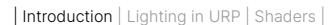

| Async Asset Upload           |   |   |
|------------------------------|---|---|
| Time Slice                   | ✅ |   |
| Buffer Size                  | ✅ |   |
| Persistent Buffer            | ✅ |   |
| Level of Detail              |   |   |
| LOD Bias                     | ✅ |   |
| Maximum LOD level            | ✅ |   |
| Meshes                       |   |   |
| Skin Weights                 | ✅ |   |
| Lighting                     |   |   |
| Main Light:                  |   | ✅ |
| —<br>Cast Shadows            |   | ✅ |
| —<br>Shadow Resolution       |   | ✅ |
| Additional Lights:           |   | ✅ |
| —<br>Per Object Limit        |   | ✅ |
| —<br>Cast Shadows            |   | ✅ |
| —<br>Shadow Atlas Resolution |   | ✅ |
| —<br>Shadow Resolutiontiers  |   | ✅ |
| —<br>Cookie AtlasResolution  |   | ✅ |
| —<br>Cookie AtlasFormat      |   | ✅ |
| Reflection probes:           | ✅ |   |
| —<br>Probe Blending          |   | ✅ |
| —<br>Box Projection          |   | ✅ |
| Post-processing              |   |   |
| Grading Mode                 |   | ✅ |
| LUT size                     |   | ✅ |
| Fast sRGB/Linear conversion  |   | ✅ |
|                              |   |   |

If you switch between Quality options, choose a **Quality Level** for the Render Pipeline Asset in the **Quality** panel via **Project Settings**. Note that if the Quality Level is not set, the Render Pipeline Asset will default to the one set as the Scriptable Render Pipeline Asset in the Graphics panel. This can cause some confusion as you attempt to adjust the Quality settings of a URP Asset. For instance, you might accidentally assume that the Quality Level set in the URP Asset is the one currently used by the Scene and Game views.

<span id="page-29-0"></span>

| Current Active Quality Level        |                                                                                       |   |
|-------------------------------------|---------------------------------------------------------------------------------------|---|
| Name                                | Low                                                                                   |   |
|                                     | A Scriptable Render Pipeline is in use, some settings will not be used and are hidden |   |
| Rendering                           |                                                                                       |   |
| Render Pipeline Asset               | (SUniversalRP-LowQuality (Universal Render Pipeline Asset)                            | 0 |
| Realtime Reflection Probes          |                                                                                       |   |
| Resolution Scaling Fixed DPI Factor |                                                                                       |   |
| VSync Count                         | Don't Sync                                                                            |   |

Setting the Quality Level for the Render Pipeline Asset

## <span id="page-29-1"></span>Modifying a URP Asset

This image shows a URP Asset in the Inspector with all its available settings. See the [URP](https://docs.unity3d.com/Packages/com.unity.render-pipelines.universal@17.0/manual/universalrp-asset.html#rendering?)  [documentation](https://docs.unity3d.com/Packages/com.unity.render-pipelines.universal@17.0/manual/universalrp-asset.html#rendering?) to learn more about each setting.

**Note:** If you have the URP 2D Renderer enabled, some of the options related to 3D rendering in the URP Asset will not impact your final app or game. The 2D Renderer Asset is available under **Scriptable Render Pipeline Settings** via **Edit > Project Settings > Graphics**.

| PC.High (Universal Render Pigeline Asset)         | 01<br>Oper                         |
|---------------------------------------------------|------------------------------------|
| * Rendering                                       | 1                                  |
| Renderer List                                     |                                    |
| D PC, High Renderer (Universal Renderer Data)     | 0<br>Defit                         |
|                                                   | Set Default<br>0                   |
| PC, High ScreenRendener (Universal Renderer Data) |                                    |
|                                                   | + =                                |
| Depth Texture                                     | 1                                  |
| Opaque Texture<br>Opaque Downsampling             | 2 . Diffridae                      |
| Terrain Holes                                     | 1                                  |
| OPU Resident Drawer                               | Instanced Drawing                  |
| Small-Miesh Screen-Percentage                     | 0                                  |
| GPU Declusion Culling                             | 1                                  |
| GRP Batcher                                       | 1                                  |
| Dynamic Batching                                  |                                    |
| Deport Frees                                      | Disabled                           |
| Store Actions                                     | Auto                               |
| T Quality                                         |                                    |
| HOR                                               | 1                                  |
| HOR Precision                                     | 32 Bits                            |
| Anti Allasing (MSAA)                              | Disabled                           |
| Render Scale                                      |                                    |
| Upscaling Filter                                  | Automotive                         |
| LOD Cress Face                                    |                                    |
| LOO Cross Fade Dithering Type                     | Bloo Nolok                         |
| T Lighting                                        | 188                                |
| Main Light                                        | Pat Pical<br>4                     |
| Cast Shadows                                      | ><br>2048                          |
| Shadow Resolution                                 |                                    |
| Light Probe System                                | Light Probe Groups                 |
| Additional Lights                                 | Par Point                          |
| Per Object Limit                                  |                                    |
| Cast Shadows<br>Shadow Atlas Resolution           | V<br>2048                          |
| Shadow Resolution Thirs                           | Medium 552<br>Low 250<br>High 1024 |
|                                                   |                                    |
| Cookie Atlas Resolution                           | 2048<br>Color High                 |
| Cookie Atus Format                                |                                    |
| Reflection Probes                                 |                                    |
| Probe Biending                                    | 4                                  |
| Box Projection                                    | 1                                  |
| Mieed Lighting                                    | >                                  |
| Use Rendering Layers                              | 1<br>1                             |
| Light Cookies<br>SH Exaluation Mode               | Acres                              |
|                                                   |                                    |
| Shadows                                           | 100                                |
| Max Distance<br>Working Unit                      | 50<br>Metriq                       |
| Cascode Count                                     | . 4                                |
| Spet 1                                            | 6.15<br>0                          |
| Spet 2                                            | 14.63                              |
| Special                                           | 26.8                               |
| Last Border                                       | 2.5                                |

The Quality panel for a URP Asset allows you to set the HDR format to 64-bit for better fidelity. However, be aware that this results in a performance hit and requires additional memory, so avoid this setting on low-end hardware.

Another feature of the Quality panel is the option to enable LOD Cross Fade. LOD is a technique to reduce the GPU cost needed to render distant meshes. As the Camera moves, different LODs will be swapped to provide the right level of quality. LOD Cross Fade allows for smoother transitions of different LOD geometries and avoids the harsh snapping and popping that occurs during a swap.

A URP Asset in the Inspector

#### <span id="page-30-0"></span>**GPU Resident Drawer and GPU occlusion culling**

**[GPU Resident Drawer]( https://docs.unity3d.com/6000.0/Documentation/Manual/urp/gpu-resident-drawer.html)** is a new feature in Unity 6 that's available via the **Rendering** section of the URP Asset**.**

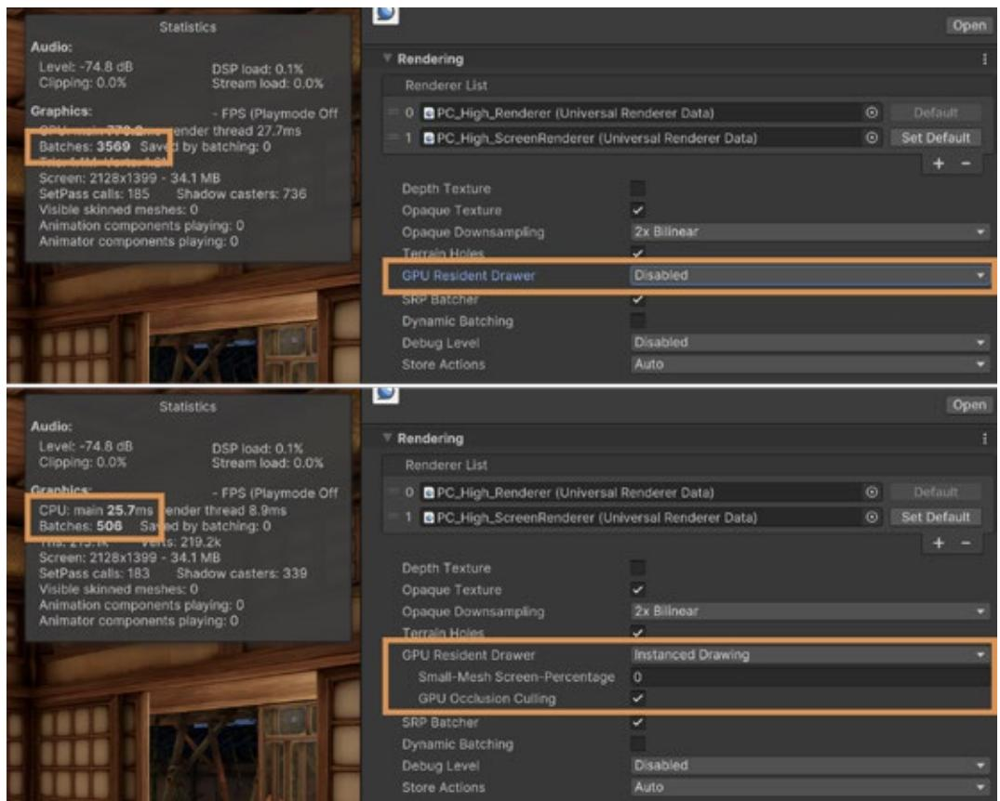

The GPU Resident Drawer and GPU Occlusion Culling options available via the URP Asset in Unity 6

Notice from the screengrabs above that the batches necessary to render the garden environment from the URP 3D Sample scene in Editor mode is 3569. When GPU Resident Drawer is set to **Instanced Drawing** this drops to just 506.

The GPU Resident Drawer is a GPU-driven rendering system that's designed to optimize CPU time. It enables GameObjects to take advantage of the BatchRenderGroup API, so they can benefit from its faster batching and improved CPU performance.

With GPU Resident Drawer, you can author your game using GameObjects, and when processed, they will be ingested and rendered via a special fast path that handles better instancing. When you enable this feature, games that are CPU-bound due to a high number of draw calls will see a reduction in this bottleneck as the amount of draw calls is reduced.

The improvements you will see are dependent on the scale of your scenes and the amount of instancing you utilize. The more instanceable objects you render, the bigger the benefits gain.


GPU Resident Drawer is targeted for MeshRenderers. It will not handle Skinned Mesh Renderers, VFX Graphs, particle systems, or similar effects renderers. No changes to your existing content are required to take advantage of it.

**Note:** GPU Resident Drawer requires the Forward+ renderer, and **Project Settings > Graphics > BatchRendererGroup Variants** needs to be set to **Keep All**.

| Graphics                                 |                                                                                                                       |   |
|------------------------------------------|-----------------------------------------------------------------------------------------------------------------------|---|
| Set Default Render Pipeline Asset        | Sot the Default Render Pipeline Assot that Unity uses when you don't have assigned Rondor Pipeline Associative Lovel. |   |
| Default Render Pipeline                  | PC_RPAsset - Dither (Universal Render Pipeline Asset)                                                                 | 0 |
| Shader Stripping                         |                                                                                                                       |   |
| Lightmap Modes                           | Automatic                                                                                                             |   |
| Fog Modes                                | Automatic                                                                                                             |   |
| Instancing Variants                      | Strip Unused                                                                                                          |   |
| BatchRendererGroup Variants              | Keep All                                                                                                              |   |
| Shader Loading<br>Log Shader Compilation | Strip if no Entities Graphics package<br>Strip All<br>V Keep All                                                      |   |

When you enable GPU Resident Drawer, [GPU occlusion culling](https://docs.unity3d.com/6000.0/Documentation/Manual/urp/gpu-culling.html) also becomes available as an option. This uses a GPU-driven approach to ensure you don't render things you can't see on the screen; depending on your content, it can reduce CPU work dramatically.

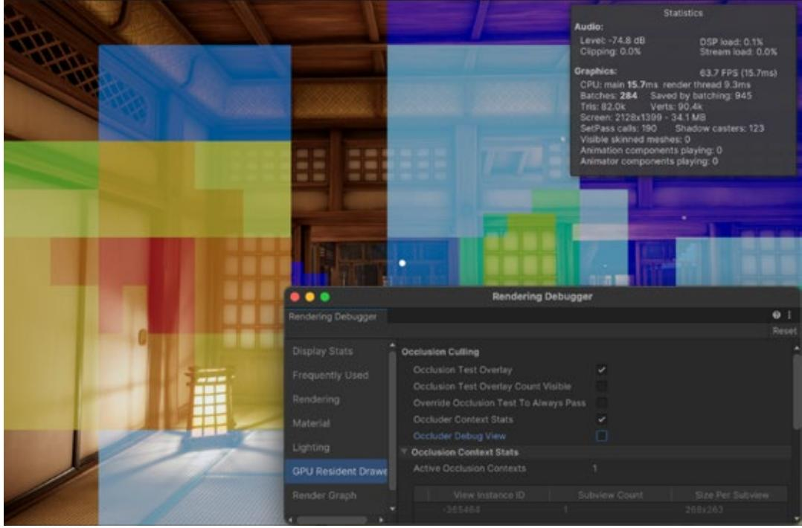

Viewing the Occlusion Test using the Rendering Debugger

To see if GPU occlusion culling is effective for your scene go to **Window > Analysis > Rendering Debugger**, and select **GPU Resident Drawer > Occlusion Test Overlay**. This displays a heatmap of culled instances. The heatmap displays blue if there are few culled instances, through to red if there are many culled instances. If you enable this setting, culling might be slower.

## <span id="page-32-0"></span>Lighting in URP

This section shows how lighting in URP in Unity 6 works, including covering techniques you can use to achieve balance between graphic fidelity and performance.

Start with these resources if you are new to lighting in Unity:

- [Lighting documentation](https://docs.unity3d.com/6000.0/Documentation/Manual/LightingInUnity.html?)
- [The art of lighting game environments](https://cgcookie.com/posts/art-of-lighting-game-environments)
- [Real-time lighting in Unity](https://www.youtube.com/watch?v=wwm98VdzD8s)
- [Harnessing light with the URP and the GPU Lightmapper](https://youtu.be/hMnetI4-dNY)

#### **Choose your renderer**

URP offers different rendering techniques, each with its own strengths and weaknesses. The choice of rendering technique depends on the specific requirements and constraints of your project. Let's delve into the differences between Forward, Forward+, and Deferred rendering in (URP).


#### **Forward rendering**

| How it works<br>Pros                                                                                                                                                                                                                                                                                                                              | Cons                                                                                                                                                                                                                                                                                                                                                                                                |
|---------------------------------------------------------------------------------------------------------------------------------------------------------------------------------------------------------------------------------------------------------------------------------------------------------------------------------------------------|-----------------------------------------------------------------------------------------------------------------------------------------------------------------------------------------------------------------------------------------------------------------------------------------------------------------------------------------------------------------------------------------------------|
| Forward rendering is a traditional<br>rendering technique where each<br>object in the scene is rendered<br>individually and each pixel<br>computed separately. This means<br>that for every pixel on the screen,<br>Unity calculates the lighting and<br>shading for each object in the<br>scene that contributes to that<br>pixel's final color. | The workflow is relatively<br>It can be inefficient for<br>straight-forward to<br>rendering scenes with a<br>understand. It works well<br>large number of lights or<br>in scenes with a small<br>complex materials. This<br>number of lights and<br>is because it requires<br>simple materials.<br>multiple passes over<br>the scene for each light,<br>leading to increased<br>rendering overhead. |

#### **Forward+ rendering**

| How it works                                                                                                                                                                                                                                                                                                                                                                                         | Pros                                                                                                                                                                                                                                                                 | Cons                                                                                                                                                                                                                               |
|------------------------------------------------------------------------------------------------------------------------------------------------------------------------------------------------------------------------------------------------------------------------------------------------------------------------------------------------------------------------------------------------------|----------------------------------------------------------------------------------------------------------------------------------------------------------------------------------------------------------------------------------------------------------------------|------------------------------------------------------------------------------------------------------------------------------------------------------------------------------------------------------------------------------------|
| Forward+ rendering is an<br>enhancement that addresses<br>some of the limitations of Forward<br>rendering, particularly when<br>dealing with a large number of<br>lights. In Forward+ rendering,<br>lights are grouped into clusters,<br>and only objects within each<br>cluster are considered when<br>calculating lighting, rather than<br>processing every object in the<br>scene for each light. | It improves performance<br>compared to Forward<br>rendering, especially in<br>scenes with many lights.<br>It allows for more efficient<br>utilization of hardware<br>resources by reducing the<br>number of objects that<br>need to be considered for<br>each light. | It can still struggle<br>with extremely large<br>numbers of lights or<br>very complex scenes.<br>Additionally, implementing<br>Forward+ rendering may<br>require more effort and<br>optimization compared to<br>Forward rendering. |

#### **URP Deferred rendering**

| How it works                                                                                                                                                                                                  | Pros                                                                                                                                                            | Cons                                                                                                                                                            |
|---------------------------------------------------------------------------------------------------------------------------------------------------------------------------------------------------------------|-----------------------------------------------------------------------------------------------------------------------------------------------------------------|-----------------------------------------------------------------------------------------------------------------------------------------------------------------|
| Deferred rendering decouples the<br>lighting and shading calculations<br>from the geometry rendering<br>process. Geometry is first<br>rendered to a set of buffers (e.g.,<br>G-buffer) that store information | It's highly efficient for<br>scenes with a large<br>number of lights or<br>complex materials because<br>lighting calculations are<br>performed per-pixel rather | Deferred rendering has<br>its own set of challenges,<br>including increased<br>memory usage due to the<br>need to store additional<br>buffers, limitations with |
| about each pixel's position,<br>normals, and material properties.<br>Then, lighting calculations are<br>performed per-pixel based on<br>the information stored in these<br>buffers.                           | than per-object. This<br>allows for a large number<br>of lights to be rendered<br>with minimal performance<br>impact.                                           | transparent objects, and<br>difficulty in handling<br>certain types of<br>lighting effects such as<br>volumetric lighting.                                      |


The table below provides more detail about these three rendering options:

| Feature                                             | Forward                                          | Forward+                                         | Deferred                                                                                                                                                                                                                                                                                          |
|-----------------------------------------------------|--------------------------------------------------|--------------------------------------------------|---------------------------------------------------------------------------------------------------------------------------------------------------------------------------------------------------------------------------------------------------------------------------------------------------|
| Maximum number of<br>real-time lights per<br>object | 9                                                | Unlimited;<br>per-Camera<br>limit applies        | Unlimited                                                                                                                                                                                                                                                                                         |
| Per pixel normal<br>encoding                        | No<br>encoding<br>(accurate<br>normal<br>values) | No<br>encoding<br>(accurate<br>normal<br>values) | Two options:<br>—<br>Quantization of normals<br>in G-buffer (loss of<br>accuracy, better<br>performance)<br>—<br>Octahedron encoding<br>(accurate normals,<br>might have significant<br>performance impact on<br>mobile GPUs)<br>For more information, see<br>Encoding of normals in<br>G-buffer. |
| MSAA                                                | Yes                                              | Yes                                              | No                                                                                                                                                                                                                                                                                                |
| GPU Resident Drawer                                 | No                                               | Yes                                              | No                                                                                                                                                                                                                                                                                                |
| Vertex lighting                                     | Yes                                              | No                                               | No                                                                                                                                                                                                                                                                                                |
| Camera stacking                                     | Yes                                              | Yes                                              | Supported with a limitation:<br>Unity renders only the base<br>Camera using the Deferred<br>path; Unity renders all<br>overlay Cameras using the<br>Forward Rendering path                                                                                                                        |

<span id="page-35-0"></span>

Use the Universal Renderer Data Asset to switch between the rendering paths.


Choosing a rendering path.

When using Forward+, a number of URP Asset Lighting settings are overridden:

- **Main light**: The value of this property is **Per Pixel**, regardless of the value you select.
- **Additional lights**: The value of this property is **Per Pixel**, regardless of the value you select.
- **Additional Lights > Per Object Limit**: Unity ignores this property.
- **Reflection Probes > Probe Blending**: Reflection probe blending is always on.

#### **Light settings**

You set light properties in the three places listed here:

- **1. Window > Rendering > Lighting:** This panel allows you to set lightmapping and environment settings, and view real-time and baked lightmaps. It is unchanged from the Built-In Render Pipeline to URP.
- **2. Light Inspector:** There are significant differences between the Built-In Render Pipeline and URP Inspectors. See th[e Light Inspector section](#page-38-0) for details.
- **3. URP Asset Inspector:** This is the principal place where you will set shadows. Lighting in URP relies heavily on the settings chosen in this panel.

Quality settings are handled via **Edit > Project Settings > Quality** in the Built-In Render Pipeline. In URP, this depends on the URP Asset settings which can be swapped using the

<span id="page-36-0"></span>

#### **Quality** panel (see the [Quality settings section\)](#page-26-0).

As the focus here is on lighting, the methods apply to materials that use the shaders in the following table.

| Shader      | Description                                                                                                                                                                                                                                                                                                  |
|-------------|--------------------------------------------------------------------------------------------------------------------------------------------------------------------------------------------------------------------------------------------------------------------------------------------------------------|
| Complex Lit | This shader has all the features of the Lit Shader. Select it when using<br>the Clear Coat option to give a metallic sheen to a car, for example. The<br>specular reflection is calculated twice – once for the base layer, and again<br>to simulate a transparent thin layer on top of the base layer.      |
| Lit         | The Lit Shader lets you render real-world surfaces, such as stone, wood,<br>glass, plastic, and metals with photorealistic quality. The light levels and<br>reflections look lifelike and react across various lighting conditions, from<br>bright sunlight to a dark cave.                                  |
|             | This is the default choice for most materials that use lighting. It supports<br>baked, mixed, and real-time lighting, and works with Forward or Deferred<br>rendering.                                                                                                                                       |
|             | It is a physically based shading (PBS) model. Due to the complexity of the<br>shading calculations, it's best to avoid using this shader on low-end mobile<br>hardware.                                                                                                                                      |
| Simple Lit  | This shader is not physically based. It uses a non-energy conserving Blinn<br>Phong shading model and gives a less photorealistic result. Nonetheless, it<br>can provide an excellent visual appearance. It is more suited to use on non<br>physically based projects when targeting low-end mobile devices. |
| Baked Lit   | This shader provides a performance boost for objects that don't need to<br>support real-time lighting, including distant static objects that will never be<br>affected by dynamic objects, real-time lights, or dynamic shadows.                                                                             |

#### **URP shaders for lit scenes**

<span id="page-37-0"></span>

#### **Lit or Simple Lit?**

The choice between a Lit Shader and Simple Lit Shader is largely an artistic decision. It is easier for artists to get a realistic render using the Lit Shader, but if a more stylized render is desired, Simple Lit provides stellar results.

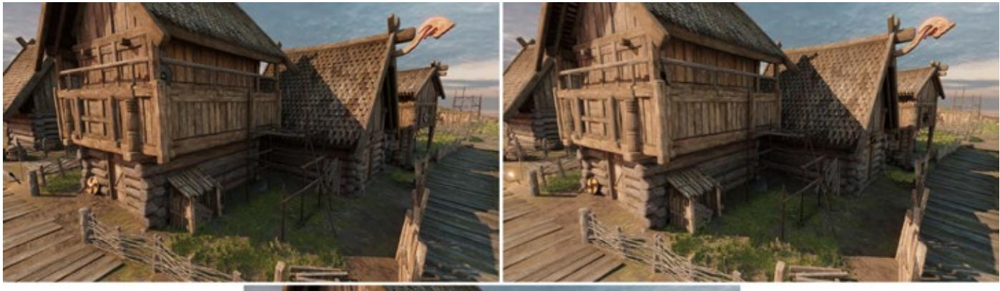


Comparing scenes rendered using different shaders: The top-left image uses the Lit Shader, the top-right, the Simple Lit Shader, and the bottom image, the Baked Lit Shader.

It's possible to implement your own custom lighting model by writing a custom shader or using Shader Graph (see the [Additional tools chapter\)](#page-137-0).

<span id="page-38-0"></span>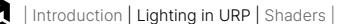

## Lighting overview

Lights are divided into Main [Light and Additional Lights](https://docs.unity3d.com/Packages/com.unity.render-pipelines.universal@17.0/manual/universalrp-asset.html#lighting) in URP. The settings for the Main Light property affect the Directional Light. This is either the brightest light or the one set via **Window > Rendering > Lighting > Environment > Sun Source**.

| Inspector   | Navigation            |        | · Lighting                |                                                      |   |
|-------------|-----------------------|--------|---------------------------|------------------------------------------------------|---|
|             |                       |        |                           | Scene Environment Realtime Lightmaps Baked Lightmaps |   |
| Environment |                       |        |                           |                                                      |   |
|             | Skybox Material       |        | C Default-Skybox          |                                                      | O |
| Sun Source  |                       |        | Directional Light (Light) |                                                      | O |
|             | Realtime Shadow Color |        |                           |                                                      |   |
|             | Environment Lighting  |        |                           |                                                      |   |
| Source      |                       | Skybox |                           |                                                      |   |
|             | Intensity Multiplier  |        |                           |                                                      |   |

Setting the Sun Source

Later in the guide, you'll learn how to use the URP Asset settings to set the number of dynamic lights that affect an object via the Object Per Light limit, which is capped at eight for the URP Forward Renderer, but Unlimited for Forward+ and Deferred. The number of dynamic lights that can be used per Camera is also limited by different hardware:

- **Desktop and console platforms**: 1 main light, and 256 additional lights
- **Mobile platforms**: 1 main light, and 32 additional lights
- **OpenGL ES 3.0 and earlier**: 1 main light, and 16 additional lights

#### **Light Inspector**

The Light Inspector is one of three places where you can set up lighting.

The available properties for lights in URP are Directional, Spot, Point, and Area, though area lights only work in Baked Indirect Mode. See the [Light Mode](#page-47-0) section for more details.

<span id="page-39-0"></span>

| ▼ < Light            |                                         | 0<br>14 |
|----------------------|-----------------------------------------|---------|
| T General            |                                         | 0       |
| Type                 | Directional                             |         |
| Mode                 | Realtime                                |         |
| V Emission           |                                         | @       |
| Light Appearance     | Filter and Temperature                  |         |
| Filter               |                                         | P       |
| Temperature          |                                         |         |
|                      | 5000                                    | Kelvin  |
| Intensity            | 2                                       |         |
| Indirect Multiplier  | 1                                       |         |
| Cookie               |                                         |         |
| Rendering            |                                         | 0       |
| Render Mode          | Auto                                    |         |
| Rendering Layers     | Default                                 |         |
| Culling Mask         | Everything                              | D       |
| T Shadows            |                                         | 0       |
| Shadow Type          | Soft Shadows                            | D       |
| Realtime Shadows     |                                         |         |
| Strength             |                                         | @ 1     |
| Blas                 | Use settings from Render Pipeline Asset |         |
| Near Plane           |                                         | 0.2     |
| Soft Shadows Quality | Low                                     |         |
| Custom Shadow Layers |                                         |         |

The Light Inspector panel in URP

The image above shows how light properties are presented in the Light Inspector. The URP version has four groupings of controls, based on whether the light is Directional or Point, and an additional Shape grouping for Spot and Area lights.

#### **Lighting a new scene**

| 1 Inspector |                   | @ Lighting              | Project Settings |                         |                                                                                     |  |       |       |
|-------------|-------------------|-------------------------|------------------|-------------------------|-------------------------------------------------------------------------------------|--|-------|-------|
|             |                   |                         |                  |                         | Scene   Adaptive Probe Volumes   Environment   Realtime Lightmaps   Baked Lightmaps |  |       | 8 *   |
|             | Lighting Settings |                         |                  |                         |                                                                                     |  |       |       |
|             |                   | Lighting Settings Asset |                  | % New Lighting Settings |                                                                                     |  | O New | Clone |

Creating a Lighting Settings Asset

The first step to lighting a new scene for URP is to create a new Lighting Settings Asset (see image above). Open **Window > Rendering > Lighting**, and once you're on the **Scene** tab, click **New Lighting Settings**, and give the new asset a name. The settings that you apply in Lighting panels are now saved to it. Switch between settings by switching the Lighting Settings Asset.

<span id="page-40-0"></span>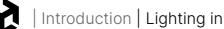

#### **Ambient or Environment lighting**

The main ambient light is calculated from the panel accessible via **Window > Rendering > Lighting > Environment**.

| @ Inspector      |                      | . Lighting              | Project Settings |                   |                                                       |                 |     |    |
|------------------|----------------------|-------------------------|------------------|-------------------|-------------------------------------------------------|-----------------|-----|----|
|                  | Scene                |                         |                  |                   | Adaptive Probe Volumes Environment Realtime Lightmaps | Baked Lightmaps |     | 00 |
| V Environment    |                      |                         |                  |                   |                                                       |                 |     |    |
|                  | Skybox Material      |                         |                  | @ Default-Skybox  |                                                       |                 |     | 0  |
| Sun Source       |                      |                         |                  | None (Light)      |                                                       |                 |     | 0  |
|                  |                      | Realtime Shadow Color   |                  |                   |                                                       |                 |     | A  |
|                  | Environment Lighting |                         |                  |                   |                                                       |                 |     |    |
| Source           |                      |                         |                  | Skybox            |                                                       |                 |     |    |
|                  | Intensity Multiplier |                         |                  |                   |                                                       |                 |     |    |
|                  |                      | Environment Reflections |                  |                   |                                                       |                 |     |    |
| Source           |                      |                         |                  | Skybox            |                                                       |                 |     |    |
|                  | Resolution           |                         |                  | 128               |                                                       |                 |     |    |
|                  | Compression          |                         |                  | Auto              |                                                       |                 |     |    |
|                  | Intensity Multiplier |                         |                  |                   |                                                       |                 |     |    |
|                  | Bounces              |                         |                  |                   |                                                       |                 |     |    |
| V Other Settings |                      |                         |                  |                   |                                                       |                 |     |    |
| Fog              |                      |                         |                  |                   |                                                       |                 |     |    |
| Halo Texture     |                      |                         |                  | None (Texture 2D) |                                                       |                 |     | 0  |
|                  | Halo Strength        |                         |                  |                   |                                                       |                 | 0.5 |    |
|                  | Flare Fade Speed     |                         |                  | 3                 |                                                       |                 |     |    |
|                  | Flare Strength       |                         |                  |                   |                                                       |                 | ● 1 |    |
| Spot Cookie      |                      |                         |                  | C Soft            |                                                       |                 |     | 0  |

The available settings for lighting in the Environment panel

You can set Environment Lighting to use the scene's Skybox, with an option to adjust the Intensity, Gradient, or Color. Only the Gradient and Color modes update in real-time. The Skybox mode requires an on-demand bake to compute the ambient probe from the sky.

| Environment Lighting<br>Source<br>Intensity Multiplier | Skybox   |    |
|--------------------------------------------------------|----------|----|
| Environment Lighting                                   |          |    |
| Source                                                 | Gradient | œ  |
| Sky Color                                              |          | 8  |
| Equator Color                                          | HDS      | 20 |
| Ground Color                                           | HDR      |    |
| Environment Lighting                                   |          |    |
| Source                                                 | Color    | V  |
| Ambient Color                                          |          |    |

Environment Lighting options

<span id="page-41-0"></span>

## Shadows

As discussed earlier, you need a Renderer Data object and a Render Pipeline Asset when using URP. The section on [setting up a project for URP](#page-12-0) covers how to view your scene via Render Pipeline Asset, which you can use to define the fidelity of your shadows.


The URP Asset

#### **Main Light shadow resolution**

The Lighting and Shadow groups in the URP Asset are key to setting up shadows in your scene. First, set the **Main Light Shadow** to **Disabled** or **Per Pixel**, then go to the checkbox to enable **Cast Shadows**. The last setting is the resolution of the shadow map.

If you've worked with shadows in Unity before, you know that real-time shadows require rendering a shadow map that contains the depth of objects from the perspective of the light. The higher the resolution of this shadow map, the higher the visual fidelity – though both more processing power and increased memory are required. Factors that increase shadow processing include:

- 1. The number of Shadow Casters rendered in the shadow map this number for the Main Light depends on the Shadow Distance (far plane of shadow frustum)
- 2. Shadow Receivers that are visible (you have to encompass them all)
- 3. Shadow Cascades splits
- 4. Shadow filtering (soft shadows)

The highest resolution isn't always ideal. For example, the **Soft Shadows** option has the effect of blurring the map. In the following image of a cartoon-like haunted room, you can see that the chair in the foreground casts a shadow on the desk drawers, which appears too crisp when the resolution is greater than 1024.


Setting the shadow resolution for the Main Light: The resolution is set to 256 in the top-left image, 512 in the top-right image, 1024 in the middle-left image, 2048 in the middle-right image, and 4096 in the bottom image.

<span id="page-43-0"></span>

#### **Main Light: Shadow Max Distance**

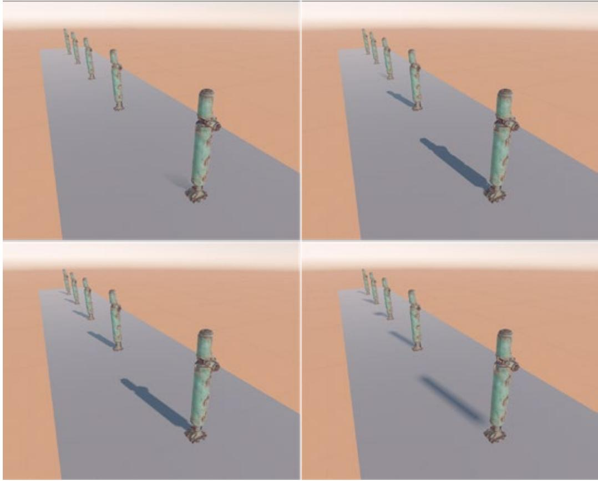

Varying Max Distance for the Main Light Shadow: Top-left image – 10, top-right image – 30, bottom-left image – 60, bottom-right image – 400

Another important setting for the Main Light Shadow is Max Distance. This is set in scene units. In the image above, the poles are 10 units apart. The Max Distance varies from 10 to 400 units. Notice that only the first pole casts a shadow, and this is cut short at 10 units from the Camera location. At 60 units (bottom-left image), all shadows are in view – the shadow fidelity is adequate. When the Max Distance is much greater than the visible assets, the shadow map is being spread over too large an area. This means that the region in-shot has a much lower resolution than required.

The Max Distance property needs to relate directly to what the user can see, as well as the units used in the scene. Aim for the minimum distance that gives acceptable shadows (see note below). If the player only sees shadows from dynamic objects 60 units from the Camera, then set Max Distance to 60. When the Lighting Mode for Mixed Lights is set to [Shadowmask](https://docs.unity3d.com/6000.0/Documentation/Manual/LightMode-Mixed-Shadowmask.html), the shadows of objects beyond Shadow Distance are baked. If this was a static scene then you would see shadows on all objects, but only dynamic shadows would be drawn up to the Shadow Distance.

<span id="page-44-0"></span>

#### **Shadow Cascades**

As assets disappear into the distance due to perspective, it is convenient to decrease Shadow Resolution, thereby devoting more of the shadow map to shadows closer to the Camera. [Shadow Cascades](https://docs.unity3d.com/6000.0/Documentation/Manual/shadow-cascades.html?) can help with this.

The images below show the shadow map of the scene with the chair and desk in the haunted room. The cascade count is 1 in the image to the left. The map takes up the whole area. In the image to the right, the cascade count is 4. Notice that the map includes four different maps, with each area receiving a lower resolution map.

A cascade count of 1 is likely to give the best result for small scenes like this. But if your Max Distance is a large value, then a cascade count of 2 or 3 will give better shadows for foreground objects, as these receive a larger proportion of the shadow map. Notice that the chair in the left image is much bigger, resulting in a sharper shadow.

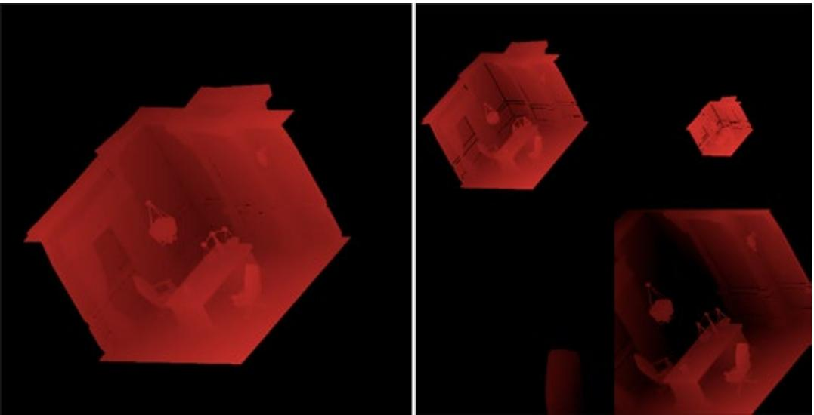

Shadow map when cascade count is set to 1 (left image) and 4 (right image)

You can adjust the start and end ranges for each section of the cascade using the draggable pointers, or by setting the units in the relevant fields (see following image). Always adjust Max Distance to a value that is a close fit for your scene and choose the slider positions carefully. If you use metric as the working unit, always choose the last cascade to be, at most, the distance of the last Shadow Caster. Adjusting the range of a Shadow Cascade

| Shadows<br>40                        |            |                     |
|--------------------------------------|------------|---------------------|
| Max Distance                         | 30.9       |                     |
| Working Unit                         | Metric     | P                   |
| Cascade Count                        |            | 4<br>0              |
| Split 1                              |            | 1,91344             |
| Split 2                              |            | 6.18                |
| Split 3                              |            | 9.09728             |
| Last Border                          |            | 13,3931             |
| 1                                    |            |                     |
| 0<br>2<br>1<br>1,900<br>4,3m<br>2.9m | 3<br>B. Am | 3->Falback<br>13 4m |
|                                      |            |                     |

<span id="page-45-0"></span>

#### **Additional Light Shadows**

| 3<br>Lighting                                         |                           |  |
|-------------------------------------------------------|---------------------------|--|
| Main Light                                            | Per Pixel                 |  |
| Cast Shadows                                          | >                         |  |
| Shadow Resolution                                     | Disabled                  |  |
| Additional Lights<br>Per Object Limit<br>Cast Shadows | Per Vertex<br>V Per Pixel |  |
|                                                       | >                         |  |
| Shadow Atlas Resoluti  1024                           |                           |  |
| Shadow Resolution TicLow 128                          | Medium 256 High 512       |  |

Settings available for Additional Lights in URP Asset

Having sorted the shadows for the Main Light, it's time to move on to **Additional Lights Mode**. Enable additional lights to cast shadows by setting the Additional Lights Mode for the URP Asset to **Per Pixel**. While the mode can be set to Disabled, Per Vertex, or Per Pixel (see above image), only the latter works with shadows.

**Note:** URP does not support shadows for additional directional lights. Remember, the Main light is always the brightest Directional light. For additional lights with shadows, use a Point or Spot light.

Check the **Cast Shadows** box. Then, select the resolution of the **Shadow Atlas**. This is the map that will be used to combine all the maps for every light casting shadows. Bear in mind that a Point light casts six shadow maps, creating a cubemap, since it casts light in all directions. This makes a Point light the most demanding performance-wise. The individual resolution of an additional light shadow map is set using a combination of the three Shadow Resolution tiers, plus the resolution chosen via the Light Inspector when selecting the light in the Hierarchy window.

| Shadows              |                                         | 0     |
|----------------------|-----------------------------------------|-------|
| Shadow Type          | Soft Shadows                            |       |
| Baked Shadow Angle   |                                         | 0     |
| Realtime Shadows     |                                         |       |
| Strength             |                                         | 0.843 |
| Bias                 | Use settings from Render Pipeline Asset |       |
| Near Plane           |                                         | 0.1   |
| Soft Shadows Quality | Medium                                  | >     |

Shadows group in the Light Inspector

Setting **Shadow Type** to **Soft Shadows** enables the **Baked Shadow Angle** slider. This property adds some artificial softening to the edges of shadows and gives them a more natural look. A new option in Unity 6 is available to switch the **Soft Shadows Quality** between Low, Medium, and High.

In the haunted room, there is a Spot light over the mirror and a Point light over the desk. There are also seven maps. To fit these seven maps onto a 1024px square map, the size of each map needs to be 256px or smaller. If you exceed this size, the resolution of shadow maps will shrink to fit the atlas, resulting in a warning message in the console.

| Number of maps | Atlas tiling | Atlas size (multiply shadow tier size by) |  |
|----------------|--------------|-------------------------------------------|--|
| 1              | 1x1          | 1                                         |  |
| 2–4            | 2x2          | 2                                         |  |
| 5–16           | 4x4          | 4                                         |  |

Setting the Shadow Atlas size based on the number of Additional Lights shadow maps and the tier size chosen per map

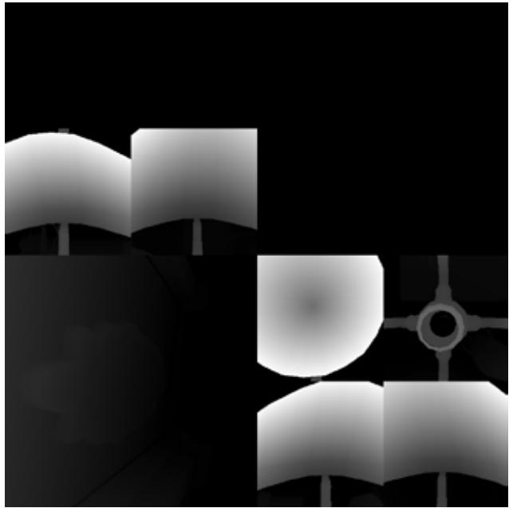

Shadow Atlas for Additional Lights

The image above shows the six maps used by the Point light where the resolution is set to medium and the tier value to 256px. The Spot light has a resolution set to high, with a tier value of 512px.

<span id="page-47-0"></span>

This is a low-polygon version of the haunted room, lit with a Main Directional light, a Point light over the desk, and a Spot light over the mirror. All lights are real-time and casting shadows.

## Light modes

Environments have predominantly static geometry, so that if a light is static, you don't need to calculate the lighting and shadows for it repeatedly. You can calculate this once at design time, and then use that data when rendering the geometry. This is called lightmapping or baking.

Let's go through the steps for lightmapping using an FPS Sample project by Unity. The following screenshots are from this project, which you can download [here](https://github.com/NikLever/Unity6E-book). The scene via **Inspection > Scenes > Small Indirect** demonstrates how to use real-time and baked lighting in URP.

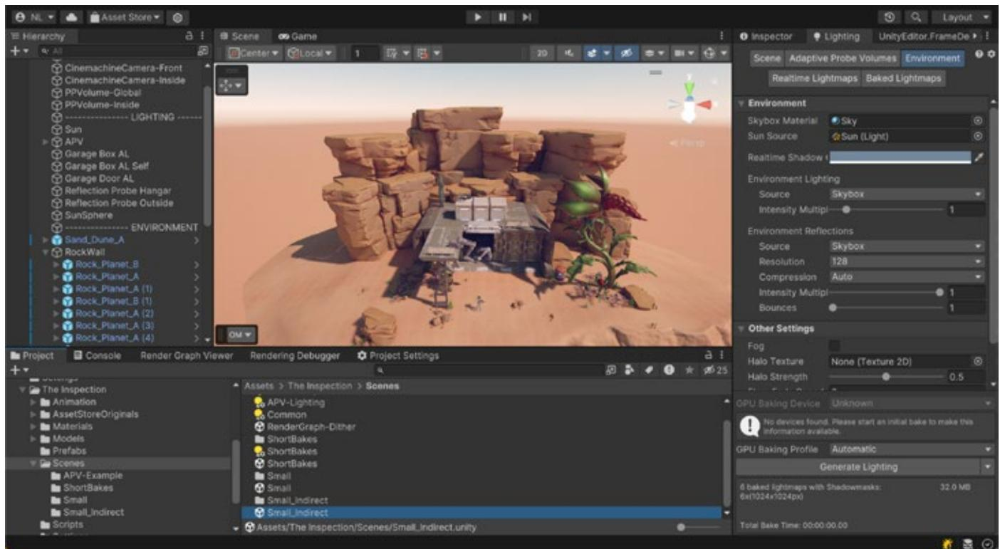

The Inspection > Scenes > Small Indirect scene from the Unity 6 URP e-book repository on GitHub.

1. The scene from the FPS Sample project contains largely static geometry. To include the geometry in lightmapping, click the **Static** box to the right side of the Inspector.

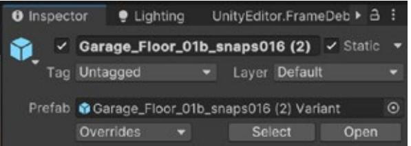

2. Choose the lightmapping settings via **Window > Rendering > Lighting > Scene**. Keep the Lightmap Resolution low while adjusting the settings. Once you have your desired settings, increase the value when generating the final lightmaps. Choose **Progressive GPU** to speed up the lightmap generation, if your GPU supports it.

| Lightmapping Settings            |                                                |                 |
|----------------------------------|------------------------------------------------|-----------------|
| Lightmapper                      | Progressive GPU                                | D               |
| Importance Samp √                |                                                |                 |
| Direct Samples                   |                                                | 32              |
| Indirect Samples -               |                                                | 256             |
| Environment San-                 |                                                | 256             |
| Light Probe Sam  3               |                                                |                 |
| Max Bounces                      | 2                                              |                 |
| Filtering                        | Auto                                           | D               |
| Lightmap Resolution 30           |                                                | texels per unit |
| Lightmap Padding 2               |                                                | texels          |
| Max Lightmap Size 2048           |                                                |                 |
| Fixed Lightmap Size              |                                                |                 |
| Use Mipmap Limits ✔              |                                                |                 |
| Lightmap Compres: Normal Quality |                                                | D               |
| Ambient Occlusion V              |                                                |                 |
| Max Distance                     | 1                                              |                 |
| Indirect Contribu-               |                                                |                 |
| Direct Contributio               |                                                | 0               |
| Directional Mode Directional     |                                                |                 |
| Albedo Boost                     |                                                |                 |
| Indirect Intensity               |                                                |                 |
|                                  | Lightmap Paramete Default-Medium O New   Clone |                 |

3. Filtering blurs the map to minimize noise. This can result in gaps in a shadow where one object meets another. Use **A-Trous** filtering to minimize this artifact. See [Progressive](https://docs.unity3d.com/6000.0/Documentation/Manual/progressive-lightmapper.html?)  [Lightmapping documentation](https://docs.unity3d.com/6000.0/Documentation/Manual/progressive-lightmapper.html?) for more details on the settings available for lightmapping.

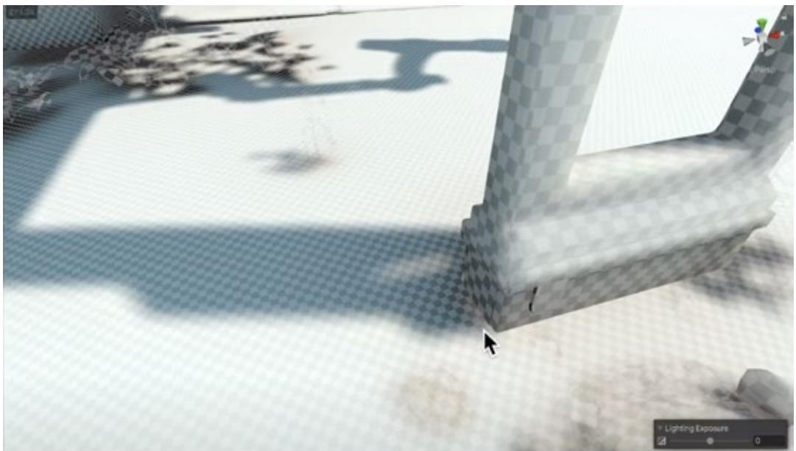

How filtering affects the shadow between objects


4. Make sure all static geometry has no overlapping UV values, or is generating lighting **UVs** on import.


5. Set **Light Mode** to **Baked** or **Mixed**. Select the light in the **Hierarchy** window and use the **Inspector**. Mixed lights will illuminate dynamic objects as well as static ones.

| < > Light        |             | 0 = : |
|------------------|-------------|-------|
| V General        |             | B     |
| Type             | Directional | D     |
| Mode             | Mixed       | P     |
| Emission         | Realtime    |       |
| Light Appearance | V Mixed     |       |
| Filter           | Baked       |       |
| Tammaratura      |             |       |

- 6. When using mixed lights, set the **Light Mode** to **Baked Indirect**, **Subtractive**, or **Shadowmask** via **Window > Rendering > Lighting > Scene**.
	- **a. [Baked Indirect:](https://docs.unity3d.com/6000.0/Documentation/Manual/LightMode-Mixed-BakedIndirect.html)** Only the indirect light contribution will be baked into the lightmaps and light probes (the bounces of the lights only). Direct lighting and shadows will be real-time. This is an expensive option and not ideal for mobile platforms. However, it does mean that you get correct shadows and direct light for both static and dynamic geometry.
- **b. [Subtractive:](https://docs.unity3d.com/6000.0/Documentation/Manual/LightMode-Mixed-Subtractive.html)** Here, you bake the direct lighting from a Directional light set to Mixed into the static geometry, and subtract the lighting from shadows cast by dynamic geometry. This results in the static geometry unable to cast a shadow on dynamic objects, unles[s light probes](#page-57-0) or Adaptive Probe Volumes (APV) are used, which can cause unpleasant visual discontinuities. URP calculates an estimate of the contribution of the light from the Directional Light and subtracts that from the baked Global Illumination. The estimate is clamped by the Real-time Shadow Color setting in the Environment section of the Lighting window, so the color subtracted is never darker than this color. Then choose the minimum color of your subtracted value and the original baked color. While this mode is the most suitable option for low-end hardware, it cannot correctly combine baked and real-time shadows at runtime, leading to artifacts. This trade-off prioritizes performance over quality.
- **c. [Shadowmask:](https://docs.unity3d.com/6000.0/Documentation/Manual/LightMode-Mixed-Shadowmask.html?)** Though similar to Baked Indirect Mode, Shadowmask combines both dynamic and baked shadows, rendering shadows at a distance. It does this by using an additional Shadowmask texture and storing additional information in the light probes. This provides the highest fidelity shadows, but is also the most expensive option in terms of memory use and performance. Visually, it's identical to Baked Indirect for shots up close. The difference is apparent when looking in the far distance, making it well-suited for open-world scenes. Due to the processing cost, it's recommended for mid- to high-end hardware only.

| Mixed Lighting                                                      |                |  |
|---------------------------------------------------------------------|----------------|--|
| Baked Global Illumination ✔                                         |                |  |
| Lighting Mode                                                       | Baked Indirect |  |
| Mixed lights provide re √ Baked Indirect<br>lightmaps and light pro | Subtractive    |  |
| Lightmapping Settings                                               | Shadowmask     |  |


7. Adjust the **Lightmap Scale** via **Asset > Inspector > Mesh Renderer > Lightmapping > Scale In Lightmap**, so that distant objects take up less space on the lightmap. The following image shows the texel size of the background rock lightmap with a setting varying from 0.05 to 0.5.

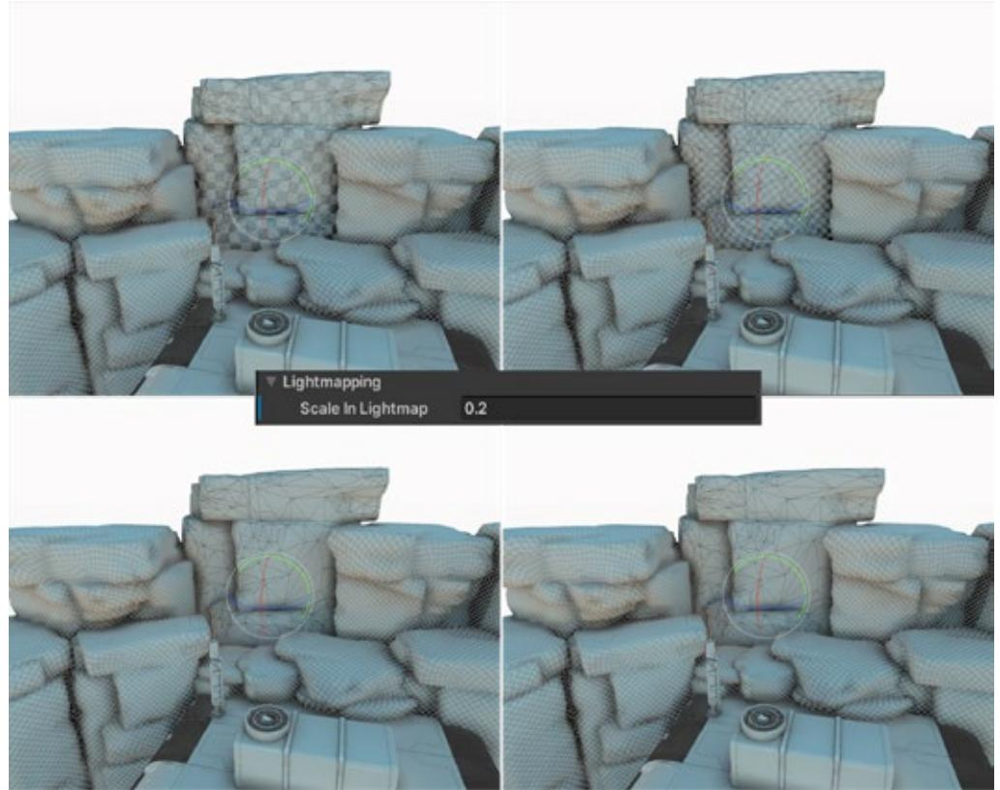

8. Click **Generate Lighting** to bake. The baking time depends on the number of static objects, lights set to mixed or baked mode, and the settings chosen for lightmapping, particularly the Max Lightmap Size and the Lightmap Resolution. Baking time is proportional to the number of rays used in baking so Sample Count (Direct Samples, Indirect Samples and Environment Samples) also have a direct effect on baking time.

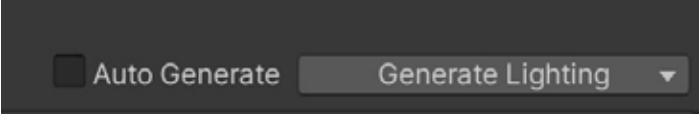

Bake your lightmap via **Window > Rendering > Lighting > Generate Lighting**.

<span id="page-53-0"></span>9. An interactive baking feature is new in Unity 6 with Draw Modes active (1)\* and Baked Lightmap selected (2). A new panel is displayed with a Preview option (3). While you are in this mode the changes made do not affect the generated data. This feature enables a technical artist to tweak the properties and see how changes could affect the rendering without destroying a previous bake that might have taken a long time to calculate.

\*Numbers refer to the image below.

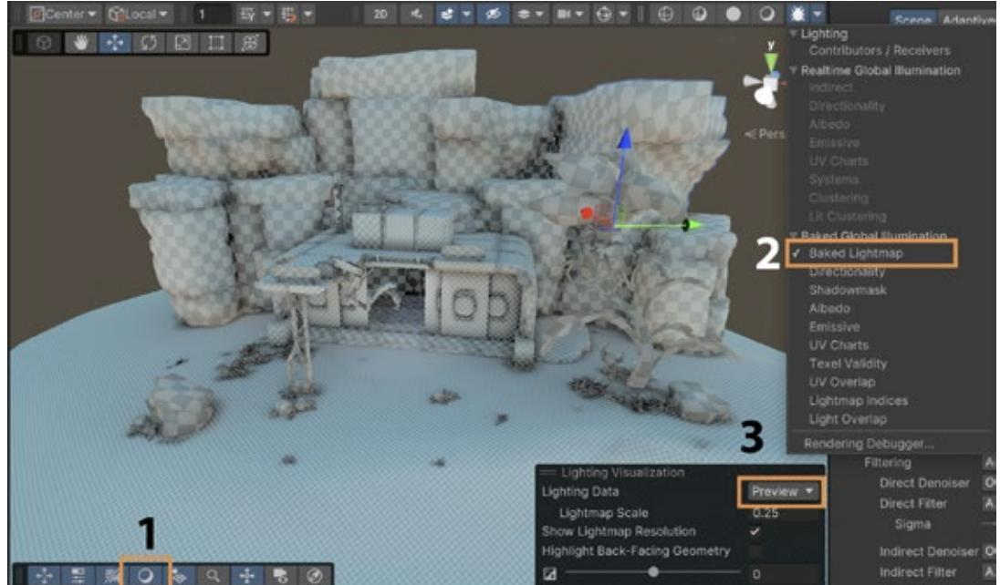

Activating interactive preview mode

Unity also now provides a **Baking Profile**. This can be found in the **Lighting** window when using the GPU backend in on-demand mode, and offers users a tradeoff between performance and GPU memory usage.

| GPU Baking Device<br>GPU Baking Profile | Highest Performance<br>High Performance |  |
|-----------------------------------------|-----------------------------------------|--|
|                                         | V Automatic                             |  |
|                                         | Low Memory Usage                        |  |
| Scenario Size                           | Lowest Memory Usage                     |  |
| Baking Set Size                         | 11-1 MG                                 |  |

GPU Baking Profile

#### **Note:**

Since the 2019 release, Unity has provided a system for automatically generating baked environment lighting in scenes that haven't been baked explicitly. This system was known as the SkyManager. However the SkyManager was causing confusion for users as the automatic behavior wasn't clear, and was only present in a few specific situations. Additionally, the system caused differences in the behavior of the Editor and built Player, sometimes leading to the environment lighting being unexpectedly missing.

<span id="page-54-0"></span>

In Unity 6 the SkyManager is replaced with a new default Lighting Data Asset in the Editor, which is assigned to newly created scenes. The asset contains environment lighting matching the default settings for environment lighting. If you change these settings using the Skybox Mode, you'll have to manually rebake lighting using the **Generate Lighting** button in the Lighting Window.

#### **More resources:**

- [Lightmapping](https://docs.unity3d.com/6000.0/Documentation/Manual/Lightmappers.html?) documentation
- [Lighting Settings Asset](https://docs.unity3d.com/6000.0/Documentation/Manual/class-LightingSettings.html?) documentation
- [Lighting Explorer](https://docs.unity3d.com/6000.0/Documentation/Manual/LightingExplorer.html?) documentation
- [5 common lightmapping problems and tips to help you fix them](https://blog.unity.com/engine-platform/5-common-lightmapping-problems-and-tips-to-help-you-fix-them)

### Rendering Layers

The [Rendering Layers](https://docs.unity3d.com/Packages/com.unity.render-pipelines.universal@17.0/manual/features/rendering-layers.html?) feature lets you configure certain lights to affect only specific GameObjects so you can emphasize and draw attention to them in a scene. In the image below, the syringe, a key collectable, appears in a shaded part of the scene. With a Rendering Layer, it becomes visible and helps ensure that the player doesn't miss picking it up.


Highlighting an object using Rendering Layers


Here are the steps for setting up Rendering Layers.

1. Select the **URP Asset**. In the Lighting section, click the vertical ellipsis icon (⁝) and select **Advanced Properties**.

| Lighting               |           |                       |
|------------------------|-----------|-----------------------|
| Main Light             | Per Pixel |                       |
| Cast Shadows           | >         | ✔ Advanced Properties |
| Shadow Resolution 2048 |           | >                     |

2. A new setting, **Use Rendering Layers**, will appear under the Lighting section.


3. Rename a Rendering Layer via **Project Settings > Tags and Layers > Rendering Layers**.

| Memory Settings<br>Package Manager | · Tags and Layers  |                 |
|------------------------------------|--------------------|-----------------|
| Physics<br>Settings                | Tags               |                 |
| Physics 2D                         | Sorting Layers     |                 |
| Player<br>Preset Manager           | Layers<br>A        |                 |
| Quality                            | V Rendering Layers |                 |
| Scene Template                     | Layer O            | Dafault         |
| Script Execution Order<br>Services | Layer 1            | Highlight       |
| ShaderGraph                        | Layer 2            | Light Layer Z   |
| Tags and Layers                    | Layer 3            | Light Layer 3   |
| TextMesh Pro                       | aver A             | I ight I aver 4 |

4. The **Light Inspector > Rendering** section includes a **Rendering Layers** drop-down. A light can contribute to more than one layer.

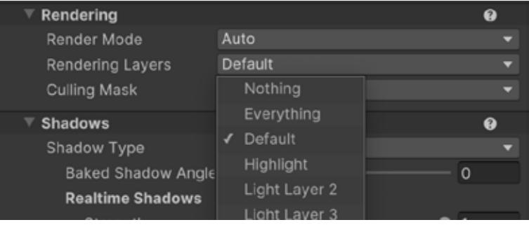


5. With Rendering Layers enabled, create a new light and set up a custom shadow layer. The new light can cast shadows from the scene's **Main Light** or from its own frustum.

| Shadows               |                                         | B   |
|-----------------------|-----------------------------------------|-----|
| Shadow Type           | Soft Shadows                            |     |
| Realtime Shadows      |                                         |     |
| Strength              |                                         | @ 1 |
| Bias                  | Use settings from Render Pipeline Asse▼ |     |
| Near Plane            |                                         | 0.1 |
| Soft Shadows Qua Low  |                                         | >   |
| Custom Shadow Lay ✔   |                                         |     |
| Layer                 | Default                                 | D   |
|                       | Nothing                                 |     |
| V Universal Additiona | Everything                              | (2) |
|                       | Default<br>V                            |     |
| A                     | Highlight                               |     |
|                       |                                         |     |
|                       | Light Layer 2                           |     |
|                       | Light Layer 3                           |     |

6. Lastly, select the object this applies to in the **Hierarchy** window and then set the **Rendering Layer Mask**.

| Additional Settings                     |                   |  |
|-----------------------------------------|-------------------|--|
| Motion Vectors                          | Per Object Motion |  |
| Dynamic Occlusion                       | V                 |  |
| Rendering Layer Mask Default, Highlight |                   |  |

This can also be dynamically set in code.

```
Renderer renderer = GetComponent<Renderer>();
int layerID = 1;
int mask = 1 << layerID;
renderer.renderingLayerMask = (uint)mask;
```
## <span id="page-57-0"></span>Light probes

As covered in the [light modes section](#page-47-0), you can combine baked and dynamic objects using Mixed Lighting Mode. When using Mixed Lighting Mode it's recommended to also add probes to your scene. With Unity 6 there are two options: light probes and the new Adaptive Probe Volumes (APV). The two options solve the same problem, namely allowing dynamic objects to move through a scene and be affected by global illumination.

A probe is simply a point in your scene. At design time the global illumination at this location is calculated. At run time, when rendering a frame, a URP shader that includes lighting calculations uses a blend of the nearest probes for global illumination values.

**Note:** Global illumination (GI) is a system that models how light bounces off surfaces onto other surfaces, to create indirect light, rather than being limited to just the light that hits a surface directly from a direct light source.

#### **Light probes**

[Light probe](https://docs.unity3d.com/6000.0/Documentation/Manual/LightProbes.html)s save the light data at a particular position within an environment when you bake the lighting by clicking **Generate Lighting** via **Window > Rendering > Lighting** panel. This ensures that the illumination of a dynamic object moving through an environment reflects the lighting levels used by the baked objects. In a dark area it will be dark, and in a lighter area it will be brighter. Sampling is per object so for large objects this can lead to lighting anomalies if an object extends from a dark to a light area. If this is a problem for your scene then consider using APVs, which are sampled per pixel (see the section on APVs later on in the guide).

**Note:** You'll need to ensure that active URP Asset has **Lighting > Light Probe System** set to **Light Probe Group** when using light probes:

| Lighting           |                        |   |
|--------------------|------------------------|---|
| Main Light         | Per Pixel              | P |
| Cast Shadows       | >                      |   |
| Shadow Resolution  | 2048                   |   |
| Light Probe System | V Light Probe Groups   |   |
| Additional Lights  | Adaptive Probe Volumes |   |
| Per Object Limit   | D                      | 4 |


Below, you can see the robot character inside and outside of the hangar in the FPS Sample: The Inspection.

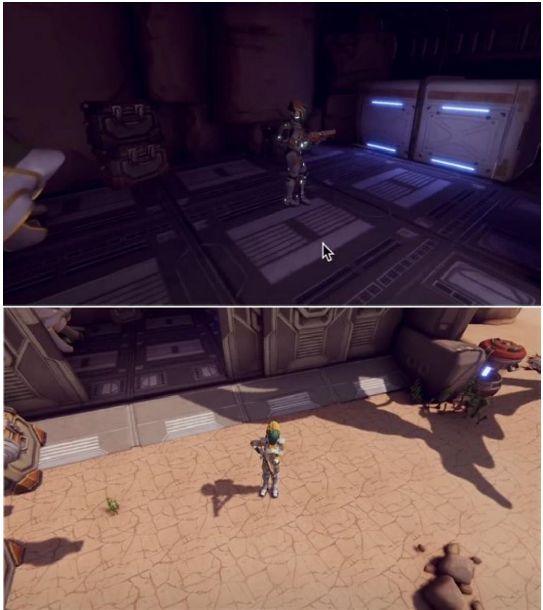

The robot inside and outside of the cave, with lighting level affected by light probes

To create light probes, right-click in the **Hierarchy** window and choose **GameObject > Light > Light Probe Group**.

| Light                            | > | Directional Light       |  |
|----------------------------------|---|-------------------------|--|
| Video                            | > | Point Light             |  |
| UI Toolkit                       | > | Spot Light              |  |
| Rendering                        | > | Area Light              |  |
| Spline                           | > |                         |  |
| Volume                           | > | Reflection Probe        |  |
| Camera                           |   | Adaptive Probe Volume   |  |
| Cinemachine                      | A | Probe Adjustment Volume |  |
| Visual Scripting Scene Variables |   | Light Probe Group       |  |

Creating a new GameObject for the Light Probe Group

Initially, there will be a cube of probes, eight in total. To view and edit the positioning of the probes and add additional ones, select the **Light Probe Group** in the **Hierarchy** window, and in the Scene view click **Tools > Edit Light Probes**. Be sure to activate the light probes gizmos.


Add or remove light probes and modify their position from the Inspector.


The Scene view will now be in an editing mode where only light probes can be selected. Use the Move tool to move them around.


Moving a light probe

Light probes should be positioned, first, in an area where a dynamic object might move to, and second, where there is a significant change in lighting level. When calculating the lighting level for an object, the engine finds a pyramid of the nearest light probes and uses those to determine an interpolated value for the illumination level.

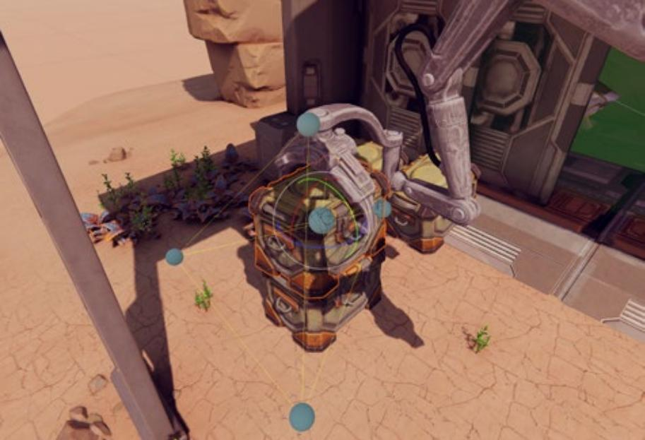

The nearest light probes for the selected crate

<span id="page-61-0"></span>

Positioning probes can be time-consuming, but a code-based approach such as [this one](https://docs.unity3d.com/6000.0/Documentation/Manual/LightProbes-Placing-Scripting.html?) can speed up your editing, especially for a large scene or for super quick placement switch to using APVs.

Creators often build modular content for their projects in scenes. These scenes are then repositioned at runtime in a "hub" scene. However, when building modular content including light probes, creators were unable to reposition these together with their Scene, because the positions of the probes were read-only. This issue is solved in Unity 6 with a [new API](https://docs.unity3d.com/6000.0/Documentation/ScriptReference/LightProbes.SetPositionsSelf.html) that allows the repositioning of light probes at runtime.

Further details on how a Mesh Renderer works with light probes and how to adjust the configuration can be found in [this documentation.](https://docs.unity3d.com/6000.0/Documentation/Manual/LightProbes-MeshRenderer.html)

## Adaptive Probe Volumes

Any technical artist who has carefully positioned light probes for a scene only to find the scene layout has changed will immediately see the benefits of Adaptive Probe Volumes (APVs). For many scenes you can now place all the probes in a matter of seconds. Let's look at a practical example using the [FPS Sample: The Inspection](https://github.com/NikLever/Unity6E-book) again. This example is found via **The Inspection > Scenes > APV-Example**

1. First make sure the active URP Asset has the **Light Probe System** option set to **Adaptive Probe Volumes**.


2. In the Hierarchy window right-click and select **GameObject > Light > Adaptive Probe Volume** (APV).

| Light                            | > | Directional Light       |
|----------------------------------|---|-------------------------|
| Video                            | > | Point Light             |
| Ul Toolkit                       | > | Spot Light              |
| Rendering                        | > | Area Light              |
| Spline                           | > |                         |
| Volume                           | > | Reflection Probe        |
| Camera                           |   | Adaptive Probe Volume   |
| Cinemachine                      | > | Probe Adjustment Volume |
| Visual Scripting Scene Variables |   | Light Probe Group       |


3. Set the Mode to **Global** and accept the default settings – Subdivisions of 1, 3, 9 and 27 meters.

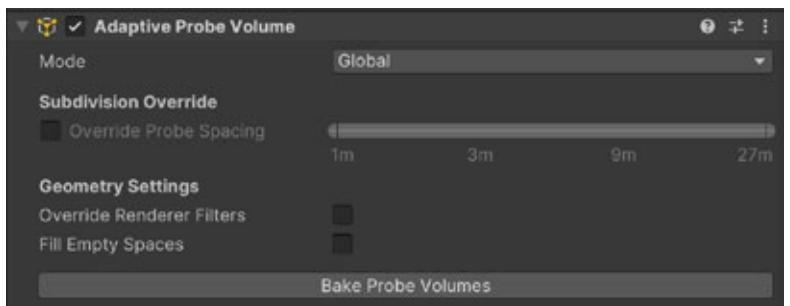

4. Bake the volume by pressing **Bake Probe Volumes**. The current scene is scanned and the probes are placed based on the geometry in the scene. Probes are at their densest where there is the most geometry.


5. To view the result of the bake open **Analysis > Rendering Debugger**. Select **Probe Volumes**  and select **Display Probes**. To view the different resolutions choose **Display Bricks**.

| C Console<br>Project | Render Graph Viewer        | Rendering Debugger | Project Settings | 0    |
|----------------------|----------------------------|--------------------|------------------|------|
|                      |                            |                    |                  | Rese |
| Frequently Used      | Subdivision Visualization  |                    |                  |      |
| Probe Volumes        | Display Cells              |                    |                  |      |
|                      | Display Bricks             |                    | V                |      |
| Rendering            | Debug Draw Distance        |                    | 500              |      |
| Material             | Subdivision Preview        |                    |                  |      |
|                      | Live Updates               |                    |                  |      |
| Lighting             | Probe Visualization        |                    |                  |      |
| GPU Resident Drawer  | Display Probes             |                    | A                |      |
| Render Graph         | Probe Shading Mode         |                    | SH               |      |
| Volume               | Debug Size                 |                    |                  | 0.73 |
|                      | Exposure Compensation      |                    | 0                |      |
|                      | Max Subdivisions Displayed |                    |                  | 3    |
|                      | Min Subdivisions Displayed |                    |                  | 0    |

For many scenes that would complete the job, and you can head off for a coffee break. But APVs provide much more fidelity. You can add multiple volumes with different subdivisions to have precise control over the placement and density of probes.

Take the oasis environment in the URP 3D Sample as an example. Imagine most of the action in the scene is around the tent and therefore, you want to place most of the probes around it. To achieve this you would:

1. Open **Rendering > Lighting > Adaptive Probe Volumes** and change **Max Probe Spacing** to 81m.

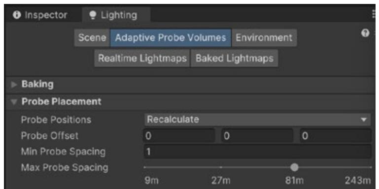

2. Add an **Adaptive Probe Volume** set as **Global** and set the **Override Probe Spacing** to 27m>81m.

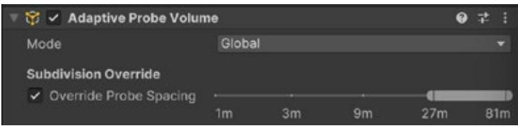

3. Add an Adaptive Probe Volume set as **Local** and set the **Override Probe Spacing** to 1m>9m. Set the Volume to be a bit bigger than the tent.

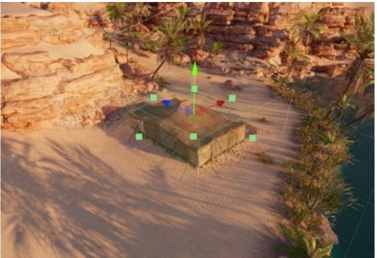

<span id="page-64-0"></span>

#### 4. Bake the Probe Volumes.

As you can see from the image below, most probes are around the tent.


Probe placement

#### **Lighting Scenario asset**

Another feature of Adaptive Probe Volumes is the ability to switch between indirect lighting data. A **Lighting Scenario** asset contains the baked lighting data for a scene or **[Baking Set](https://docs.unity3d.com/Packages/com.unity.render-pipelines.universal@17.0/manual/probevolumes-usebakingsets.html)**. You can bake different lighting setups into different Lighting Scenarios, and change which one URP uses at runtime or at design time using the Rendering Debugger.

| Project         | Console             | Rendering Debugger                           |       | 0 1   |
|-----------------|---------------------|----------------------------------------------|-------|-------|
|                 |                     |                                              |       | Reset |
| Frequently Used |                     | Display Probes                               |       |       |
| Probe Volumes   |                     | Debug Probe Sampling<br>Virtual Offset Debug |       |       |
| Rendering       |                     | Debug Draw Distance                          | 200   |       |
| Material        |                     | Probe Adjustment Volumes                     |       |       |
|                 |                     | Auto Display Probes                          | >     |       |
| Lighting        |                     | Isolate Affected                             | V     |       |
|                 | GPU Resident Drawer | Scenario Blending                            |       |       |
|                 |                     | Number Of Cells Blencied Per Frame           | 10000 |       |
| Render Graph    |                     | Turnover Rate                                | œ     | 0.1   |
| Volume          |                     | Scenario Blend Target                        | Night |       |
|                 |                     | Seanario Blandino Factor                     |       |       |

Scenario Blending using the Rendering Debugger


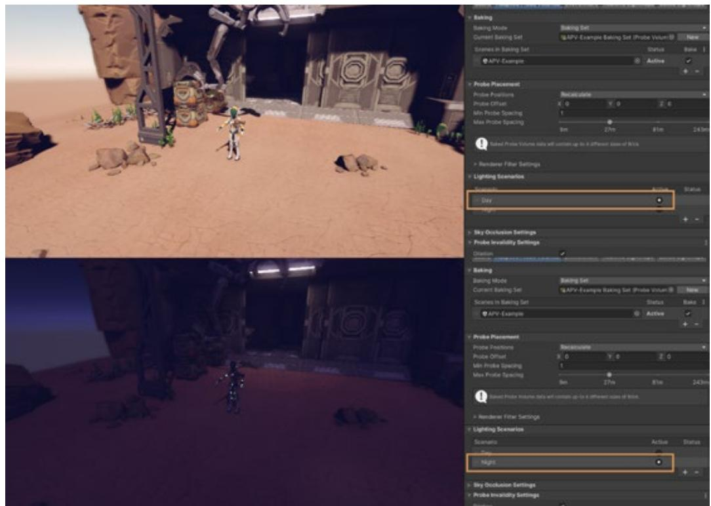

For example, you can create one Lighting Scenario for day, and another one for night. At runtime, you can switch or blend between the two.

Day/night Lighting Scenarios

1. To use a Lighting Scenario asset, go to the active URP Asset and enable **Lighting > Light Probe Lighting > Lighting Scenarios**.


- 2. To create a new Lighting Scenario asset so you can store baking results inside, do the following:
	- a. Open the **Adaptive Probe Volumes** panel in the **Lighting** window.
	- b. In the **Lighting Scenarios** section, select the **Add** (+) button to add a Lighting Scenario asset.

| V Lighting Scenarios |        |        |
|----------------------|--------|--------|
| Scenario             | Active | Status |
| Day                  |        |        |
| Night                |        |        |
|                      |        | +      |

3. In the **Lighting** window, under the **Adaptive Probe Volume** tab, make sure the **Probe Positions** are set to **Don't Recalculate**. This ensures that Unity will only rebake lighting without changing the probe positions, which could otherwise invalidate previously baked scenarios.

| @ Inspector                                            |                                          | @ Lighting |  |  |  |
|--------------------------------------------------------|------------------------------------------|------------|--|--|--|
|                                                        | Scene Adaptive Probe Volumes Environment |            |  |  |  |
|                                                        | Realtime Lightmaps Baked Lightmaps       |            |  |  |  |
| Baking                                                 |                                          |            |  |  |  |
| Probe Placement<br>Recalculate                         |                                          |            |  |  |  |
| Probe Positions<br>V Don't Recalculate<br>Probe Offset |                                          |            |  |  |  |
|                                                        | Min Probe Spacing 0.4                    |            |  |  |  |

- 4. To bake into a Lighting Scenario, follow these steps:
	- a. In the Lighting Scenarios section, select a Lighting Scenario to make it active.
	- b. Select **Generate Lighting**. URP stores the baking results in the active Lighting Scenario.
	- c. Use the dropdown button next to **Generate Lighting** to only focus on the probes if you're not using lightmaps.

| GPU Baking Profile | Automatic         |                        |
|--------------------|-------------------|------------------------|
|                    | Generate Lighting | Bake Probe Volumes     |
| Scenario Size      | 7.3 MB            | Bake Reflection Probes |
| Baking Set Size    | 18.6 MB           | Clear Baked Data       |

<span id="page-67-0"></span>

You can set which Lighting Scenario URP uses at runtime using the [ProbeReferenceVolume](https://docs.unity3d.com/Packages/com.unity.render-pipelines.universal@17.0/manual/probevolumes-bakedifferentlightingsetups.html) API.

#### **Note:**

If you change the active Lighting Scenarios at runtime, URP changes only the indirect lighting data in the light probes. You might still need to use scripts to move geometry, modify lights or change direct lighting.

#### **Fixing issues with Adaptive Probe Volumes**

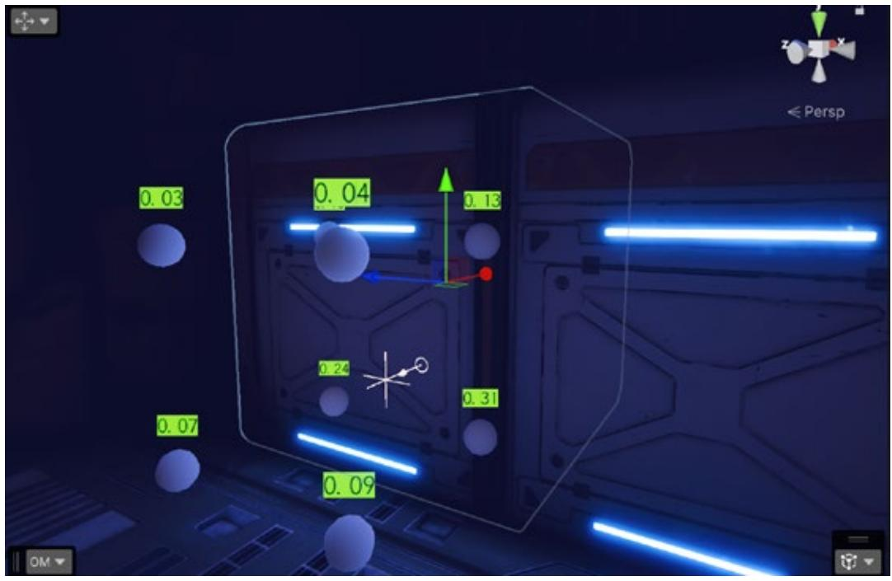

Debug Probe Sampling

To fix issues such as APV artifacts, use **Window > Analysis > Rendering Debugger > Probe Volumes > Debug Probe Sampling** to inspect probes and how they are sampled for a given pixel.

| Project            | Console<br>Rendering Debugger   |     | 0 :   |
|--------------------|---------------------------------|-----|-------|
|                    |                                 |     | Reset |
| Frequently Used    | Subdivision Visualization       |     |       |
| Probe Volumes      | Display Cells<br>Display Bricks |     |       |
| Rendering          | Debug Draw Distance             | 500 |       |
| Material           | Probe Visualization             |     |       |
| Lighting           | Display Probes                  |     |       |
|                    | Debug Probe Sampling            | >   |       |
| GPU Resident Drawe | Debug Size                      |     | 0.3   |

Visualizing Probe Sampling per pixel

Since light probes are added in a grid, placement can sometimes cause rendering errors such as dark areas where it should be light and vice versa. The Editor provides several tools to let a technical artist quickly fix these issues.

Light probes inside geometry are called invalid probes. URP marks a probe as invalid when it fires sampling rays to capture surrounding light data, but the rays hit the unlit backfaces inside geometry. The APV system has several tools to fix these issues.


The Probe Invalidity Settings available in the [Adaptive Probe Volumes panel](https://docs.unity3d.com/Packages/com.unity.render-pipelines.universal@17.0/manual/probevolumes-lighting-panel-reference.html)

**Virtual Offset** tries to make invalid light probes valid, by moving their capture points so they're outside any colliders. And **Dilation** detects light probes that remain invalid after Virtual Offset, and gives them data from valid probes nearby.

You can check which light probes are invalid using the **Rendering Debugger.**

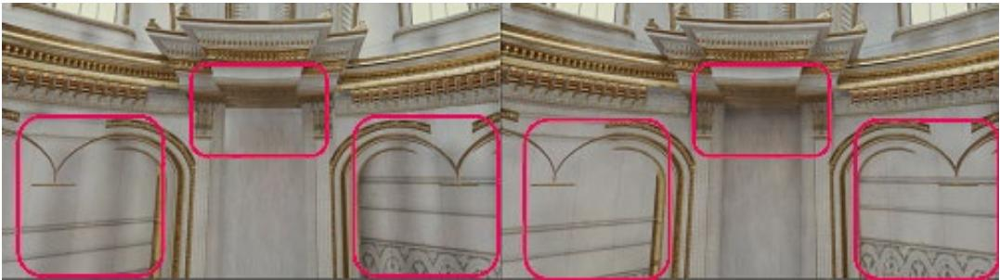

In the left-side scene in the image above, Virtual Offset isn't active and dark bands are visible. In the scene on the right side, Virtual Offset is active.

<span id="page-69-0"></span>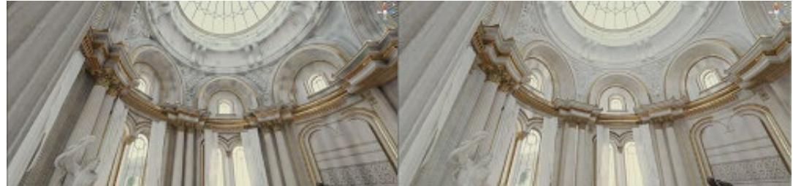

In the left-side scene in the image above, Dilation isn't active and some areas are too dark. In the scene on the right, Dilation is active.

#### **Light leaks**

Light leaks are areas that are too light or dark, often in the corners of a wall or ceiling.


A light leak

Light leaks often occur when geometry receives light from a light probe that isn't visible to the geometry, for example due to the light probe being on the other side of a wall. APVs use regular grids of light probes, so light probes might not follow walls or be at the boundary between different lighting areas.

Try the following techniques to fix light leaks:

- [Create thicker walls](https://docs.unity3d.com/Packages/com.unity.render-pipelines.universal@17.0/manual/probevolumes-fixissues.html#create-thicker-walls)[.](https://docs.unity3d.com/Packages/com.unity.render-pipelines.universal@17.0/manual/probevolumes-fixissues.html#create-thicker-walls)
- Add an [Adaptive Probe Volumes Options override](https://docs.unity3d.com/Packages/com.unity.render-pipelines.universal@17.0/manual/probevolumes-fixissues.html#add-an-adaptive-probe-volumes-options-override-to-your-scene) to your scene:

<span id="page-70-0"></span>

- Add a [Volume,](https://docs.unity3d.com/Packages/com.unity.render-pipelines.universal@17.0/manual/volumes-landing-page.html) then an **Adaptive Probe Volumes Options** override to the Volume. This adjusts the position that GameObjects use to sample the light probes.
- [Enable Rendering Layers](https://docs.unity3d.com/Packages/com.unity.render-pipelines.universal@17.0/manual/probevolumes-fixissues.html#layers):
	- In the Lighting window, configure the **Rendering Layer Masks** in the [Adaptive](https://docs.unity3d.com/Packages/com.unity.render-pipelines.universal@17.0/manual/probevolumes-lighting-panel-reference.html)  [Probe Volumes panel](https://docs.unity3d.com/Packages/com.unity.render-pipelines.universal@17.0/manual/probevolumes-lighting-panel-reference.html) to allow the APV to assign a Rendering Layer Mask to each light probe.
- [Adjust Baking Set properties](https://docs.unity3d.com/Packages/com.unity.render-pipelines.universal@17.0/manual/probevolumes-fixissues.html#probevolumesettings):
	- If adding a Volume doesn't work, use the [Adaptive Probe Volumes panel](https://docs.unity3d.com/Packages/com.unity.render-pipelines.universal@17.0/manual/probevolumes-lighting-panel-reference.html) in the Lighting window to adjust Virtual Offset and Dilation settings.
- [Use a Probe Adjustment Volume](https://docs.unity3d.com/Packages/com.unity.render-pipelines.universal@17.0/manual/probevolumes-fixissues.html#probevolumeadjustment) component:
	- Use this component to make light probes invalid in a small area. This triggers Dilation during baking, and improves the results of **Leak Reduction Mode** at runtime.

#### **Rendering Layers**

When switching the URP 3D Sample oasis environment from using light probes/lightmaps to using APV only, an issue arises with light leaks, which you can see on the bright roof and wall in the image below.


Light leaking in the tent in the oasis environment from the URP 3D Sample

This is because some pixels are blending between probes on the inside and outside of the tent. By using **Window > Analysis > Rendering Debugger > Probe Volumes > Debug Probe Sampling**, you can spot which probes are used when interpolating the value for a pixel.


Viewing the interpolated probes for a pixel

One option to fix this is to use a **Volume** to modify how APV is sampled at runtime using the **Adaptive Probe Volume Options** override. Use the **NormalBias** and **ViewBias** settings to adjust the sampling position:: NormalBias pushes it along the normal (away from walls), while ViewBias pushes it towards the camera (keeping it on the same side of the wall as the camera). When you change these properties in the Volume, you can see the updates in realtime in both the lighting results and the **Debug Probe Sampling View**, where the sampling position and weights are updated accordingly. But a better option is to use Rendering Layers.

APV supports [Rendering Layers](https://docs.unity3d.com/6000.0/Documentation/Manual/urp/features/rendering-layers-introduction.html), allowing you to create up to four different masks and restrict sampling to those specific masks for certain objects. This can be useful to prevent interior objects from sampling exterior probes, or vice versa. Activate and add them using **Window > Rendering > Lighting > Adaptive Probe Volumes > Rendering Layers**.

| Rendering Layers      |   |          |   |
|-----------------------|---|----------|---|
| Rendering Layer Masks | > |          |   |
| Exterior              |   | Default  | > |
| Interior              |   | Interior | P |
|                       |   |          | - |


You'll also need to add a layer via **Project Settings > Tags and Layers > Rendering Layers**:

| Tags and Layers<br>PARK RELEAR FLATURE FRANCE |          | 0 2 |
|-----------------------------------------------|----------|-----|
| > Layers                                      |          |     |
| T Rendering Layers                            |          |     |
| Layer O                                       | Default  |     |
| Layer 1                                       | Screen   |     |
| Layer 2                                       | Lamps    |     |
| Layer 3                                       | Interior |     |
|                                               |          | + = |

To implement this, edit the meshes themselves to ensure they are divided between the different areas you want to create. In this project, for example, the meshes are edited to separate the interior and exterior into multiple meshes. Once the meshes are split, assign the correct Rendering Layers to them, and specify which ones APV should use in the **Adaptive Probe Volume Tab**.

You don't need to assign layers to every object in the tent, only to those susceptible to leaking, like the walls or objects near the walls.

When generating lighting, the system will automatically assign layers to the probes during the bake process based on the nearby objects, eliminating the need to manually assign layers per probe. To facilitate this automatic probe assignment, you need to assign layers to larger objects. In the oasis environment tent example, the interior layer is assigned to the walls and ceiling of the tent to ensure that most of the interior probes hit them during baking and are automatically assigned to the interior mask. Probes are assigned to the layer they encounter most frequently.

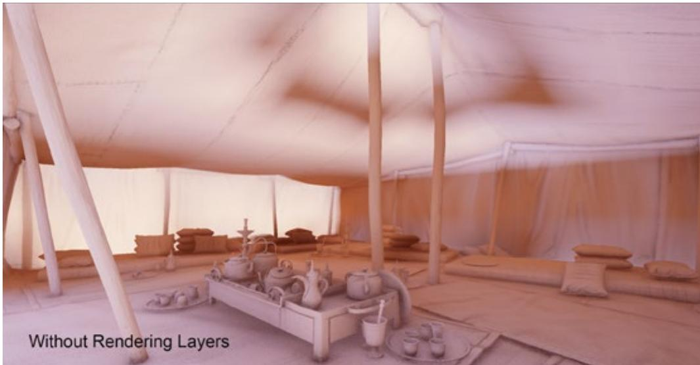

Once this is done, click **Generate Lighting** and observe that leaking is eliminated for the tent, thanks to the separate interior and exterior masks.

<span id="page-73-0"></span>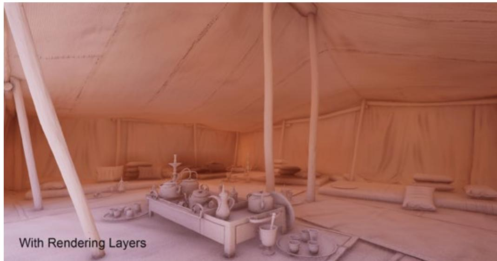

Light leaks without and with rendering layers

Get more information [here](https://docs.unity3d.com/Packages/com.unity.render-pipelines.universal@17.0/manual/probevolumes-fixissues.html) about fixing issues with APVs.

#### **Streaming APVs**

[APV streaming](https://docs.unity3d.com/Packages/com.unity.render-pipelines.universal@17.0/manual/probevolumes-streaming.html) enables you to use APV-based lighting in large worlds. APV streaming bakes APV data that's larger than the available CPU or GPU memory, and loads it at runtime when it's needed. At runtime, as the camera moves, URP loads only APV data from cells within the camera's view frustum.

You can enable and disable streaming for different URP quality levels. Enable streaming with the following steps:

- 1. Select **Edit > Project Settings > Quality** from the main menu.
- 2. Select a Quality Level.
- 3. Double-click the Render Pipeline Asset to open it in the Inspector.
- 4. Expand the Lighting tab.
- 5. You can now enable two types of streaming:
	- a. Enable Disk Streaming to stream from disk to CPU memory.
	- b. Enable GPU Streaming to stream from CPU memory to GPU memory. You must enable Enable Disk Streaming first.

<span id="page-74-0"></span>

| V Lighting                        |                        |   |
|-----------------------------------|------------------------|---|
| Main Light                        | Per Pixel              | D |
| Cast Shadows                      | 1                      |   |
| Shadow Resolution                 | 2048                   | D |
| Light Probe System                | Adaptive Probe Volumes | œ |
| Memory Budget                     | Memory Budget Medium   | P |
| SH Bands                          | Spherical Harmonics L1 | D |
| Enable GPU Streaming              | 1                      |   |
| Enable Disk Streaming             | 1                      |   |
| Enable Lighting Scenanios         | >                      |   |
| Enable Lighting Scenario Blending |                        |   |

You can configure streaming settings in the same window. Refer to the URP Asset for more information.

#### **Debug streaming**

The smallest section URP loads and uses is a cell, which is the same size as the largest brick in an APV. You can influence the size of cells in an APV by adjusting the density of light probes


Use the Rendering Debugger to view the cells in an APV or debug streaming.

APV Streaming

#### **Sky occlusion**

Sky occlusion is the process whereby if a GameObject samples a color from the sky, Unity will dim the color if the light can't reach the GameObject. Sky occlusion in Unity uses the sky color from the ambient probe, which updates at runtime. This means you can dynamically light GameObjects as the sky color changes. For example, you can change the sky color from light to dark to simulate the effect of a day-night cycle.


#### **Note:**

If you enable sky occlusion, APVs might take longer to bake, and Unity might use more memory at runtime.

When you [enable sky occlusion](https://docs.unity3d.com/Packages/com.unity.render-pipelines.universal@17.0/manual/probevolumes-skyocclusion.html), Unity bakes an additional static sky occlusion value into each probe in an APV. The sky occlusion value is the amount of indirect light the probe receives from the sky, including light that bounced off static GamesObjects.

The main benefit of using sky occlusion is you can modify the sky lighting at runtime.


Let's look at the series of images to the left to illustrate this:

- a. The top image shows the problem that occurs when you can't bake the sky lighting because you need it to change at runtime. In this image only an ambient probe is used with no baking resulting in a poor result.
- b. In the second to fifth images the ambient probe is used together with sky occlusion. You could also light this image with a regular APV bake, with sky occlusion disabled but then the lighting would not change at runtime.

An example of the results of using sky occlusion in a scene. The images are from the Unity Asset Store package [Azure\[Sky\] Dynamic Skybox](https://assetstore.unity.com/packages/tools/particles-effects/azure-sky-dynamic-skybox-36050) by 7stars.


Follow these steps to enable sky occlusion:

- 1. Enable the **Progressive GPU Lightmapper**. Unity doesn't support sky occlusion if you use Progressive CPU. Go to **Window > Rendering > Lighting**.
- 2. Go to the Scene panel.
- 3. Set Lightmapper to Progressive GPU.

| Lightmapping Settings |                 |  |
|-----------------------|-----------------|--|
| Lightmapper           | Progressive GPU |  |
| Importance Sampling   | V               |  |

- 4. Open the Adaptive Probe Volumes panel.
- 5. Enable Sky Occlusion.

| Sky Occlusion Settings |   |   |   |      |
|------------------------|---|---|---|------|
| Sky Occlusion          | V |   |   |      |
| Samples                |   |   | 0 | 2048 |
| Bounces                |   |   |   | 2    |
| Albedo Override        |   | 0 |   | 0.6  |
| Sky Direction          |   |   |   |      |

To update the lighting data, you must also bake the APV after you enable or disable sky occlusion. Once the sky occlusion is baked, the scene lighting will respond to the ambient probe updates. In URP, the ambient probe is updated in real-time only when using the Color or Gradient Mode, not the Skybox mode. This means you'll probably have to manually animate a color to match the animated sky visuals.

#### **Note:**

URP now supports per-vertex quality sampling for probes. This is especially useful to boost performance on lower-end devices. To set the sampling mode use the **URP Asset** in the Lighting section. **Advanced Properties** must be active to view the option; press the ellipsis at the top right of the Lighting panel to activate it. With Advanced Properties active, the **SH Evaluation Mode** dropdown will appear.

| V Auto     |
|------------|
| Per Vertex |
| Mixed      |
| Per Pixel  |
|            |

<span id="page-77-0"></span>

#### **More Information**

- Adaptive Probe Volumes [documentation.](https://docs.unity3d.com/Packages/com.unity.render-pipelines.universal@17.0/manual/probevolumes.html)
- GDC 2023 session: [Efficient and impactful lighting with Adaptive Probe Volumes](https://www.youtube.com/watch?v=iU7X5xICkc8)

#### **Light probes vs APVs**


Light Probe Groups in use in the top image, and APVs in the bottom image; images are from the Unity Asset Store package [ArchVizPRO](https://assetstore.unity.com/packages/3d/environments/industrial/archvizpro-photostudio-urp-225832)  [Photostudio URP](https://assetstore.unity.com/packages/3d/environments/industrial/archvizpro-photostudio-urp-225832) by ArchVizPro

<span id="page-78-0"></span>

The bottom image (shown above) shows how smoothly a transition from dark to light works with APV. In the top image, the Light Probe Group results in a bright light on the car door because a single interpolated probe is used per object. This is because the door is a separate GameObject to the rest of the door and uses a different probe, resulting in a rendering error.

The table below compares the features of light probes and APVs.

| Light Probe Groups                                                                                                                                                                             | Adaptive Probe Volumes                                                                                                                                                                |  |  |
|------------------------------------------------------------------------------------------------------------------------------------------------------------------------------------------------|---------------------------------------------------------------------------------------------------------------------------------------------------------------------------------------|--|--|
| Time-consuming to place probes and move<br>them if geometry changes                                                                                                                            | Fast to place and easy to update as<br>geometry changes                                                                                                                               |  |  |
| A single interpolated probe is used for<br>lighting objects:<br>—<br>Objects cannot transition well from<br>darkness to light and stand out.<br>—<br>It can cause problems for big<br>objects. | Each pixel is individually lit:<br>—<br>This ensures smooth transitions.<br>—<br>Volumetric effects work well using<br>APV because the APV grid is easy<br>to sample at any location. |  |  |
| Static objects are usually lit using light<br>maps. Only dynamic objects use probes.                                                                                                           | No need for lightmaps or lightmap UVs:<br>—<br>Use a single lighting solution for all<br>objects in a scene.<br>—<br>Light large worlds with a<br>constrained memory budget.          |  |  |
| Probes can be freely placed and moved at<br>runtime.                                                                                                                                           | Probes are placed in a grid structure and<br>cannot be moved at run time.                                                                                                             |  |  |
| Switch GI is not supported.                                                                                                                                                                    | The Lighting Scenario asset allows for<br>switching between different lighting, e.g.,<br>from day to night, turning a light on or off,<br>and so on.                                  |  |  |

## Reflection probes

A ray-tracing tool, such as Maya or Blender, can take the time to accurately calculate the values for each frame pixel of a reflective surface. This process takes far too long for a realtime renderer, which is why shortcuts are often used.

Reflections in a real-time renderer use environment maps (pre-rendered cubemaps). Unity supplies a default map using the SkyManager. Having a single map as the source of reflections from all locations in a scene can lead to unconvincing reflections. Take the example of the robot shown in this section. If the metal parts of this character always reflect the sky, then it will look very strange when inside the hangar where the sky is not visible. This is where reflection probes are helpful.


A [Reflection Probe component](https://docs.unity3d.com/6000.0/Documentation/Manual/ReflectionProbes.html?) is a pre-rendered cubemap placed at a key position in the scene. You can use several reflection probes in a single scene. As a dynamic object moves through the scene, it can select the nearest reflection probe and use that as the basis of its reflections. You can also set up the scene to blend between probes.

To add a Reflection Probe component, right-click the **Hierarchy** window and select **Light > Reflection Probe**.

| Light                            | > | Directional Light         |
|----------------------------------|---|---------------------------|
| Video                            | > | Point Light               |
| Ul Toolkit                       | > | Spot Light                |
| Rendering                        | > | Area Light                |
| Spline                           |   |                           |
| Volume                           |   | Reflection Probe          |
| Camera                           |   | Adaptive Probe Volume     |
| Cinemachine                      |   | > Probe Adjustment Volume |
| Visual Scripting Scene Variables |   | Light Probe Group         |

Adding a Reflection Probe component

Then position the probe and adjust its [settings](https://docs.unity3d.com/6000.0/Documentation/Manual/class-ReflectionProbe.html?). Once the probe is placed correctly and the settings are adjusted, click **Bake** to generate a cubemap.

| Cubemap Capture Settings |             |    |
|--------------------------|-------------|----|
| Resolution               | 128         |    |
| HDR                      | V           |    |
| Shadow Distance          | 100         |    |
| Clear Flags              | Skybox      |    |
| Background               |             | 00 |
| Culling Mask             | Everything  | œ  |
| Use Occlusion Culling    | V           |    |
| Clipping Planes          | 0.3<br>Near |    |
|                          | 1000<br>Far |    |
|                          |             |    |

Settings for the Reflection Probe component

<span id="page-80-0"></span>

The following image shows the two reflection probes used in FPS Sample: The Inspection, one inside the hangar and one outside.

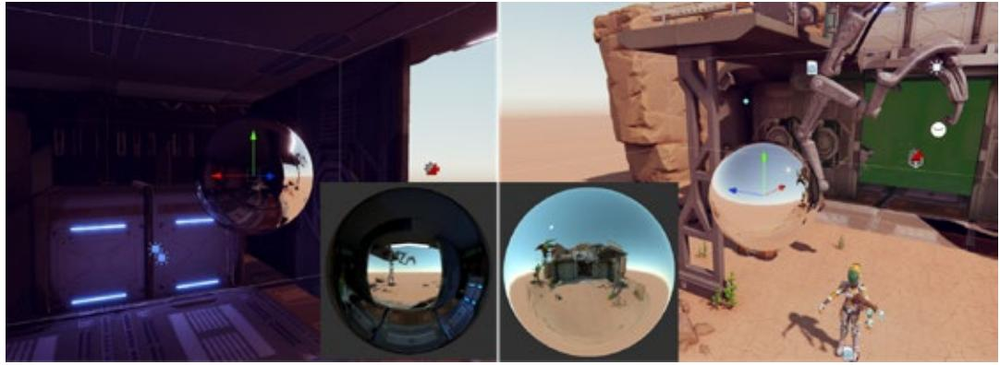

Each reflection probe captures an image of its surroundings in a cubemap texture.

#### **Reflection probe blending**

[Blending](https://docs.unity3d.com/Packages/com.unity.render-pipelines.universal@17.0/manual/lighting/reflection-probes.html#reflection-probe-blending?) is a great feature of reflection probes. You can enable blending via the **Renderer Asset Settings** panel. Blending is always on when the Forward+ path is chosen, regardless of the Renderer Asset setting.

Blending gradually fades out one probe's cubemap, while fading in the other as the reflective object passes from one zone to the other. This gradual transition prevents a moving object from suddenly acquiring completely different reflections when crossing the boundary between two reflection probes.

#### **Box Projection**

Normally, the reflection cubemap is assumed to be at an infinite distance from any given object. Different angles of the cubemap will be visible as the object turns, but it's not possible for the object to move closer or further away from the reflected surroundings. While this works well for outdoor scenes, its limitations show in an indoor scene. The interior walls of a room are clearly not an infinite distance away, and the reflection of a wall should get larger as the object nears it.

The [Box Projection](https://docs.unity3d.com/6000.0/Documentation/Manual/AdvancedRefProbe.html?) option enables you to create a reflection cubemap at a finite distance from the probe, allowing objects to show reflections of different sizes according to their distance from the cubemap's walls. The size of the surrounding cubemap is determined by the probe's zone of effect, depending on its Box Size property. For example, with a probe that reflects the interior of a room, you should set the size to match the dimensions of the room.

<span id="page-81-0"></span>

## Lens flares

If you're coming to URP from using the Built-In Render Pipeline the workflow for creating a [lens](https://docs.unity3d.com/Packages/com.unity.render-pipelines.universal@17.0/manual/shared/lens-flare/lens-flare-asset.html?)  [flare](https://docs.unity3d.com/Packages/com.unity.render-pipelines.universal@17.0/manual/shared/lens-flare/lens-flare-asset.html?) has been updated for URP. The first step in configuring it is to create a Lens Flare (SRP) Data asset. Right-click in the **Project** window, in a suitable Assets folder, and select **Create > Rendering > Lens Flare (SRP)**.

| Create<br>><br>Reveal in Finder<br>Open                                       |       | Folder<br>Material<br>MonoBehaviour Script      |                  | Type<br>Runtime Settings<br>Importance<br>Intensity   |
|-------------------------------------------------------------------------------|-------|-------------------------------------------------|------------------|-------------------------------------------------------|
| Delete<br>Rename<br>Copy Path                                                 | CHC   | 2D<br>Animation                                 | ><br>>           | Box Projection<br>Blend Distance                      |
| Open Scene Additive                                                           |       | Audio<br>Cinemachine                            | V<br>V           | Material<br>Material Variant                          |
| View in Package Manager                                                       |       | Rendering<br>Scene                              | ><br>>           | Lightmap Parameters<br>Lighting Settings              |
| Import New Asset<br>Import Package<br>Export Package                          | >     | Scripting<br>Search<br>Shader                   | ><br>><br>>      | Lens Flare<br>Render Texture<br>Custom Render Texture |
| Find References In Scene<br>Find References In Project<br>Select Dependencies |       | Shader Graph<br>Testing<br>Terrain<br>Text Core | ><br>><br>><br>A | Legacy Cubemap<br>Volume Profile<br>Lens Flare (SRP)  |
| Refresh                                                                       | ਡੀ ਕਿ | TextMeshPro                                     | 3                |                                                       |

Creating a Lens Flare (SRP) Data asset

Use this asset to configure the shape of your flare by setting **Type** as Circle, Polygon, or Image assets and adjusting the Tint and Intensity settings.

| Elements               |         | 4 |
|------------------------|---------|---|
| > > Lens Flare Element |         |   |
| Type                   | Circle  |   |
| Tint                   |         |   |
| Intensity              |         |   |
| Lens Flare Element     |         |   |
| Type                   | Polygon | D |
| Tint                   |         |   |
| Intensity              | 0.2     |   |
| Count                  | 5       |   |
| > > Lens Flare Element |         |   |
| Type                   | Image   | P |
| Tint                   |         |   |
| Intensity              |         |   |
| > < Lens Flare Element |         |   |
| Type                   | Image   |   |
| Tint                   |         |   |
| Intensity              | 0.19    |   |
|                        |         |   |
|                        |         |   |

Adding and configuring Lens Flare elements


To render a lens flare, choose the light source that will cause the flare and then select **Add Component > Rendering > Lens Flare (SRP)**.

|            | Add Component      |  |
|------------|--------------------|--|
| Q          |                    |  |
| €          | Rendering          |  |
| 2D         |                    |  |
| I Camera   |                    |  |
|            | Canvas Renderer    |  |
|            | Flare Layer        |  |
|            | C Lens Flare (SRP) |  |
| 9<br>Light |                    |  |
|            | Light Anchor       |  |

Setting up rendering for a lens flare

Select the Lens Flare Data Asset.

In the **Settings** panel for this component, assign the **Lens Flare Data asset** you created to the **Lens Flare Data property**.

| T & V Lens Flare (SRP)       |                                 | 2 |   |
|------------------------------|---------------------------------|---|---|
| General                      |                                 |   |   |
| Lens Flare Data              | LensFlare (Lens Flare Data SRP) |   | O |
| Intensity                    | 0.61                            |   |   |
| Scale                        | 1                               |   |   |
| Attenuation By Light Shape ✔ |                                 |   |   |
| Attenuation Distance         | 100                             |   |   |
| Attenuation Distance Cur     |                                 |   |   |
| Scale Distance               | 100                             |   |   |
| Scale Distance Curve         |                                 |   |   |
| Screen Attenuation Curve     |                                 |   |   |
| Occlusion                    |                                 |   |   |
| Enable                       |                                 |   |   |
| Allow Off Screen             |                                 |   |   |

Settings for the Lens Flare (SRP) component

If you use lens flares you'll find that the workflows for adding and adjusting them are very flexible.

<span id="page-83-0"></span>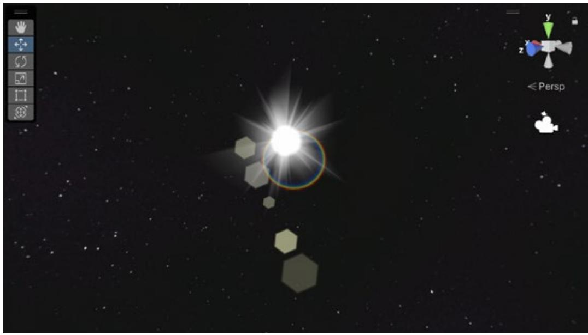

An example of a lens flare

## Screen space lens flare

Setting up lens flares for multiple lights can be time consuming. Unity 6 introduces a new post-processing technique, the Screen Space Lens Flare override (SSLF). This technique can generate flares from any bright surface, such as a bright specular highlight or an emissive mesh. In contrast, the lens flare (SRP) effect is limited to generating flares specifically from lights. Screen space lens flare uses a post-production technique.

Follow these steps to use SSLF:

1. Because SSLF is a post-processing filter you use a Volume component to apply it. Either add a Volume component to your scene or use the new Default Volume in Unity 6. Settings for the Default Volume are adjusted using **Edit > Project Settings > Graphics**.

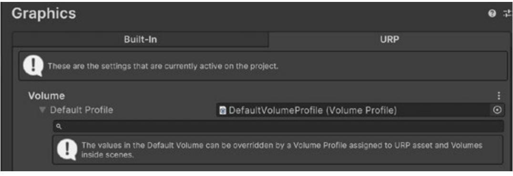


2. If using the Default Volume look for the Screen Space Lens Flare override in the settings panel.

| Graphics                  |   | 0 | 14 |
|---------------------------|---|---|----|
| Motion Blur<br>A          |   | 0 |    |
| P Panini Projection       |   | @ |    |
| T Screen Space Lens Flare |   | 0 |    |
| Intensity                 | 0 |   |    |
| Tint Color                |   |   |    |
| Bloom Mip Bias            |   |   |    |
| Flares                    |   |   |    |
| Regular Multiplier        |   |   |    |
| Reversed Multiplier       |   |   |    |
| Warped Multiplier         |   |   |    |

3. If using a scene Volume create a Volume Profile so you can add overrides. Then add the override via **Post-processing > Screen Space Lens Flare**.

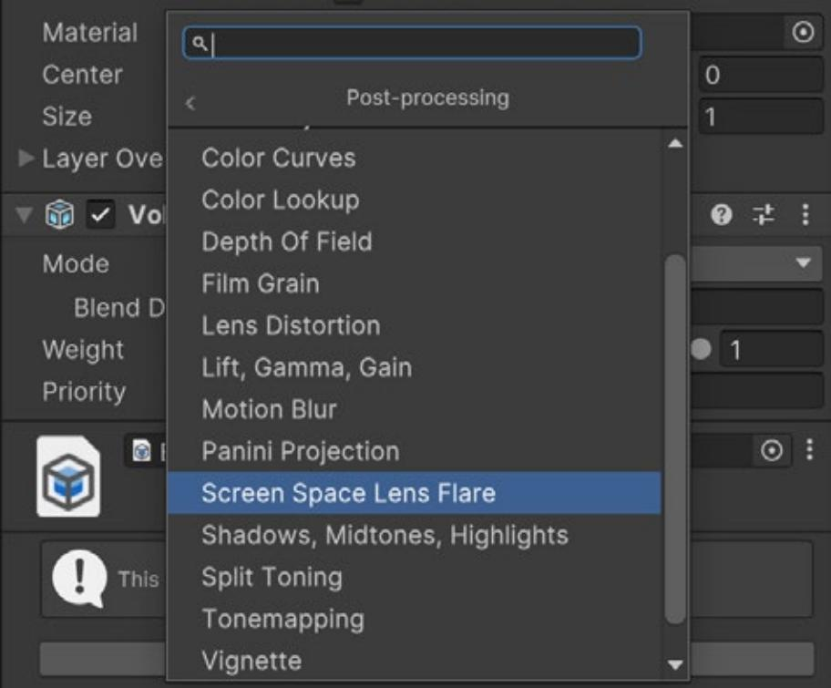

4. Now you can experiment with the settings to achieve the desired style for your scene. Keep in mind that intensity needs to be more than 0.

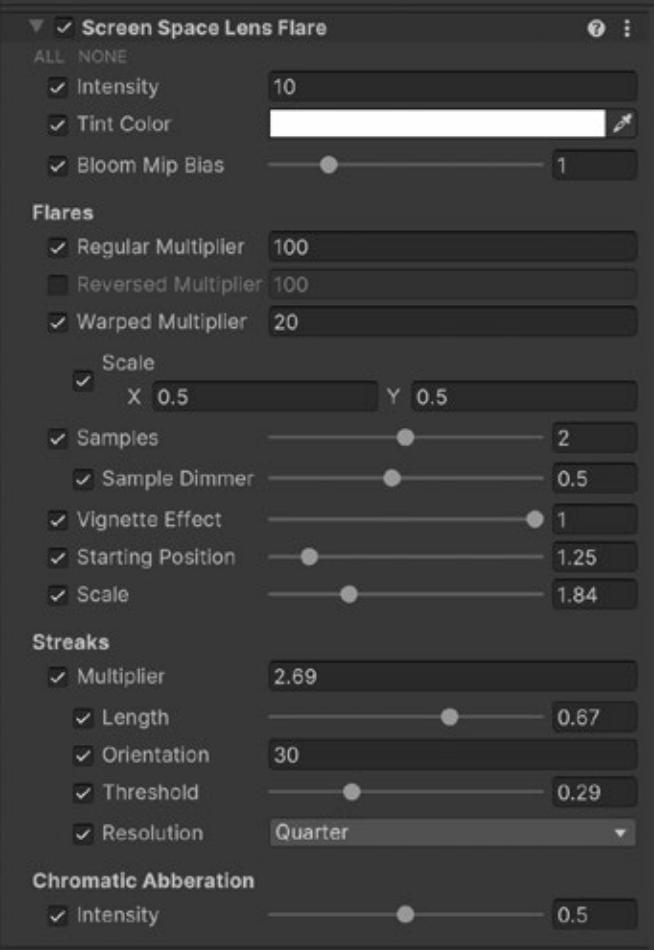

You can combine SSLF with a Lens Flare (SRP) component for more control.


Clockwise from top left: No SSLF; flares added; flares, warped flares, and streaks; flares and warped flares

## <span id="page-86-0"></span>Light halos

The **Draw Halo** property is not available for lights in URP, but it's easily mimicked with a billboard. Another option is to set the alpha transparency of a sphere. The first image below shows the Shader Graph for such a shader, and the second image depicts the result. For more information on using Shader Graph to create this shader, see the [Additional tools chapter](#page-137-0).

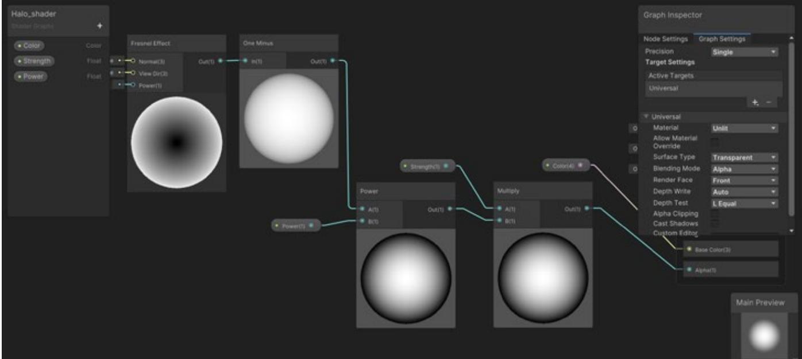

Fresnel transparency using Shader Graph


A halo effect that uses a sphere with a material using the Shader Graph shader from above

## <span id="page-87-0"></span>Screen Space Ambient Occlusion

Since ambient light does not consider geometry by default, high levels of ambient light can lead to unconvincing renders. In the real world, a narrow gap between two objects is likely to be darker than a much wider gap. Ambient occlusion can help deal with this issue in your Unity project. To use it with URP, select the Renderer that the URP Asset is using. Go to **Add Renderer Feature** and choose **[Screen Space Ambient Occlusion](https://docs.unity3d.com/Packages/com.unity.render-pipelines.universal@17.0/manual/post-processing-ssao.html?)** (SSAO).

| Renderer Features          |                                |
|----------------------------|--------------------------------|
| No Renderer Features added |                                |
|                            | Add Renderer Feature           |
|                            | Render Objects (Experimental)  |
|                            | Decal                          |
|                            | Screen Space Ambient Occlusion |
|                            | Screen Space Shadows           |
|                            | Blit Material Feature          |
|                            | Simple Desaturate Feature      |

Choosing SSAO from the Add Renderer Feature

Either use the default SSAO settings or adjust as needed:

| T / Screen Space Ambient Occlusion |               | 2    |   |
|------------------------------------|---------------|------|---|
| Method                             | Blue Noise    |      | œ |
| Intensity                          | 0.4           |      |   |
| Radius                             | 0.3           |      |   |
| Falloff Distance                   | 100           |      |   |
| Direct Lighting Strength           |               | 0.25 |   |
| Quality                            |               |      |   |
| Source                             | Depth Normals |      | œ |
| Normal Quality                     | Medium        |      | 1 |
| Downsample                         |               |      |   |
| After Opaque                       |               |      |   |
| Blur Quality                       | High          |      |   |
| Samples                            | Medium        |      | P |

The SSAO settings

Let's look at the SSAO properties.

- **Method**: This property defines the type of noise the SSAO effect uses.
- **Intensity**: This property defines the intensity of the darkening effect.
- **Radius**: When Unity calculates the ambient occlusion value, the SSAO effect takes samples of the normal texture within this radius from the current pixel. A lower Radius value improves performance because the SSAO Renderer Feature samples pixels closer to the source pixel.


- **Falloff Distance:** SSAO does not apply to objects farther than this distance from the Camera. A lower value increases performance in scenes that contain many distant objects.
- **Direct Lighting Strength:** This property defines how visible the effect is in areas exposed to direct lighting.
- **Quality**: For details about these quality settings, check the [documentation](https://docs.unity3d.com/Packages/com.unity.render-pipelines.universal@17.0/manual/post-processing-ssao.html?q=SSAO)
	- Source
	- Downsample
	- After Opaque
	- Blur Quality
	- Samples


A scene with only an ambient occlusion texture demonstrating a varying falloff distance

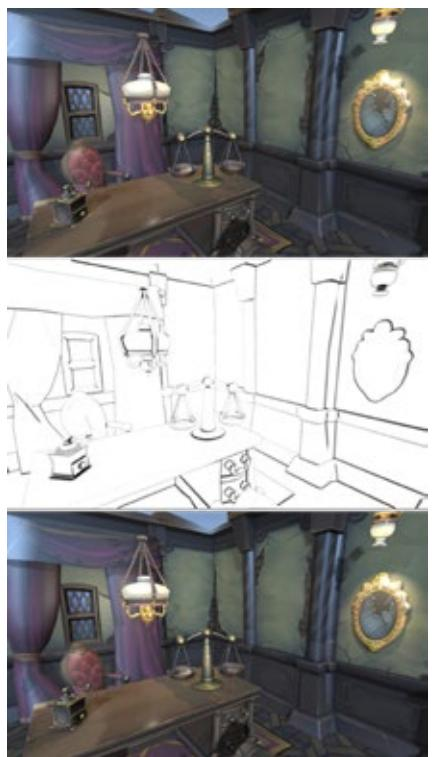

SSAO adds shading to narrow gaps. Let's look at the three images to the left:

The top image has no SSAO. The middle image shows the calculated SSAO, while the bottom image shows the result of SSAO. Notice that the grinder and scales have a stronger edge where they meet the desk.

SSAO is a post-processing technique the details of which are covered [later](#page-86-0) in this guide.

The haunted room in three versions: At the top, with no SSAO, in the middle, with SSAO applied, and at the bottom, rendered with SSAO

<span id="page-89-0"></span>

## Decals

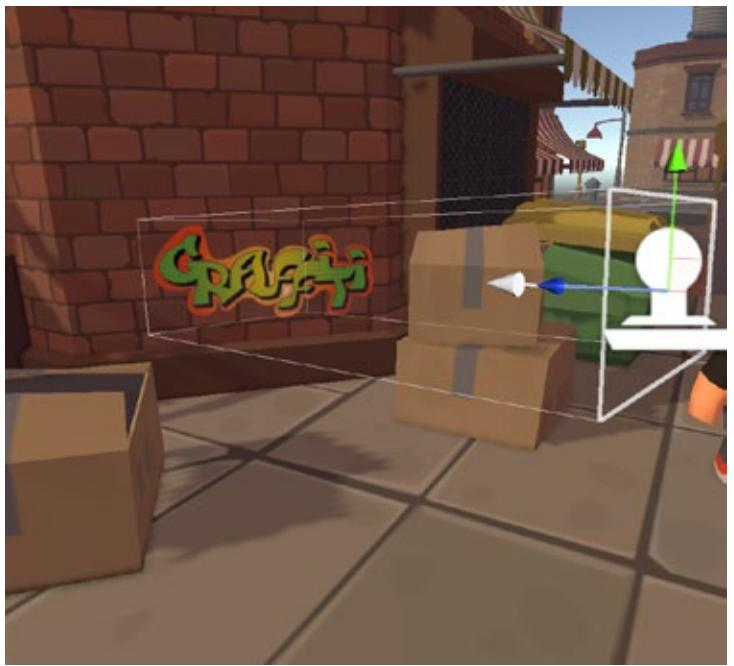

A Decal Projector

The Decal Projector component provides you with a great way of adding detail to a mesh. Use them for elements such as bullet holes, footsteps, signage, cracks, and more. Because they use a projection framework, they conform to an uneven or curved surface. To use a Decal Projector with URP, you need to locate your Renderer Data asset and add the **Decal Renderer Feature**.

| Renderer Features |                                    |   |  |
|-------------------|------------------------------------|---|--|
|                   | > > Screen Space Ambient Occlusion | C |  |
|                   | Add Renderer Feature               |   |  |
|                   | ರ                                  |   |  |
|                   | Renderer Features                  |   |  |
|                   | Full Screen Pass Renderer Feature  |   |  |
|                   | Render Objects (Experimental)      |   |  |
|                   | Decal                              |   |  |
| Asset Labels      | Screen Space Shadows               |   |  |

Adding the Decal Renderer Feature

For most purposes, you can accept the [default settings](https://docs.unity3d.com/Packages/com.unity.render-pipelines.universal@17.0/manual/renderer-feature-decal.html).

Now your scene is ready for decals. Create a decal by right-clicking in the Hierarchy view and selecting **Rendering > URP Decal Projector.** By default, the projector uses the material Decal, which will project a white square onto a surface. Use the usual tools to position and orientate the projector. Adjust the **Width**, **Height**, and **Projection Depth** in the Inspector.


To customize the decal, create a material using the **Shader Graph > Decal** shader. Then assign it to the URP Decal Projector.

| 1 / URP Decal Projector | <br>14                    |        |          |  |  |  |  |
|-------------------------|---------------------------|--------|----------|--|--|--|--|
|                         | 2 = 4                     |        |          |  |  |  |  |
|                         | Decal Scene Editing Mode: |        |          |  |  |  |  |
| Scale Mode              | Scale Invariant<br>2.38   |        |          |  |  |  |  |
| Width                   |                           |        |          |  |  |  |  |
| Height                  | 1.15<br>1                 |        |          |  |  |  |  |
| Projection Depth        |                           |        |          |  |  |  |  |
| Pivot                   | X<br>0                    | Y O    | N<br>0.5 |  |  |  |  |
| Material                | GrafittiMat               |        | O        |  |  |  |  |
| Rendering Layers        | TDe ault                  |        |          |  |  |  |  |
| Tilling                 | ×<br>1                    | Y<br>1 |          |  |  |  |  |
| Offset                  | ×<br>0                    | Y<br>0 |          |  |  |  |  |
| Opacity                 |                           |        | 1        |  |  |  |  |
| Draw Distance           | 1000                      |        |          |  |  |  |  |
| Start Fade              |                           |        | 0.9      |  |  |  |  |
| Angle Fade              |                           |        | 6 8      |  |  |  |  |

Decal Projector component settings

The Inspector for a Decal Projector includes three **Editing Mode** buttons: Scale, Crop, and Pivot/UV, which you can read about [here](https://docs.unity3d.com/Packages/com.unity.render-pipelines.universal@17.0/manual/renderer-feature-decal.html).

By default, the projector will affect any surface within its frustum. The Decal Renderer Feature includes the setting **Use Rendering Layers**. Enable this to facilitate targeting specific meshes.

| V v Decal            |           | 0 | 2 |
|----------------------|-----------|---|---|
| Technique            | Automatic |   | > |
| Max Draw Distance    | 1000      |   |   |
| Use Rendering Layers |           |   |   |

Decal Renderer Feature settings

Refer back to the [Rendering Layers](#page-53-0) section to learn about setting up and using this rendering option. Here are the steps to set up a decal:

- 1. Use **Edit > Project Settings … > Tags and Layers > Rendering Layers** to name a Rendering Layer.
- 2. Select the mesh/meshes that you want to receive the projector. In the Inspector, find **Mesh Renderer > Additional Settings > Rendering Layer Mask**, and add the named Rendering Layer to the mask.

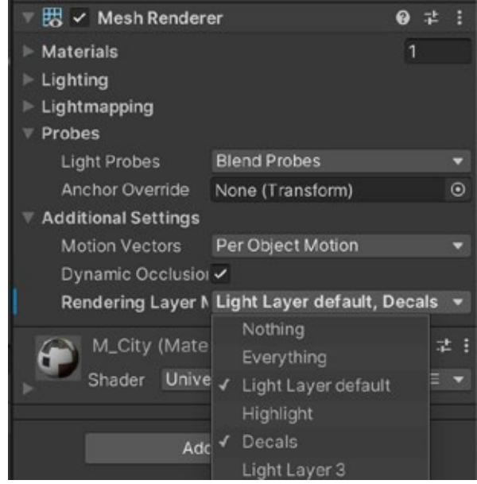

Adding Rendering Layer to the Mesh Renderer Rendering Layer Mask

3. Select the URP Decal Projector and in the Inspector, select the named Rendering Layer for the Rendering Layers property.

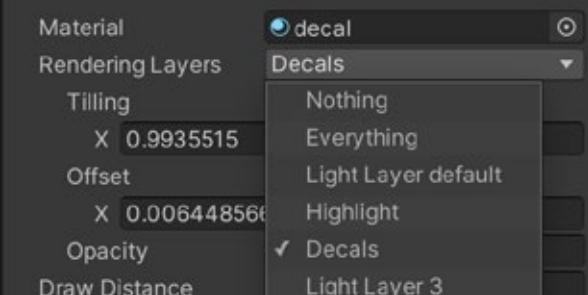

The image below shows the scene with and without a decal, and with a wall projection limited by using Rendering Layers.

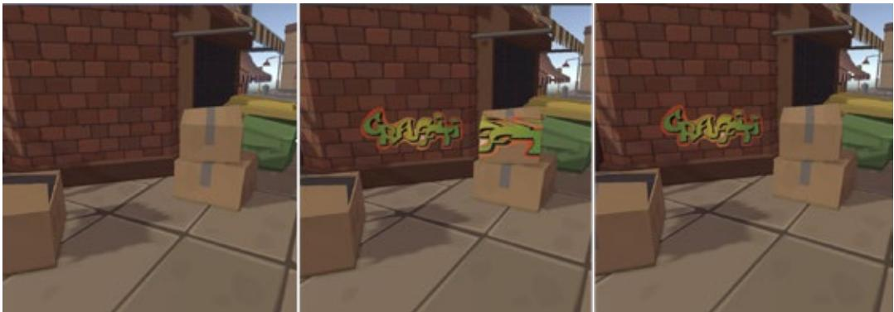

From left to right: No decal in the image, the decal hitting all objects, and the decal applied to the wall only using Rendering Layers

## <span id="page-92-0"></span>Shaders

This section is for users who want to convert an existing custom shader to work with URP and/or want to write a custom shader in code without using Shader Graph. It provides the information required to port both basic and advanced shaders to URP from the Built-In Render Pipeline. The tables included show helpful samples of available HLSL shader functions, macros, and so on. In each case, a link is provided to the relevant include containing many other useful functions.

For those who already have experience coding shaders, the includes provide you with a clear idea of what's available in HLSL to write compact and efficient shaders. After considering the information here, hopefully porting your shaders to URP won't seem so daunting.

Another approach is to use Shader Graph to create versions of your custom shaders. An introduction to Shader Graph is provided in the [Additional tools](#page-137-1) section.

## <span id="page-93-0"></span>Comparing URP and Built-In Render Pipeline shaders

URP shaders use the [ShaderLab](https://docs.unity3d.com/6000.0/Documentation/Manual/SL-Reference.html?) structure, as seen in the code snippet below. As such, Property, SubShader, Tags, and Pass will all be familiar to shader coders.


The basic structure of a SubShader block

The first thing to notice is that a URP shader uses the key-value pair "RenderPipeline" = "UniversalPipeline" in the SubShader tag.

A SubShader tag with the name RenderPipeline tells Unity which render pipelines to use this SubShader with. The value of UniversalPipeline indicates that Unity should use this SubShader with URP.

Looking at the render pass code, you'll see the shader code contained between the HLSLPROGRAM / ENDHLSL macros. For URP, the shader code inside those passes is written in HLSL.

Unity will use the first SubShader block that is supported on the GPU. If the first SubShader block doesn't have a "RenderPipeline" = "UniversalPipeline" tag, it won't run in the URP. Instead, Unity will try to run the next SubShader, if any. If none of the SubShaders are supported, Unity will render the well-known magenta error shader.

### Custom shaders

If you start creating a custom shader by using **Create > Shader > Unlit Shader** you'll get a template intended for the Built-In Render Pipeline. It will use code that makes it incompatible with the SRP Batcher. Why does this happen? For most purposes developers will find using [Shader Graph](https://docs.unity3d.com/Packages/com.unity.shadergraph@17.0/manual/index.html) a more convenient route for custom shaders for the URP. However, many developers will have shaders that they have created over many years using Unity and will want to know how best to use these with the URP. This section will point you in the right direction using five examples. If you want to view the scene in the Editor it is available via **Shaders > Shaders** in the examples [repo](https://github.com/NikLever/Unity6E-book) mentioned earlier. For more information checkout the [documentation.](https://docs.unity3d.com/Packages/com.unity.render-pipelines.universal@17.0/manual/writing-custom-shaders-urp.html)

<span id="page-94-0"></span>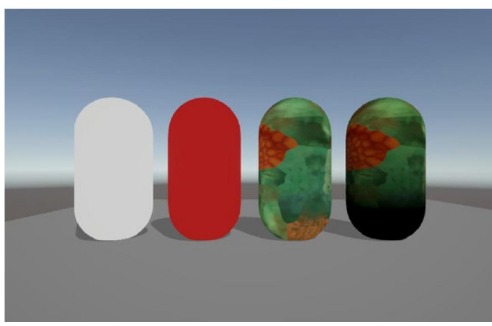

Shaders in URP, from the left: Unlit hard coded white; unlit using property to set color; unlit using a texture; simple Lambert lighting using the Main Light - floor; for more information on how to access and use shadows, see the "Shadows" section further down

#### **Unlit**

Let's unpack the simplest of shaders, a [basic unlit example:](https://docs.unity3d.com/Packages/com.unity.render-pipelines.universal@17.0/manual/writing-shaders-urp-basic-unlit-structure.html)

- Every visible pixel using this shader will be set to the same color.
- **Properties** are empty because the color is hard set.
- In **Tags** the **RenderType** is set to **Opaque** and **RenderPipeline** is set to **UniversalPipeline**. The #include to use is **Core.hlsl** which contains a large number of useful functions and macros.
	- If you're familiar with Built-In shaders then this serves a similar purpose to UnityCG.cginc. The function TransformObjectToHClip is found in the Core.hlsl include. The purpose of this function is to convert Object Space to [Homogenous](https://en.wikipedia.org/wiki/Homogeneous_coordinates) Space.
- The vertex shader vert simply sets the positionHCS value of the **Varyings** struct that is passed to the fragment shader frag.
- HLSL uses [semantics](https://learn.microsoft.com/en-us/windows/win32/direct3dhlsl/dx-graphics-hlsl-semantics) for all values passed between shader stages. A semantic is a string attached to a shader input or output that conveys information about the intended use of a parameter.
	- For example, with **Attributes** positionOS, the semantic is POSITION. When compiling POSITION in a vertex shader is the position in Object Space for a vertex.


The fragment shader simply returns white resulting in the white capsule on the left in the image above.

```
Shader "CustomURP/Unlit"
{
 Properties
 { }
 SubShader
 {
 Tags { "RenderType" = "Opaque" "RenderPipeline" = "UniversalPipeline" }
 Pass
 {
 HLSLPROGRAM

 #pragma vertex vert
 #pragma fragment frag
 #include "Packages/com.unity.render-pipelines.universal/ShaderLibrary/Core.hlsl"
 struct Attributes
 {
 float4 positionOS : POSITION;
 };
 struct Varyings
 {
 float4 positionHCS : SV_POSITION;
 };
 Varyings vert(Attributes IN)
 {
 Varyings OUT;
 OUT.positionHCS = TransformObjectToHClip(IN.positionOS.xyz);
 return OUT;
 }
 half4 frag() : SV_Target
 {
 half4 customColor = half4(1, 1, 1, 1);
 return customColor;
 }

 ENDHLSL
 }
 }
}
```
<span id="page-96-0"></span>

#### **Unlit Color**

- For the second shader example, unlit color, you'll need to include a [property](https://docs.unity3d.com/6000.0/Documentation/Manual/SL-Properties.html) to set the color.Use an attribute, [MainColor]; this is optional but helps inform Unity how to use the property. The name of the property is \_BaseColor, the name in the Inspector is **Base Color** and the type is a Color.
- Shader variables with URP must be compatible with SRP Batcher. In this example compatibility is achieved by declaring them inside two macros CBUFFER\_ START(UnityPerMaterial) and CBUFFER\_END (described as a CBUFFER block).
- Now the fragment shader returns the value of \_BaseColor.

```
Shader "CustomURP/UnlitColor"
{
 Properties
 { 
 [MainColor] _BaseColor("Base Color", Color) = (1, 1, 1, 1)
 }
 SubShader
 {
 Tags { "RenderType" = "Opaque" "RenderPipeline" = "UniversalPipeline" }
 Pass
 {
 HLSLPROGRAM
 #pragma vertex vert
 #pragma fragment frag
 #include "Packages/com.unity.render-pipelines.universal/ShaderLibrary/Core.hlsl"
 struct Attributes
 {
 float4 positionOS : POSITION;
 };
 struct Varyings
 {
 float4 positionHCS : SV_POSITION;
 };
 CBUFFER_START(UnityPerMaterial)
 half4 _BaseColor;
 CBUFFER_END
 Varyings vert(Attributes IN)
 {
 Varyings OUT;
 OUT.positionHCS = TransformObjectToHClip (IN.positionOS.xyz);
 return OUT;
 }
```
<span id="page-97-0"></span>

|   | half4 frag() : SV_Target |
|---|--------------------------|
|   | {                        |
|   | return _BaseColor;       |
|   | }                        |
|   | ENDHLSL                  |
| } |                          |
| } |                          |
| } |                          |
|   |                          |

To confirm if the shader is SRP Batcher compatible, select the shader and check the Inspector which will indicate if the shader is SRP Batcher compatible.

| Custom URP/Unlit (Shader) |                           |
|---------------------------|---------------------------|
| Surface shader            | no                        |
| Fixed function            | no                        |
| Preprocess only           |                           |
| Compiled code             | Compile and show code   ▼ |
| Cast shadows              | no                        |
| Render queue              | 2000                      |
| LOD                       | 0                         |
| Ignore projector          | no                        |
| Disable batching          | no                        |
| Keywords                  |                           |
| SRP Batcher               | compatible                |

The shader's Inspector will indicate if it's compatible with the SRP Batcher.

#### **Unlit Textured**

The third example in the image uses a texture.

- The shader has a property named \_BaseMap, (in the Inspector it's called **Base Map**) that uses the attribute [MainTexture]and the type 2D.
- To use a texture you need interpolated UV values passing from the vertex to the fragment shader. You add a float2, uv, with semantic TEXCOORD0, to both the Attributes and the Varyings structs.
- Just before the CBUFFER block, add two macros: TEXTURE2D which takes the property \_BaseMap, and SAMPLER(sampler\_BaseMap).


- For tiling and offset to work you need a float4 defining that uses the name of the 2D property with the suffix \_ST. This is essential when using the macro TRANSFORM\_TEX, which is used by the vertex shader. The macro takes the vertex UV value, in this example IN.uv, and a 2D property that has been declared using the TEXTURE2D macro. It ensures tiling and offsets are supported.
- The fragment shader uses the macro SAMPLE\_TEXTURE2D. This takes three parameters – a Texture2D, a sampler, and the UV value, and returns a color value. This value is returned in the frag method.

```
Shader "CustomURP/UnlitTexture"
{
 Properties
 { 
 [MainColor] _BaseColor("Base Color", Color) = (1, 1, 1, 1)
 [MainTexture] _BaseMap("Base Map", 2D) = "white" {}
 }
 SubShader
 {
 Tags { "RenderType" = "Opaque" "RenderPipeline" = "UniversalPipeline" }
 Pass
 {
 HLSLPROGRAM
 #pragma vertex vert
 #pragma fragment frag
 #include "Packages/com.unity.render-pipelines.universal/ShaderLibrary/Core.hlsl"
 struct Attributes
 {
 float4 positionOS : POSITION;
 float2 uv : TEXCOORD0;
 };
 struct Varyings
 {
 float4 positionHCS : SV_POSITION;
 float2 uv : TEXCOORD0;
 };
 TEXTURE2D(_BaseMap);
 SAMPLER(sampler_BaseMap);
 CBUFFER_START(UnityPerMaterial)
 half4 _BaseColor;
 float4 _BaseMap_ST;
 CBUFFER_END
 Varyings vert(Attributes IN)
 {
```

```
 Varyings OUT;
 OUT.positionHCS = TransformObjectToHClip (IN.positionOS.xyz);
 OUT.uv = TRANSFORM_TEX(IN.uv, _BaseMap);
 return OUT;
 }
 half4 frag(Varyings IN) : SV_Target
 {
 half4 color = SAMPLE_TEXTURE2D(_BaseMap, sampler_Base Map, IN.uv);
 return color;
 }
 ENDHLSL
 }
 }
}
```
#### **Lit Simple**

- To use [lighting in a URP shader](https://docs.unity3d.com/Packages/com.unity.render-pipelines.universal@17.0/manual/use-built-in-shader-methods-lighting.html) add the include **Lighting.hlsl**, which is in the same folder as **Core.hlsl**.
- This example shader uses the main light the directional light with the greatest intensity. It also uses the Lambert technique, calculating at the vertex level and using the interpolated value in the fragment shader. Therefore, you need to update the Varyings struct adding a half3 lightAmount with semantic TEXCOORD2.
- The vertex shader has a VertexNormalInputs using the function GetVertexNormalInputs. This function takes a normal in object space and converts it to world space.
	- For a centered object you can use the object space position as a proxy to the normal. VertexNormalInputs is a struct containing a float4 value, normalWS.
- You get details of the main light using the function GetMainLight. This returns a Light struct containing, amongst other data, the light color and direction.
- Finally, in the vert function, you use the function LightingLambert to return the lighting at the current vertex. The LightingLambert function takes three parameters – light color, light direction, and a world space normal. At this point you have all the necessary data to call the function. It returns a half3.
- The fragment shader uses the macro SAMPLE\_TEXTURE2D. This takes three parameters – a Texture2D, a sampler, and a float2 value, uv. You multiply this by the lightAmount after bouncing this up to a half4 by adding an additional w value set to 1.


```
Shader "CustomURP/LitSimple"
{
 Properties
 { 
 [MainColor] _BaseColor("Base Color", Color) = (1, 1, 1, 1)
 [MainTexture] _BaseMap("Base Map", 2D) = "white" {}
 }
 SubShader
 {
 Tags { "RenderType" = "Opaque" "RenderPipeline" = "UniversalPipeline" }
 Pass
 {
 HLSLPROGRAM
 #pragma vertex vert
 #pragma fragment frag
 #include "Packages/com.unity.render-pipelines.universal/ShaderLibrary/Core.hlsl"
 #include "Packages/com.unity.render-pipelines.universal/ShaderLibrary/Lighting.hlsl"
 struct Attributes
 {
 float4 positionOS : POSITION;
 float2 uv : TEXCOORD0;
 };
 struct Varyings
 {
 float4 positionHCS : SV_POSITION;
 float2 uv : TEXCOORD0;
 half3 lightAmount : TEXCOORD2;
 };
 TEXTURE2D(_BaseMap);
 SAMPLER(sampler_BaseMap);
 CBUFFER_START(UnityPerMaterial)
 half4 _BaseColor;
 float4 _BaseMap_ST;
 CBUFFER_END
 Varyings vert(Attributes IN)
 {
 Varyings OUT;
 OUT.positionHCS = TransformObjectToHClip(IN.positionOS.xyz);
 OUT.uv = TRANSFORM_TEX(IN.uv, _BaseMap);
 VertexNormalInputs positions =
 GetVertexNormalInputs(IN.positionOS);
 Light light = GetMainLight();
```
<span id="page-101-0"></span>

 } }

```
 OUT.lightAmount = LightingLambert(light.color, light.direction, positions.normalWS.xyz);
 return OUT;
 }
 half4 frag(Varyings IN) : SV_Target
 {
 half4 color = SAMPLE_TEXTURE2D(_BaseMap, sampler_BaseMap, IN.uv) * half4(IN.lightAmount, 1);
 return color;
 }
 ENDHLSL
 }
```
#### **Shadows**

- To control the strength of the shadow add a property \_ShadowStrength, which is called **Shadow Strength** in the Inspector. It is a Float value initialized to 0.5. Add this value to the CBUFFER block.
	- To use shadows you need the pragma, multi\_compile, adding: \_MAIN\_LIGHT\_ SHADOWS
	- MAIN\_LIGHT\_SHADOWS\_CASCADE
	- \_MAIN\_LIGHT\_SHADOWS\_SCREEN
- The Varyings struct has a float4 value shadowCoords using the semantic TEXCOORD3.
- In the vert function you use the function GetVertexPositionInputs, to convert object space to world space. Now you can convert the vertex position to a position on the shadow map using the function GetShadowCoord. Save this as the Varyings value, shadowCoords.
- In the frag function the shadowAmount uses the function MainLightRealtimeShadow passing the interpolated shadowCoord. Strength, is set to one minus \_ ShadowStrength. The color value is the \_BaseColor modulated by the maximum of strength and shadowAmount.

```
Shader "CustomURP/SimpleShadows"
{
 Properties
 { 
 [MainColor] _BaseColor("Base Color", Color) = (1, 1, 1, 1)
 _ShadowStrength("Shadow Strength", Float) = 0.5
 }
 SubShader
 {
 Tags { "RenderType" = "AlphaTest" "RenderPipeline" = "UniversalPipeline" }
 Pass
 {
 HLSLPROGRAM
 #pragma vertex vert
 #pragma fragment frag
 #pragma multi_compile _ _MAIN_LIGHT_SHADOWS _MAIN_LIGHT_
 SHADOWS_CASCADE _MAIN_LIGHT_SHADOWS_SCREEN
 #include "Packages/com.unity.render-pipelines.universal/
 ShaderLibrary/Lighting.hlsl"
 struct Attributes
 {
 float4 positionOS : POSITION;
 };
 struct Varyings
 {
 float4 positionCS : SV_POSITION;
 float4 shadowCoords : TEXCOORD3;
 };
 CBUFFER_START(UnityPerMaterial)
 half4 _BaseColor;
 float _ShadowStrength;
 CBUFFER_END
 Varyings vert(Attributes IN)
 {
 Varyings OUT;
 OUT.positionCS = TransformObjectToHClip(IN.positionOS.xyz);
 VertexPositionInputs positions =
 GetVertexPositionInputs(IN.positionOS.xyz);
 // Convert the vertex position to a position on the shadow map
 float4 shadowCoordinates = GetShadowCoord(positions);
 OUT.shadowCoords = shadowCoordinates;
 return OUT;
 }
 half4 frag(Varyings IN) : SV_Target
 {
```


 } }

 // Get the value from the shadow map at the shadow coordinates half shadowAmount = MainLightRealtimeShadow(IN.shadowCoords); half strength = 1.0 - \_ShadowStrength; half4 color = \_BaseColor \* max(strength, shadowAmount); return color; } ENDHLSL }

> [Custom shaders](https://docs.unity3d.com/Packages/com.unity.render-pipelines.universal@17.0/manual/writing-custom-shaders-urp.html) require some work when upgrading to URP. These tables of functions will be helpful.

- [Transform positions in a custom URP shader](https://docs.unity3d.com/Packages/com.unity.render-pipelines.universal@17.0/manual/use-built-in-shader-methods-transformations.html)
- [Use the camera in a custom URP shader](https://docs.unity3d.com/Packages/com.unity.render-pipelines.universal@17.0/manual/use-built-in-shader-methods-camera.html)
- [Use lighting in a custom URP shader](https://docs.unity3d.com/Packages/com.unity.render-pipelines.universal@17.0/manual/use-built-in-shader-methods-lighting.html)
- [Use shadows in a custom URP shader](https://docs.unity3d.com/Packages/com.unity.render-pipelines.universal@17.0/manual/use-built-in-shader-methods-shadows.html)

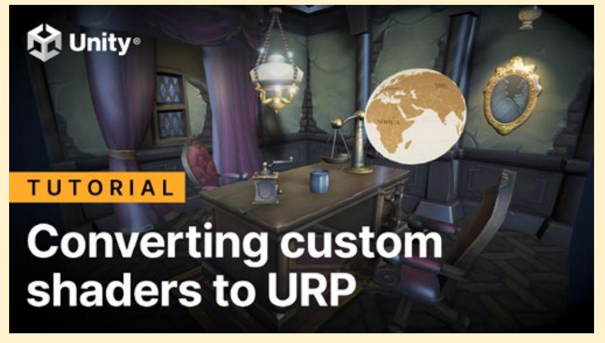

See this step-by-step video tutorial that uses a Unity project to show how to convert a custom unlit Built-In shader to URP.

#### [See the tutorial](https://youtu.be/db1ed8ZMy3U)

**Note:** A great resource for users planning to write shaders for URP is [this tutorial](https://www.cyanilux.com/tutorials/urp-shader-code/) by Cyanilux.

## <span id="page-104-0"></span>Pipeline callbacks

A great feature of SRPs is that you can add code at just about any stage of the rendering process using a C# script. Scripts can be injected at stages such as:

- Rendering shadows
- Rendering prepasses
- Rendering G-buffer
- Rendering deferred lights
- Rendering opaques
- Rendering Skybox
- Rendering transparents
- Rendering post-processing

You can inject scripts in the rendering process via the **Add Renderer Feature** option in the Inspector for the **Universal Renderer Data Asset**. Remember, when using URP, there is a Universal Renderer Data object and a URP Asset. The URP Asset has a Renderer List with at least one Universal Renderer Data object assigned. It is the asset you assign in **Project Settings > Graphics > Scriptable Render Pipeline Settings**.

If you are experimenting with multiple setting assets for different scenes, then attaching the following script to your Main Camera can be useful. Set the **Pipeline Asset** in the Inspector. Then it will switch the asset when the new scene is loaded.

<span id="page-105-0"></span>


Script to switch Universal Render Pipeline Asset on scene load

The next section covers two different types of Renderer Features, one for artists and the other for experienced programmers.

## Render Objects

A common problem in games is losing sight of the player character as they disappear behind environment objects. You could attempt to move the Camera so that the character is always in view, or adjust the environment to be as open as possible. But such options are not always available. A good trick is to show a silhouette of the character when an environment model appears between the character and the Camera, as shown in the image below.


Showing a silhouette when an environment model masks the character


Here's how you can you create this silhouette:

- 1. First, you need a material to use when the character is masked. Create a material and set the shader to **Universal Render Pipeline > Lit or Unlit** (the previous image shows the Lit option). Set the **Surface Inputs > Base Map** color. In this example, the material is called Character.
- 2. To avoid rendering the character more times than necessary, let's place it on a special layer. Select the character, add a **SeeBehind** layer to the Layers list and select it for the character.

|  | @ Inspector @ Lighting |   | Navigation |                 |        |   |
|--|------------------------|---|------------|-----------------|--------|---|
|  | v fred                 |   |            |                 | Static |   |
|  | Tag Untagged           |   |            | Layer SeeBehind |        |   |
|  | Prefab @ fred          |   |            |                 |        | O |
|  | Overides               | D | Select     |                 | Open   |   |

3. Select the **Renderer Data** object used by the URP Asset. Go to the **Opaque Layer Mask** and exclude the SeeBehind layer. The character will then disappear.

| Filtering<br>Opaque Layer Mask           | Mixed               |  |
|------------------------------------------|---------------------|--|
| Transparent Layer Mask                   | Nothing             |  |
| Rendering                                | Everything          |  |
| Rendering Path                           | Default<br>1        |  |
| Depth Priming Mode<br>Depth Texture Mode | TransparentFX<br>1  |  |
|                                          | Ignore Raycast<br>1 |  |
|                                          | 1<br>Water          |  |
| RenderPass                               | 1<br>UI             |  |
| Native RenderPass                        | SeeBehind           |  |
| Shadows                                  | Overlay             |  |
| Transparent Receive Sh                   |                     |  |

4. Click **Add Renderer Feature** and select **[Render Objects](https://docs.unity3d.com/6000.0/Documentation/Manual/urp/renderer-features/how-to-custom-effect-render-objects.html)**.

| Native F  | a                                 |          |
|-----------|-----------------------------------|----------|
| Shadows   | Renderer Features                 |          |
| Transpa   | Screen Space Shadows              |          |
| Post-proc | Full Screen Pass Renderer Feature |          |
| Enabled   | Render Objects                    |          |
| Data      | Decal                             | ess Da O |
|           | Dither Effect Feature             |          |
| Overrides |                                   |          |
| Stencil   |                                   |          |


5. Fill out the settings for this Render Object's **Pass**. Give it a name and choose when the render should be triggered. In this example, it's called AfterRenderingOpaques.

Set the **Layer Mask** to the **SeeBehind** layer, which was the layer chosen for the character. Expand the **Overrides** and set the **Override Mode** to **Material**. Select the material created in step 1. You'll want to use **Depth** when rendering, without having to update the depth buffer by writing to it. Set the **Depth Test** to **Greater** so that this Pass only renders when the distance to the rendered pixel is further from the Camera than the distance currently stored in the depth buffer.

| V Draw Character Behind (Render Objects) |                       |   |
|------------------------------------------|-----------------------|---|
| Name                                     | Draw Character Behind |   |
| Event                                    | AfterRenderingOpaques | A |
| Filters                                  |                       |   |
| Queue                                    | Opaque                | P |
| Layer Mask                               | SeeBehind             | C |
| LightMode Tags                           |                       | 0 |
| List is Empty                            |                       |   |
|                                          |                       |   |
| Overrides<br>1                           |                       |   |
| Material                                 | Character             | O |
| Pass Index                               | 0                     |   |
| Depth                                    |                       |   |
| Write Depth                              |                       |   |
| Depth Test                               | Greater               | œ |
| Stencil                                  |                       |   |
| Camera                                   |                       |   |

6. At this stage, you only see the silhouette of the character when it's behind another object. You don't see the character at all when it's in full view. To fix this, add another **Render Objects** feature. This time you don't need to update the Overrides panel. This Pass will draw the character when not masked by another object.

| V > Draw Character Front (Render Objects) |                       |   |  |
|-------------------------------------------|-----------------------|---|--|
| Name                                      | Draw Character Front  |   |  |
| Event                                     | AfterRenderingOpaques |   |  |
| Filters                                   |                       |   |  |
| Queue                                     | Opaque                |   |  |
| Layer Mask                                | SeeBehind             |   |  |
| LightMode Tags                            |                       | 0 |  |
| List is Empty                             |                       |   |  |
|                                           |                       |   |  |

The silhouette trick is a good example of the benefits of using the SRP workflow to facilitate easy injection in the render pipeline.

## <span id="page-108-0"></span>The render graph system

The [render graph system](https://docs.unity3d.com/Packages/com.unity.render-pipelines.universal@17.0/manual/render-graph-introduction.html) allows you to author a custom SRP in a maintainable and modular way. You can use the RenderGraph API to create a render graph, a high-level representation of the custom SRP's render passes, which explicitly states how the render pipeline uses its resources across render passes. It is not a graphical system.

Describing render passes in this way has two benefits: It simplifies render pipeline configuration, and it allows the render graph system to efficiently manage parts of the render pipeline, which can improve runtime performance.

To use the render graph system, you need to write your code in a different way to that required for a regular custom SRP.

#### **Main principles**

Before you write render passes with the **RenderGraph** API, know the following foundational principles:

- You no longer handle resources directly; instead, you use render graph system-specific handles. All **RenderGraph** APIs use these handles to manipulate resources. The resource types a render graph manages are **RTHandles, ComputeBuffers**, and **RendererLists**.
- Actual resource references are only accessible within the execution code of a render pass.
- The framework requires an explicit declaration of render passes. Each render pass must state which resources it reads from and/or writes to.
- There is no persistence between each execution of a render graph. This means that the resources you create inside one execution of the render graph don't carry over to the next execution.
- For resources that need persistence (e.g., from one frame to another), you can create them outside of a render graph, like regular resources, and import them. They behave like any other render graph resource in terms of dependency tracking, but the graph does not handle their lifetime.
- A render graph mostly uses RTHandles for texture resources. This has a number of implications on how to write shader code and how to set them up.

#### **Resource management**

The render graph system calculates the lifetime of each resource with the high-level representation of the whole frame. This means that when you create a resource via the RenderGraph API, the render graph system does not create the resource at that time. Instead, the API returns a handle that represents the resource, which you then use with all RenderGraph APIs. The render graph only creates the resource just before the first pass that needs to write it. In this case, "creating" does not necessarily mean that the render

<span id="page-109-0"></span>

graph system allocates resources. Rather, it means that it provides the necessary memory to represent the resource so that it can use the resource during a render pass. In the same manner, it also releases the resource memory after the last pass that needs to read it. This way, the render graph system can reuse memory in the most efficient manner based on what you declare in your passes. If the render graph system does not execute a pass that requires a specific resource, then the system does not allocate the memory for the resource.

#### **Render graph execution overview**

Render graph execution is a three-step process that the render graph system completes, from scratch, every frame. This is because a graph can change dynamically from frame to frame, for example, depending on the actions of the user.

- **Setup:** The first step is to set up all the render passes. This is where you declare all the render passes to execute and the resources each render pass uses.
- **Compilation:** The second step is to compile the graph. During this step, the render graph system culls render passes if no other render pass uses their outputs. This allows for less organized setups because you can reduce specific logic when you set up the graph. This step also calculates the lifetime of resources. This allows the render graph system to create and release resources in an efficient way as well as compute the proper synchronization points when it executes passes on the asynchronous compute pipeline.
- **Execution:** Finally, execute the graph. The render graph system executes all render passes that it did not cull, in declaration order. Before each render pass, the render graph system creates the proper resources and releases them after the render pass if later render passes do not use them.

Let's look at a practical example. The final code for this example is [here](https://github.com/NikLever/Unity6E-book/blob/main/Assets/Haunted_Mansion/Scenes/TintFeature.cs).

<span id="page-110-0"></span>

Learn how to use the render graph system to create a Renderer Feature that is injected into the render pipeline. In this tutorial we create a performant post-processing pass using the latest methods to reduce bandwidth, making it suitable on mobile platforms.

[Watch the tutorial](https://www.youtube.com/watch?v=db1ed8ZMy3U) 

### Renderer Feature

A [Renderer Feature](https://docs.unity3d.com/Packages/com.unity.render-pipelines.universal@17.0/manual/urp-renderer-feature.html?) can be used at any stage in URP to affect the final render. This example is of a post-processing technique using a material to process each pixel in the image, creating a tint effect.

1. Start by finding a suitable folder in the Project Assets folder. Right-click and choose **Create > Rendering > URP Renderer Feature**. Name it **TintFeature**.

|                  |  | Rendering<br>Material                                           |  | URP Asset (with 2D Renderer)<br>URP Asset (with Universal Renderer) |
|------------------|--|-----------------------------------------------------------------|--|---------------------------------------------------------------------|
| Create           |  | Lens Flare                                                      |  | URP Renderer Feature                                                |
| Reveal in Finder |  | Lens Flare (SRP)                                                |  | URP 2D Renderer                                                     |
| Open             |  | Render Texture<br>URP Universal Renderer<br>Lightmap Parameters |  |                                                                     |

2. Double-click the default **TintFeature** file. This is a C# script containing boilerplate for a Renderer Feature.


| 13  | using UnityEngine;                                                                                                   |
|-----|----------------------------------------------------------------------------------------------------------------------|
| 2   | using UnityEngine Rendering;                                                                                         |
| m   | using UnityEngine.Rendering.Universal;                                                                               |
| বা  | using UnityEngine.Rendering.RenderGraphModule;                                                                       |
| 5   |                                                                                                                      |
|     | 0 references                                                                                                         |
|     | 6 public class TintRendererFeature : ScriptableRendererFeature                                                       |
| 77  | -                                                                                                                    |
|     | 2 references                                                                                                         |
| 8 - | class CustomRenderPass : ScriptableRenderPass                                                                        |
| a   |                                                                                                                      |
| 18  | // This class stores the data needed by the RenderGraph pass.                                                        |
| 11  | // It is passed as a parameter to the delegate function that executes the RenderGraph pass.                          |
|     | 3 references                                                                                                         |
| 12  | private class PassData                                                                                               |
| 13  | 4                                                                                                                    |
| 14  | 1                                                                                                                    |
| 15  |                                                                                                                      |
| 16  | // This static method is passed as the RenderFunc delegate to the RenderGraph render pass.                           |
| 17  | // It is used to execute draw commands.                                                                              |
|     | 1 reference                                                                                                          |
| 18  | static void ExecutePass(PassData data, RasterGraphContext context)                                                   |
| 19  | 4                                                                                                                    |
| 20  | 2                                                                                                                    |
| 21  |                                                                                                                      |
| 22  | // RecordRenderGraph is where the RenderCraph handle can be accessed, through which render passes can be added to th |
| 23  | // FrameData is a context container through which URP resources can be accessed and managed.                         |
|     | O references                                                                                                         |
| 24  | public override void RecordRenderGraph renderGraph, ContextContainer frameData)                                      |
| 25  |                                                                                                                      |
| 26  | const string passName = "Custom Render Pass";                                                                        |
| 27  |                                                                                                                      |
| 28  | // This adds a raster render pass to the graph, specifying the name and the data type that will be passed to the     |
| 29  | using (var builder = renderGraph.AddRasterRenderPass<PassName, out var passData))                                    |
| 38  | 4                                                                                                                    |
| 31  | // Use this scope to set the required inputs and outputs of the pass and to                                          |
| 32  | // setup the passData with the required properties needed at pass execution time.                                    |
| 33  |                                                                                                                      |
| 34  | // Make use of frameData to access resources and camera data through the dedicated containers.                       |
| 35  | // Eg:                                                                                                               |
| 36  | // UniversalCameraData = frameData = frameData.Get<UniversalCameraData>();                                           |
| 37  | UniversalResourceData = frameData = frameData.Get<UniversalResourceData>();                                          |
| 38  |                                                                                                                      |

Default code for a Renderer Feature

- 3. Add these properties to the TintRendererFeature:
	- **RenderPassEvent** allows the user to set the injection point in the Inspector.
	- **Material** is the one to use when copying.
	- Requirements are set to **Color**.
	- Initialize a ProfilingSampler. You'll get two ID values allowing access to \_ BlitTexture and \_BlitScaleBias.
	- Lastly, define a **MaterialPropertyBlock**.

```
public RenderPassEvent injectionPoint = RenderPassEvent.AfterRendering;
public Material passMaterial;
public ScriptableRenderPassInput requirements = 
 ScriptableRenderPassInput.Color;
private ProfilingSampler m_Sampler;
private static readonly int m_BlitScaleBiasID = 
 Shader.PropertyToID("_BlitScaleBias");
private static MaterialPropertyBlock s_SharedPropertyBlock = null;
```
4. Rename **CustomRenderPass** to **TintPass** and add these properties to the **TintPass** class. The Material will contain the shader you apply to the current state of the rendered image. The PassData defines the data used when you declare the pass. This is where you set the data that the rendering code can access.

```
private Material m_Material;
private string m_PassName;
private ProfilingSampler m_Sampler;
private class PassData
{
 internal Material material;
 internal TextureHandle source;
}
```
4. Add a constructor to the TintPass to initialize the material, and set the position of this pass in the render pipeline.

```
public TintPass(Material mat, string name)
 {
 m_PassName = name;
 m_Material = mat;
 m_Sampler ??= new ProfilingSampler(GetType().Name + "_" + name);
 }
```
5. Delete the functions ExecutePass, OnCameraSetup, Execute and OnCameraCleanup.


- 6. Add the code below to the RecordRenderGraph function:
	- Get a resourceData instance, this is used to get a texture descriptor from the active color texture after post-processing.
	- Change the name and request a new texture. Render Graph will allocate it when needed.
	- The first blit copies the current color buffer to an intermediary texture so it can be used as an input to the next pass. A pass is created using AddRasterRenderPass. In the first pass you set the source of the passData instance to the activeColorTexture of the resourceData instance.
	- Set the builder input texture using the method UseTexture and the output using SetRenderAttachment.
	- Finally, set the render function that the builder uses. It uses a function, ExecuteCopyColorPass, which is created in the steps below.
	- The second blit uses a material when copying. It is similar to the first blit except it assigns a material to the passData instance and uses the function ExecuteMainPass in the SetRenderFunc assignment.

```
public override void RecordRenderGraph(RenderGraph renderGraph, ContextContainer frameData)
{
 UniversalResourceData resourceData = frameData.Get<UniversalResourceData>();
 var colCopyDesc =
 renderGraph.GetTextureDesc(resourceData.afterPostProcessColor);
 colCopyDesc.name = "_TempColorCopy";
 TextureHandle copiedColorTexture = renderGraph.CreateTexture(colCopyDesc);
 using (var builder = renderGraph.AddRasterRenderPass<PassData>(m_PassName +
 "_CopyPass", out var passData, m_Sampler))
 {
 passData.source = resourceData.activeColorTexture;
 builder.UseTexture(resourceData.activeColorTexture, AccessFlags.Read);
 builder.SetRenderAttachment(copiedColorTexture, 0, AccessFlags.Write);
 builder.SetRenderFunc(
 (PassData data, RasterGraphContext rgContext) =>
 {
 ExecuteCopyColorPass(rgContext.cmd, data.source);
 });
 }
 using (var builder = renderGraph.AddRasterRenderPass<PassData>(m_PassName + 
 "_FullScreenPass", out var passData, m_Sampler))
 {
 passData.source = resourceData.activeColorTexture;
```

```
 passData.material = m_Material;
 builder.UseTexture(copiedColorTexture, AccessFlags.Read);
 builder.SetRenderAttachment(resourceData.activeColorTexture, 0,
 AccessFlags.Write);
 builder.SetRenderFunc(
 (PassData data, RasterGraphContext rgContext) =>
 {
 ExecuteMainPass(rgContext.cmd, data.material, data.source);
 });
 }
}
```
7. You'll need to provide the ExecuteCopyColorPass. It simply uses the Blitter method BlitTexture. This function is provided with a variety of parameters. This example uses [this version.](https://docs.unity3d.com/Packages/com.unity.render-pipelines.core@17.0/api/UnityEngine.Rendering.Blitter.html#UnityEngine_Rendering_Blitter_BlitTexture_UnityEngine_Rendering_CommandBuffer_UnityEngine_Rendering_RTHandle_UnityEngine_Vector4_System_Single_System_Boolean_)

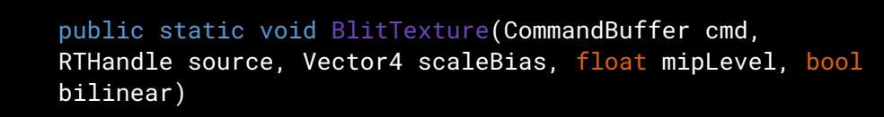

This function should be placed before the RecordRenderGraph function.


8. Now you define the ExecuteMainPass function. You need to set the \_BlitScaleBias uniform for user material with shaders replying on core Blit.hlsl to work.


- 9. Rename CustomRenderPass to TintPass, and change m\_ScriptablePass to m\_pass.
- 10. Delete the existing code in the Create method. Create a new TintPass using the custom constructor. Define the renderPassEvent and configure the input.


These next steps complete this example of a Renderer Feature, which is designed to work with a Shader Graph shader. It's a simple example consisting of a **TintColor** property, a **URP Sample Buffer** node using the BlitSource and a **Multiply** node that modulates the existing BlitSource with the TintColor. Let's look at the steps below.

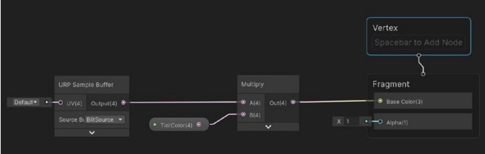

Tint Shader Graph


1. To see the effect in action, select the **Renderer Data** object and click **Add Renderer Feature**. TintFeature will appear in the list.


- 2. Create a material using the Tint Shader Graph.
- 3. Assign the Tint material to the Renderer Feature and set the materials color.

| V Tint Renderer Feature (Tint Renderer Feature |                         |   |
|------------------------------------------------|-------------------------|---|
| Name                                           | TintRendererFeature     |   |
| Script                                         | TintFeature             | 0 |
| Injection Point                                | After Rendering Onaques |   |
| Pass Material                                  | C Tint                  |   |
| Regullrements                                  | COLOL                   |   |


Effect of TintFeature: Unprocessed to the left, tinted on the right

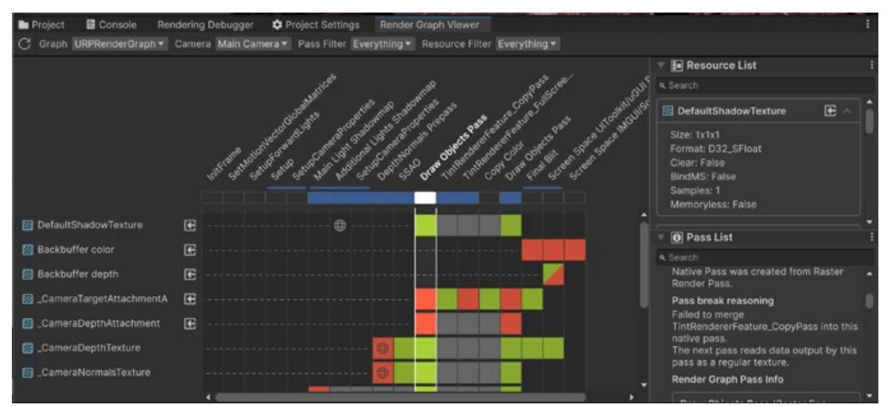

Unity 6 comes with a [Render Graph Viewer](https://docs.unity3d.com/Packages/com.unity.render-pipelines.universal@17.0/manual/render-graph-view.html#use-the-render-graph-viewer) window that you can open via **Window > Analysis > Render Graph Viewer.** This viewer allows you to study what is happening in the pipeline.

The Render Graph Viewer window

Notice that **Draw Objects Pass**, **TintRendererFeature\_CopyPass**, and **TintRendererFeature\_ FullScreen Pass** are all separate passes. It would be better to combine them into a single pass. But separate passes are necessary because of the way textures are used. If you click on the pass name, with the Pass List expanded, you'll see details about the pass. If you click on Draw Objects Pass you'll notice the message "Failed to merge"; this occurs because the next pass reads data output by this pass as a regular texture. TintRendererFeature\_CopyPass has the same issue. Let's fix this.

You'll need a new material. The project includes a material in the Resources folder called **FrameBufferFetch**. This uses the shader of the same name (FrameBufferFetch) which has two passes. You're interested in the second pass that samples the current active frame buffer. Using this approach you'll need to adapt the Tint Shader Graph. Instead of using the URP Sample Buffer node, you're going to use a custom function node. It uses the HLSL in the **FrameBufferFetch.hlsl** file. Essentially it just uses the macro LOAD\_FRAMEBUFFER\_X\_INPUT.

| FrameBuffer Fetch                                                                                       |                                                                        |
|---------------------------------------------------------------------------------------------------------|------------------------------------------------------------------------|
| Screen Position<br>FragFrameBufferFetch (Custom Function)<br>Out(4) ● === clipPos(2)<br>000 00 12 10 10 |                                                                        |
| V<br>Mode Default<br>V                                                                                  | Vertex                                                                 |
|                                                                                                         | Spacebar to Add Node                                                   |
| URP Sample Buffer                                                                                       | Fragment<br>Multiply                                                   |
| Default . O UV(4) Output(4) O<br>Source Di BillSource .<br>· TirtColorMI ·                              | . Base Color(3)<br>. A(3) . Out(3) .<br>0 803<br>X 1 · O Alphacti<br>V |
| >                                                                                                       |                                                                        |

The Tint Shader Graph using custom node FrameBufferFetch

Let's go back to the TintFeature. In the TintPass you need to add a new private static property.

#### private static Material s\_FrameBufferFetchMaterial;

You can assign it in the custom constructor by using the Load method.

```
s_FrameBufferFetchMaterial ??= UnityEngine.Resources.
Load("FrameBufferFetch") as Material;
```
In the ExecuteCopyColorPass you need to remove the Blit and use a DrawProcedural instead. Using the identity matrix again, you'll use the material s\_FrameBufferFetchMaterial for the second pass. The first pass is index 0 and the second pass is index 1. You're using topology triangles again, so you'll use indexCount 3 and instanceCount 1.

```
cmd.DrawProcedural(Matrix4x4.identity, s_FrameBufferFetchMaterial, 1, 
MeshTopology.Triangles, 3, 1, null);
```
Next you'll use the RecordRenderGraph method. For the first pass replace UseTexture with SetInputAttachment. This method uses FrameBufferFetch to access the previous pass.

builder.SetInputAttachment(resourceData.activeColorTexture, 0))

The same steps are down for the second pass.

builder.SetInputAttachment( copiedColorTexture, 0))

Look at the Render Graph Viewer and refresh if necessary. You will see that the three passes, Draw Objects Pass and the two TintRendererFeature passes, are combined into a single pass, which improves performance. In the Viewer window, the **F** means the input is accessed via FrameBufferFetch.

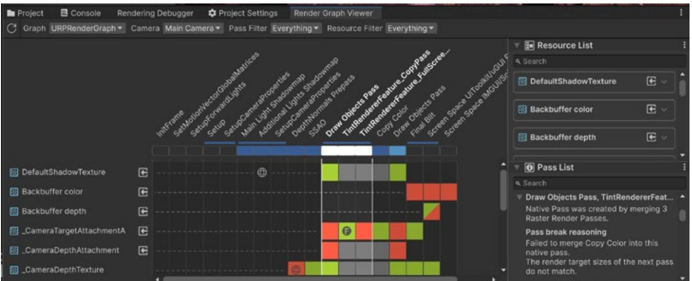

The three passes are merged

FramebufferFetch support is available on mobile platforms targeting Vulkan, Metal, and DirectX 12. On other platforms the engine falls back on texture sampling. Using FrameBufferFetch reduces bandwidth usage, which can improve performance if bandwidth bound, and generally reduce battery usage.

For more examples of using the render graph system, download the package samples via the Package Manager. Search for Universal RP, and click the Samples tab. URP RenderGraph Samples are available to import there.


Importing the URP RenderGraph Samples via the Universal RP package and Package Manager


In [this video tutorial,](https://www.youtube.com/watch?v=3CpEn_mmr3o) we show you three practical exercises using Renderer Features: How to create a custom post-processing effect, stencil effect, and occlude characters by their environment.

## <span id="page-121-1"></span><span id="page-121-0"></span>Post-processing

URP uses a [Volume](https://docs.unity3d.com/Packages/com.unity.render-pipelines.universal@17.0/manual/Volumes.html?) framework when adding post-processing effects. Unity 6 includes a **[Default Volume](https://docs.unity3d.com/Packages/com.unity.render-pipelines.universal@17.0/manual/Volumes.html#default-volumes)**. It can be found at **Project Settings > Graphics > Volume.** Any settings applied here affect the entire project but can be overridden by volumes added to a scene.

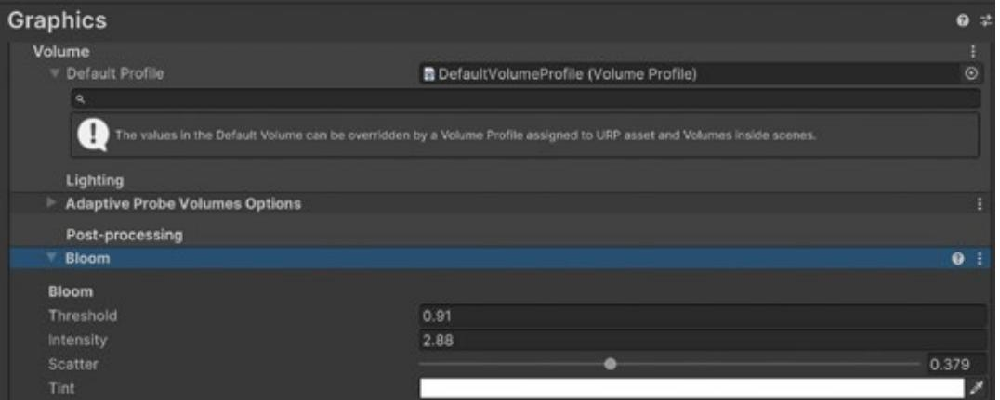

The Default Volume option


Another feature that's new to Unity 6 is a volume for the active URP Asset, which can also be overridden by volumes added to a scene.

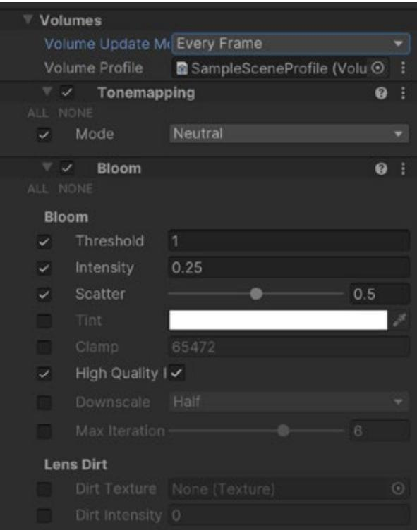

URP Asset > Volumes

When you add volumes to a scene, you can choose which post-processing effects apply to them. A volume can be Global or Local. If Global, the volume affects the Camera everywhere in the scene. With the Mode set to Local, volumes affect the Camera if it's within the bounds of the Collider.

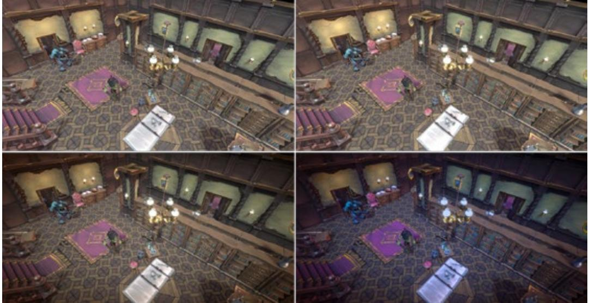

Applying post-processing effects: The top-left image has no effects applied, the top-right image has Bloom applied, the bottom-left has Vignette applied, and the bottom-right has Color Adjustment added.

<span id="page-123-0"></span>

## Using the URP post-processing framework

1. The first step is to make sure your Main Camera has post-processing enabled. Select the **Main Camera** in the **Hierarchy** window, go to the **Inspector**, and expand the **Rendering** panel. Check the **Post Processing** option.

| Rendering       | 0                                       |
|-----------------|-----------------------------------------|
| Renderer        | Default Renderer (MansionLightingRenc ▼ |
| Post Processing | >                                       |
| Anti-aliasing   | No Anti-aliasing                        |
| Stop NaNs       |                                         |

<span id="page-123-1"></span>2. Right-click the **Hierarchy** window and select **Create > Volume > Global Volume** to create a Global Volume.

| Volume         | Global Volume      |
|----------------|--------------------|
| Rendering      | >                  |
| Cinemachine    | Box Volume<br>>    |
| Camera         | Sphere Volume      |
| Visual Effects | Convex Mesh Volume |

3. With the Global Volume selected in the Hierarchy window, find the **Volume** panel in the Inspector and create a new **Profile** by clicking on **New**.

| V V Volume |                                     | 0 主<br> |
|------------|-------------------------------------|---------|
| Mode       | Global                              | D       |
| Weight     |                                     | 0<br>1  |
| Priority   | 0                                   |         |
| Profile    | Global Volume Profile 1 0 New Clone |         |

4. Start adding post-processing effects. See the table further down that lists available effects. Click **Add Override** and select **Post-processing**. In this example, the Bloom effect is chosen.

| Add Override                        |  |
|-------------------------------------|--|
| a                                   |  |
| Volume Overrides<br>Post-processing |  |
|                                     |  |


Selecting the Bloom effect

5. Each effect has a dedicated Settings panel. The image here shows the settings for Bloom.

| ▼ √ Bloom              |                |       |
|------------------------|----------------|-------|
| ALL NONE               |                |       |
| Bloom                  |                |       |
| V Threshold            | 0.91           |       |
| 1<br>Intensity         | 2.88           |       |
| Scatter<br>V           |                | 0.481 |
| V<br>Tint              |                |       |
| Clamp                  | 65472          |       |
| High Quality Filtering |                |       |
| Skip Iterations        |                | 1     |
| Lens Dirt              |                |       |
| Dirt Texture           | None (Texture) | C     |
| Dirt Intensity         | 0              |       |

6. You can easily add multiple effects (such as Vignette in this example) and configure each one using their Settings panel.

| Q        |                               |  |
|----------|-------------------------------|--|
| C        | Post-processing               |  |
|          | Color Curves                  |  |
|          | Color Lookup                  |  |
|          | Depth Of Field                |  |
|          | Film Grain                    |  |
|          | Lens Distortion               |  |
|          | Lift, Gamma, Gain             |  |
|          | Motion Blur                   |  |
|          | Panini Projection             |  |
|          | Shadows, Midtones, Highlights |  |
|          | Split Toning                  |  |
|          | Tonemapping                   |  |
| Vignette |                               |  |
|          | White Balance                 |  |

## <span id="page-125-0"></span>Adding a Local Volume component

With the Volume framework, you can configure the scene so that as a Camera moves around it, different post-processing profiles are triggered. This is achieved by adding a Local Volume component. Let's go through the steps for setting this up.

1. In the **Hierarchy** window, right-click and choose **Create > Volume > Box Volume**. Alternatively, choose **Sphere Volume** if this shape is more suited to your purpose, or **Convex Mesh Volume** for a tighter control over the shape of the Collider component that defines the volume region.

| Volume         | A | Global Volume      |
|----------------|---|--------------------|
| Rendering      | > | Box Volume         |
| Cinemachine    | > | Sphere Volume      |
| Camera         |   |                    |
| Visual Effects |   | Convex Mesh Volume |

- 2. From the **Volume** panel in the **Inspector**, create a new **Profile** to store this volume data. The panel can also be used to set:
	- a. **Blend Distance:** This is the furthest distance from the Volume's Collider that URP starts blending from, and the distance in Collider dimensions where this profile fades in. At the edge of the Collider, the post-processing effects will fade out and the Blend Distance from the edge of the Collider will fully fade in.
	- b. **Weight:** Weight defines the maximum strength of the post-processing effects. If Weight is set to 1, then the effect will reach full strength. A setting of 0 means there is no effect, while 0.5 sets the strength of the effect at a maximum of 50%.
	- c. **Priority:** Use this value to determine which Volume URP is used when multiple Volumes have an equal amount of influence on the scene. The higher the number, the higher the Priority. If you are merging Global and Local, then keep Global at the default 0 setting and set the Local Volume(s) to 1 or more.

| V Volume       | 8 花                                 |
|----------------|-------------------------------------|
| Mode           | Local<br>V                          |
| Blend Distance | 1                                   |
| Weight         | 1                                   |
| Priority       | 0                                   |
| Profile        | Box Volume Profile (Vol O New Clone |

Settings for a Local Volume


4. Position the **Volume** and control its dimensions using the **Box Collider** component, as shown in the image below.


Positioning and sizing a Box Volume using the attached Box Collider component

Post-processing can weigh heavily on your processor, so carefully consider the effects on low-end hardware and mobile devices. If your project must use it, then test on the target hardware. Some filters are less processor intensive than others. This [document](https://docs.unity3d.com/Packages/com.unity.render-pipelines.universal@17.0/manual/integration-with-post-processing.html#post-proc-how-too?) outlines the mobile-friendly effects.

These are the available post-processing effects in URP.

| Effect                                                                                                               | Description                                                           |
|----------------------------------------------------------------------------------------------------------------------|-----------------------------------------------------------------------|
| Bloom                                                                                                                | Adds a glow around pixels above a defined brightness level            |
| Channel Mixer                                                                                                        | Modifies the influence of each input color channel on the overall mix |
| Creates fringes of color along boundaries that separate dark and<br>Chromatic Aberration<br>light parts of the image |                                                                       |


| Color Adjustments              | Tweaks the overall tone, brightness, and contrast of the final<br>rendered image                                                                               |
|--------------------------------|----------------------------------------------------------------------------------------------------------------------------------------------------------------|
| Color Curves                   | An advanced way to adjust specific ranges in hue, saturation, or<br>luminosity                                                                                 |
| Color Lookup                   | Maps the colors of each pixel to a new value using a Lookup Texture                                                                                            |
| Depth of Field                 | Simulates the focus properties of a camera lens                                                                                                                |
| Film Grain                     | Simulates the random optical texture of photographic film                                                                                                      |
| Lens Distortion                | Distorts the final rendered picture to simulate the shape of a real<br>world camera lens                                                                       |
| Lift Gamma Gain                | Uses different trackballs to affect different ranges within the image;<br>adjust the slider under the trackball to offset the color lightness of<br>that range |
| Motion Blur                    | Simulates the blur that occurs in an image when a real-world<br>camera films objects moving faster than the camera's exposure time                             |
| Panini Projection              | Helps you render perspective views in scenes with a very large field<br>of view                                                                                |
| Screen Space Lens<br>Flare     | Adds a lens flare that applies to the entire scene not just a single<br>light                                                                                  |
| Shadows Midtones<br>Highlights | Separately controls the shadows, midtones, and highlights of the<br>render                                                                                     |
| Split Toning                   | Adds different color tones to the shadows and highlights in your<br>scene                                                                                      |
| Tonemapping                    | Remaps the HDR values of an image to a new range of values                                                                                                     |
| Vignette                       | Comprises darkening toward the edges of an image compared to<br>the center                                                                                     |
| White Balance                  | Removes unrealistic color casts, so items that would appear white in<br>real life render as white in your final image                                          |

<span id="page-128-0"></span>

#### **Motion Blur**


The top image shows Motion Blur off and the bottom image shows Motion Blur on.

The Motion Blur post-processing effect simulates the blur that occurs in an image when a realworld camera films objects moving faster than the camera's exposure time. This is usually due to rapidly moving objects, or a long exposure time.

<span id="page-129-0"></span>

#### **Using Motion Blur**

As with all post-processing effects using URP, Motion Blur uses the Volume system, so to enable and modify Motion Blur properties, you must add a Motion Blur override to a Volume in your scene.

| Property  | Description                                                                                                                                                                                                                                                                                          |  |  |  |  |
|-----------|------------------------------------------------------------------------------------------------------------------------------------------------------------------------------------------------------------------------------------------------------------------------------------------------------|--|--|--|--|
|           | Select the motion blur technique.<br>Options:                                                                                                                                                                                                                                                        |  |  |  |  |
| Mode      | —<br>Camera Only: Use only the motion of the camera to blur the objects.<br>This technique does not use the motion vectors and has better<br>performance than Camera and Objects.                                                                                                                    |  |  |  |  |
|           | —<br>Camera and Objects: Use the motion of both the camera and the<br>GameObjects. GameObject motion vectors overwrite the camera motion<br>vectors.                                                                                                                                                 |  |  |  |  |
| Quality   | Set the quality of the effect. Lower presets give better performance, but at a<br>lower visual quality.                                                                                                                                                                                              |  |  |  |  |
| Intensity | Set the strength of the motion blur filter to a value from 0 to 1. Higher values<br>give a stronger blur effect, but can cause lower performance, depending on<br>the Clamp parameter.                                                                                                               |  |  |  |  |
| Clamp     | Set the maximum length that the velocity resulting from camera rotation can<br>have. This limits the blur at high velocity, to avoid excessive performance<br>costs. The value is measured as a fraction of the screen's full resolution. The<br>value range is 0 to 0.2. The default value is 0.05. |  |  |  |  |

#### **Troubleshooting performance issues**

To decrease the performance impact of Motion Blur, you can:

- **Reduce the Quality**: A lower quality setting gives higher performance but may exhibit more visual artifacts.
- **Change the Mode property from Camera and Objects to Camera Only:** This technique has better performance than Camera and Objects.
- **Decrease the Clamp:** Do this to reduce the maximum velocity that Unity takes into account. Lower values give higher performance.

<span id="page-130-0"></span>

## Controlling post-processing with code

You can also dynamically adjust your post-processing profile using a C# script. The following code example shows how to adjust the intensity of the Bloom effect. If a Vignette is applied, you can control the vignetting color via code. For example, if the player character takes damage, you can temporarily tint it red.

```
using UnityEngine;
using UnityEngine.Rendering;
using UnityEngine.Rendering.Universal;
public class PPController : MonoBehaviour
{
      // Start is called before the first frame update
      void Start()
      {
 Volume volume = GetComponent<Volume>();
 Bloom bloom;
 if (volume.profile.TryGet<Bloom>(out bloom))
 {
 bloom.intensity.value = 0;
 }
 }
}
```
## <span id="page-131-0"></span>Camera Stacking

A common requirement in games is the ability to combine geometry viewed from different cameras in a single render. The image below shows a shelf in the foreground acting as an inventory within the game. Collected items are added to the shelf and can be selected at key points by the player. Notice that it has a different field of view, as well as different lighting and post-processing. This has been set up using the [Camera Stacking](https://docs.unity3d.com/Packages/com.unity.render-pipelines.universal@17.0/manual/camera-stacking.html?) feature in URP.


An example of using Camera Stacking


Let's look at how to set this feature up.

- 1. Create a Camera by right-clicking the **Hierarchy** view and choosing **Camera**. Remove the audio listener component.
- 2. Use the **Inspector > Camera Settings** panel to set this Camera as **Render Type Overlay**.

| Camera             |             |         |  | 9<br>3 | 2 |
|--------------------|-------------|---------|--|--------|---|
| Render Type        |             | Overlay |  |        | œ |
| Projection<br>2    |             |         |  | 0      |   |
| Projection         | Perspective |         |  |        | D |
| Field of View Axis | Vertical    |         |  |        |   |
| Field of View      |             |         |  | 55.1   |   |
| Clipping Planes    | Near        | 0.3     |  |        |   |
|                    | Far         | 1000    |  |        |   |
| Physical Camera    |             |         |  |        |   |

3. Create a new **Layer** for the Camera and the GameObjects it renders.

| User Layer 6 | Highlight  |
|--------------|------------|
| User Layer 7 | SeeBehind  |
| User Layer 8 | Chandelier |
| User Layer 9 | Overlay    |

4. Update the **Rendering > Culling Mask** for the Camera using the Inspector.

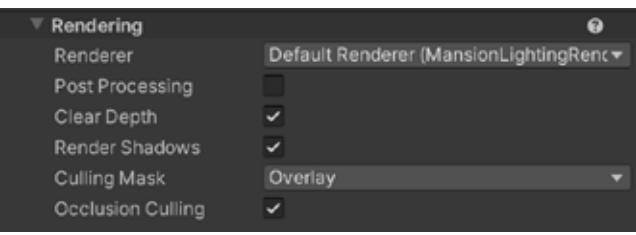

5. Move the Camera to a suitable place in the scene, then add and position **GameObjects**  by placing them in **Layer Overlay**.


<span id="page-133-0"></span>

6. Make sure the **Main Camera** does not render Overlay by updating its **Rendering > Culling Mask**.

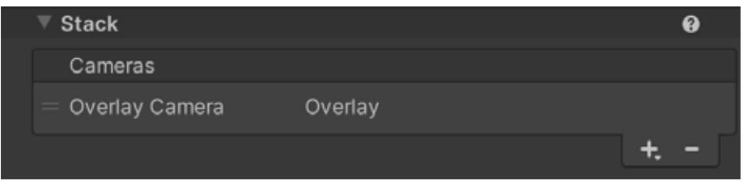

7. In the **Stack** panel, use the "**+**" button to add the **Overlay Camera**.

### Controlling a stack with code

As with post-processing, you can control the stack from code, and add or remove cameras dynamically during runtime. See this code example:

```
using UnityEngine;
using UnityEngine.Rendering.Universal;
public class StackController : MonoBehaviour
{
     public Camera overlayCamera;
     // Start is called before the first frame update
     void Start()
     {
 Camera camera = GetComponent<Camera>();
 var cameraData = camera.GetUniversalAdditionalCamera
 Data();
 cameraData.cameraStack.Remove(overlayCamera);
     }
}
```
Post-processing and Camera Stacking, both easily configured using URP, are powerful tools for creating rich, atmospheric effects in your games.

## <span id="page-134-0"></span>The SubmitRenderRequest API

Sometimes you might want to render your game to a different destination than the user's screen. The **SubmitRenderRequest** API is designed with this purpose in mind. Let's look at a possible use case.

### Coding a screengrab

The script below will render the game to an off-screen **RenderTexture** when the user presses the onscreen GUI. The script should be attached to the Main Camera. A **RenderTexture** is created in the **Start** callback. It is 1920 x 1080 pixels with a bit depth of 24. When the user presses the "Render Request" button, the RenderRequest method is called.

In the RenderRequest method, there's a reference to the Camera component. Create a [RenderPipeline.StandardRequest](https://docs.unity3d.com/6000.0/Documentation/ScriptReference/Rendering.RenderPipeline.StandardRequest.html) instance, then check whether the current pipeline supports the RenderRequest framework. If it does, you set the RenderTexture that was initialized in the Start callback as the destination of this request object and initialize the render using [RenderPipeline.SubmitRenderRequest](https://docs.unity3d.com/6000.0/Documentation/ScriptReference/Rendering.RenderPipeline.SubmitRenderRequest.html). This method takes a camera instance and a request object.

At this point, Texture2D contains a render of the current scene. To save this to a file, you first need to convert the RenderTexture to a Texture2D instance. The method **ToTexture2D** shows one possible route. Once you have a Texture2D you can use the **EncodeToPNG** method of a Texture2D instance to get a byte array. You can then use the System.IO.File method **WriteAllBytes** to save the byte array to a file.


If you use the script directly, the screengrab will be saved in a newly created folder called **RenderOutput** in the **Assets** folder of your game. The file name is R\_ followed by a randomly chosen integer between 0 and 100,000.

```
using System.Collections;
using System.Collections.Generic;
using UnityEngine;
using UnityEngine.Rendering;
[RequireComponent(typeof(Camera))]
public class StandardRenderRequest : MonoBehaviour
{
 [SerializeField]
 RenderTexture texture2D;
 private void Start()
 {
 texture2D = new RenderTexture(1920, 1080, 24);
 }
 // When user clicks on GUI button,
 // Render Requests are sent with various output textures to render 
 given frame
 private void OnGUI()
 {
 GUILayout.BeginVertical();
 if (GUILayout.Button("Render Request"))
 {
 RenderRequest();
 }
 GUILayout.EndVertical();
 }
 void RenderRequest()
 {
 Camera cam = GetComponent<Camera>();
 RenderPipeline.StandardRequest request = new RenderPipeline.StandardRequest();
 if (RenderPipeline.SupportsRenderRequest(cam, request))
 {
 // 2D Texture
 request.destination = texture2D;
 RenderPipeline.SubmitRenderRequest(cam, request);
 SaveTexture(ToTexture2D(texture2D));
 }
 }
 void SaveTexture(Texture2D texture)
 {
```

```
 byte[] bytes = texture.EncodeToPNG();
 var dirPath = Application.dataPath + "/RenderOutput";
 if (!System.IO.Directory.Exists(dirPath))
 {
 System.IO.Directory.CreateDirectory(dirPath);
 }
 System.IO.File.WriteAllBytes(dirPath + "/R_" + Random.Range(0, 
 100000) + ".png", bytes);
 Debug.Log(bytes.Length / 1024 + "Kb was saved as: " + dirPath);
 #if UNITY_EDITOR
 UnityEditor.AssetDatabase.Refresh();
 #endif
 }
 Texture2D ToTexture2D(RenderTexture rTex)
 {
 Texture2D tex = new Texture2D(rTex.width, rTex.height, 
 TextureFormat.RGB24, false);
 RenderTexture.active = rTex;
 tex.ReadPixels(new Rect(0, 0, rTex.width, rTex.height), 0, 0);
 tex.Apply();
 Destroy(tex);//prevents memory leak
 return tex;
 }
```
}

## <span id="page-137-1"></span><span id="page-137-0"></span>Additional tools compatible with URP

Another benefit of using URP is its compatibility with Unity's authoring tools that bring complex creation tasks into the reach of technical artists. This chapter provides an introduction to Shader Graph and VFX Graph.

## Shader Graph

[Shader Graph](https://docs.unity3d.com/Packages/com.unity.shadergraph@17.0/manual/Getting-Started.html?) brings custom shaders to an artist's workflow. The Shader Graph tool is included when you start a project using the URP template or import the URP package.


#### **Note:**

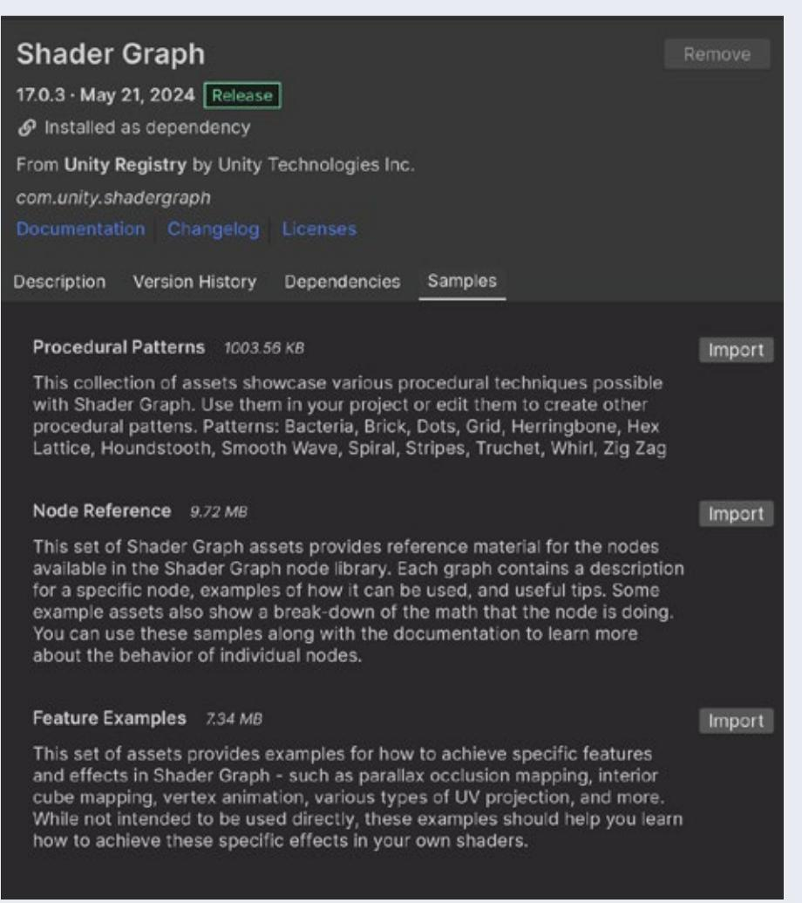

You can find the Shader Graph node examples libraries in the Shader Graph package in the Package Manager window. Read about the new Shader Graph production ready shaders in Unity 6 in [this blog post](https://unity.com/blog/engine-platform/new-shader-graph-production-ready-shaders-in-
unity-6).


Covering Shader Graph warrants a separate guide, but let's go over some basic yet crucial steps by creating the Light Halo shader from the [Lighting chapter](#page-32-0).

1. Right-click in the **Project** window, find a suitable folder, and choose **Create > Shader Graph > URP > Unlit Shader Graph**. For this example, choose Unlit. Name the new asset FresnelAlpha.


2. Double-click the new **Shader Graph Asset** to launch the Shader Graph editor.

| Graph Inspector            |                |   |                                  |                   |              |
|----------------------------|----------------|---|----------------------------------|-------------------|--------------|
| Node Settings              | Graph Settings | 4 |                                  |                   |              |
| Precision                  | Single         | D |                                  | Vertex            |              |
| Target Settings            |                |   | Object Space · · · Position(3)   |                   |              |
| Active Targets             |                |   |                                  |                   |              |
| Universal                  |                |   | Object Space · · O Normal(3)     |                   |              |
|                            |                | + |                                  |                   |              |
| Y Universal                |                |   | Object Space · · · · Tangent (3) |                   |              |
| Material                   | Unlit          | D |                                  |                   |              |
| Allow Material<br>Override |                |   |                                  |                   |              |
| Surface Type               | Opaque         |   |                                  | Fragment          | Main Preview |
| Render Face                | Front          |   |                                  |                   |              |
| Depth Write                | Auto           |   |                                  | · O Base Color(3) |              |
| Depth Test                 | LEqual         |   |                                  |                   |              |
| Alpha Clipping             |                |   |                                  |                   |              |
| Cast Shadows               | V              |   |                                  |                   |              |
| Supports LOD               |                | A |                                  |                   |              |
|                            |                |   |                                  |                   |              |

If you're familiar with shaders, then you'll recognize the Vertex and Fragment nodes. By default, this shader will ensure any model with a material using it that it is correctly placed in the Camera view using the Vertex node, and that each pixel is set to a grey color using the Fragment node.

3. This shader is going to set the alpha transparency of the object. It therefore needs to apply to the Transparent queue. Change the **Graph Inspector > Graph Settings > Surface Type** to **Transparent**. You'll see that the Fragment node now has an Alpha input as well as Base Color.

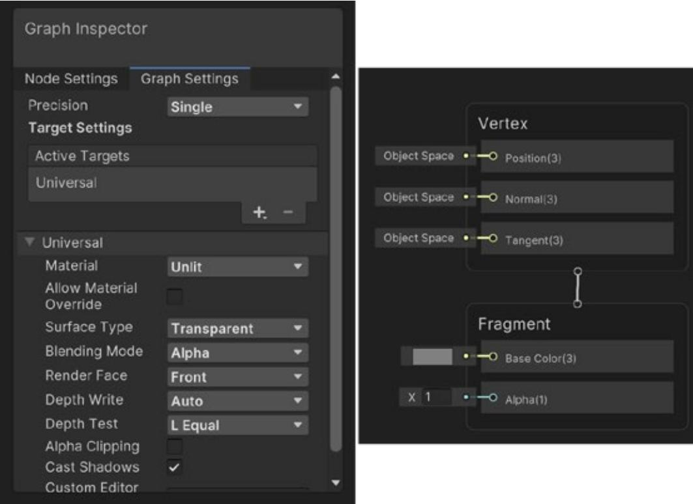

4. Add [properties to the shader](https://docs.unity3d.com/Packages/com.unity.shadergraph@17.0/manual/Blackboard.html?). For instance, add Color as a Color, and Power and Strength as Float values.

| FresnelAlpha<br>Shader Graphs | +     |                  |   |
|-------------------------------|-------|------------------|---|
| · Color                       | Color | Category         |   |
|                               |       | Float            |   |
|                               |       | Vector 2         |   |
|                               |       | Vector 3         |   |
|                               |       | Vector 4         |   |
|                               |       | Color            |   |
|                               |       | Boolean          |   |
|                               |       | Gradient         |   |
|                               |       | Texture 2D       |   |
|                               |       | Texture 2D Array |   |
|                               |       | Texture 3D       |   |
|                               |       | Cubemap          |   |
|                               |       | Virtual Texture  |   |
|                               |       | Matrix 2         |   |
|                               |       | Matrix 3         |   |
|                               |       | Matrix 4         |   |
|                               |       | Sampler State    |   |
|                               |       | Keyword          | > |


5. Set the default values using **Graph Inspector > Node Settings > Default**. Set Color to white, Power to 4, and Strength to 1.

| Graph Inspector                  |                              |  |  |  |
|----------------------------------|------------------------------|--|--|--|
|                                  | Node Settings Graph Settings |  |  |  |
| Property: Power                  |                              |  |  |  |
| Name                             | Power                        |  |  |  |
| Reference                        | _Power                       |  |  |  |
| Default                          | × 1                          |  |  |  |
| Mode                             | Default                      |  |  |  |
| Precision                        | Inherit                      |  |  |  |
| Exposed                          | >                            |  |  |  |
| Override Property<br>Declaration |                              |  |  |  |

6. Shader Graph functions by joining nodes together. A node will have one or more inputs and an output. To add a node, right-click and choose **Create Node** in the **Search** panel at the top, then enter **Fre**. The results will show a **Fresnel Effect** node.

| Create Node<br>Q - Fresnel |
|----------------------------|
| Math<br>V Vector           |
| Fresnel Effect             |
|                            |

7. A node shows a preview of its effect. Notice that the Fresnel Effect is bright toward the edge. The value is the difference between the View direction and the Normal direction – and for a sphere, this is greatest at the edge.

The alpha value should be lowest at the edge. You can flip the result using a One Minus node. To do this, click **Create Node** and enter **One**. Select the **One Minus** node. Now drag from Out(1) on the Fresnel Effect node to In(1) on the One Minus node. The 1 means that the value type is a single float. If it was 3, then it would be a vector with three components. The nodes should be joined like this:


8. Let's look at how to control the size of gradient and the overall transparency. Use a **Power** node for sizing the gradient. Create a Power node and connect One Minus Out(1) to Power A(1). Drag the Power property to the graph and join it to Power B(1). The graph should now look like this:


9. Control the overall transparency using a **Multiply** node. Create it and connect Power Out(1) to Multiply A(1). Drag the Strength property to the graph and join it to Multiply B(1). Then join the Multiply Out(1) to Fragment Alpha(1) and drag the Color(4) property to the graph and join it to Fragment Base Color(3).

Notice here that the property Color comprises a four-component vector, while Base Color is a three-component vector. Shader Graph will map the first three components of Color to the Base Color vector.

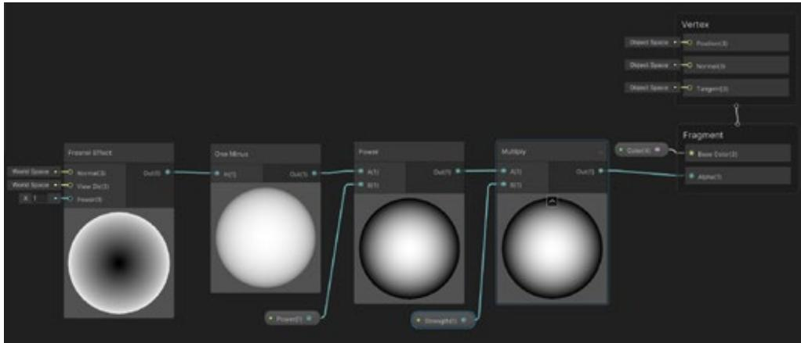

10. Save the asset and create a new material. Assign this shader to the new material, which is located in **Shader Graphs/FresnelAlpha**.


11. Now you can apply the material to an object, controlling its visibility at the edges.

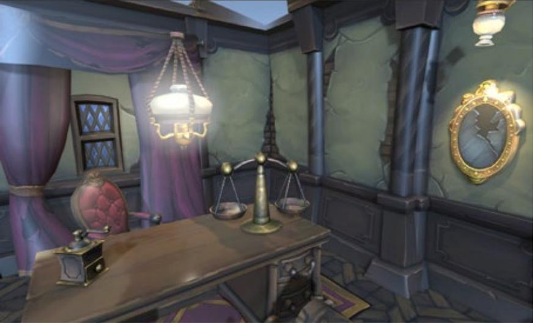

A shader is applied to a sphere-shaped Point light to provide a halo effect around it.

<span id="page-144-0"></span>

#### **Fullscreen Shader Graph**

The Fullscreen Shader Graph allows you to create custom post-processing passes. Right-click in the Project pane and select **Create > Shader Graph > URP > Fullscreen Shader Graph**.

| Shader Graph                  |   | Builtin               | > |                                                             |
|-------------------------------|---|-----------------------|---|-------------------------------------------------------------|
| Shader                        | > | URP                   | > | Lit Shader Graph                                            |
| Shader Variant Collection     |   | Blank Shader Graph    |   | Unlit Shader Graph                                          |
| Testing                       |   | Sub Graph             |   |                                                             |
| Playables                     |   | VFX Shader Graph      |   | Sprite Custom Lit Shader Graph<br>Sprite Unlit Shader Graph |
| Assembly Definition           |   |                       |   | Sprite Lit Shader Graph                                     |
| Assembly Definition Reference |   | Custom Render Texture |   |                                                             |
| Text                          | > |                       |   | Decal Shader Graph                                          |
| TextMeshPro                   | > |                       |   | Fullscreen Shader Graph                                     |
|                               |   |                       |   |                                                             |

Creating a Fullscreen Shader Graph

You can access a pixel's color for the fragment shader using a URP Sample Buffer node that itself uses the BlitSource option. The graph below shows a simple tint example. The URP Sample Buffer also gives access to world normals and motion vectors that are useful for edge detection and motion trails.

|                                              | Vertex                     |
|----------------------------------------------|----------------------------|
|                                              | Spacebar to Add Node       |
| URP Sample Buffer                            |                            |
| Defaul = · · O UV(4) Output(4) ®<br>Multiply | Fragment                   |
| Source Bi BiltSource ▼<br>@ A(4)<br>V        | Base Color (3)<br>Out(4) 4 |
| @ B(4)<br>· Color(4) @                       | × 1<br>· O Alpha(1)<br>V   |

A simple tinting example

To use this example, you need a way to Blit the result of the current camera render texture using a material that uses this shader.


With the active Renderer Data asset selected, use the Inspector to add a Renderer Feature. Select **Full Screen Pass Renderer Feature**.

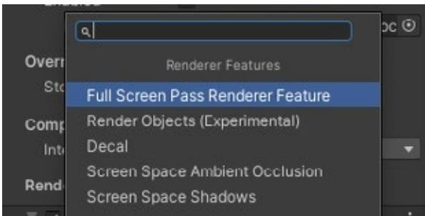

Adding the Full Screen Pass Renderer Feature

It just remains to update the settings for this Renderer Feature. Set the material you created that uses the Fullscreen Shader Graph, then select the position in the render pipeline.

|                 | > Full Sereen Pass Renderer Feature (Full S |   |
|-----------------|---------------------------------------------|---|
| Name            | FullScreenPassRendererFeature               |   |
| Pass Material   | · FullScreen                                | O |
| Injection Point | Before Rendering Post Process .             |   |
| Requirements    | Color                                       |   |
| Pass Index      | DrawProcedural (0)                          |   |

The Renderer Feature settings

The image below shows the tint effect on the left. The Fullscreen Shader Graph is a useful way to create custom post-processing effects.


The tint effect

<span id="page-146-0"></span>

#### **Six Way Shader Graph**

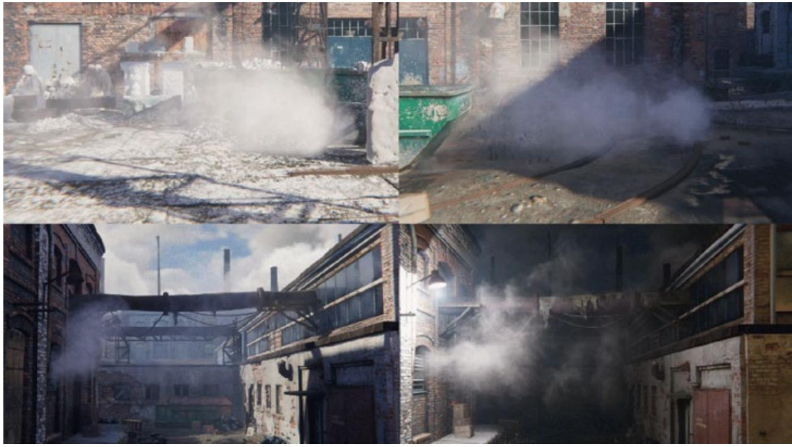

Here are four versions of the same smoke effect under different lighting conditions. From the top left: Directional light and ambient; top right, ambient, probe volumes and directional light; bottom left, ambient and probes, and bottom right, spot light and probes

The Six Way Shader Graph is a feature in Unity 6 that lets you dynamically relight smoke effects for more realism, using six-way lightmaps that can be baked in DCC tools like Houdini, Blender, or Embergen.

| >                               |                                                                                              | >   | Lit Shader Graph                                                                                                                   |
|---------------------------------|----------------------------------------------------------------------------------------------|-----|------------------------------------------------------------------------------------------------------------------------------------|
| ><br>><br>><br>><br>><br>><br>> | Blank Shader Graph<br>Builtin<br>Sub Graph<br>Custom Render Texture<br>Custom Heatmap Values | >   | Unlit Shader Graph<br>Sprite Custom Lit Shader Graph<br>Sprite Unlit Shader Graph<br>Sprite Lit Shader Graph<br>Decal Shader Graph |
| V                               |                                                                                              |     | Canvas Shader Graph<br>Fullscreen Shader Graph<br>Six Way Shader Graph                                                             |
|                                 |                                                                                              | URP |                                                                                                                                    |

Create a Six Way Shader Graph

<span id="page-147-0"></span>

To know more about six-way lighting see the blog post [Realistic smoke lighting with 6-way](https://blog.unity.com/engine-platform/realistic-smoke-with-6-way-lighting-in-vfx-graph)  [lighting in VFX Graph](https://blog.unity.com/engine-platform/realistic-smoke-with-6-way-lighting-in-vfx-graph). And see this [blog post](https://blog.unity.com/technology/custom-lighting-in-shader-graph-expanding-your-graphs-in-2019) that goes through the Shader Graph process with an example project and some advanced suggestions.

## VFX Graph

Almost any kind of visual effect is possible in Unity, whether you plan on your characters shooting fireballs from their fingertips or traveling through a wormhole. Visual effects (VFX) in a game enhance the atmosphere, help tell the story, and add details that can truly captivate your players.

Unity is pushing the boundaries of real-time graphics with tools such as the VFX Graph. This node-based editor enables technical and VFX artists to design dynamic visual effects – from simple common particle behaviors to complex simulations involving particles, lines, ribbons, trails, meshes, and more.

| 32<br>Manual<br>Bounds Setting Mode |                |
|-------------------------------------|----------------|
| 0                                   |                |
|                                     |                |
| 0                                   |                |
|                                     | V V            |
| 1.5                                 |                |
| Set Velocity Random (Per-component) | V 2            |
| 1 x -0.1<br>y 0.4                   | z -0.1         |
|                                     | z 0.1          |
|                                     | V V            |
|                                     | C × 0.1<br>y 1 |

Editing a VFX Graph

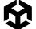

To learn more about creating VFX with URP and the VFX Graph download the e-book *[The](https://unity.com/resources/definitive-guide-to-creating-visual-effects?isGated=false)  [definitive guide to creating advanced visual effects in Unity](https://unity.com/resources/definitive-guide-to-creating-visual-effects?isGated=false).*


A smoke effect created using the VFX Graph

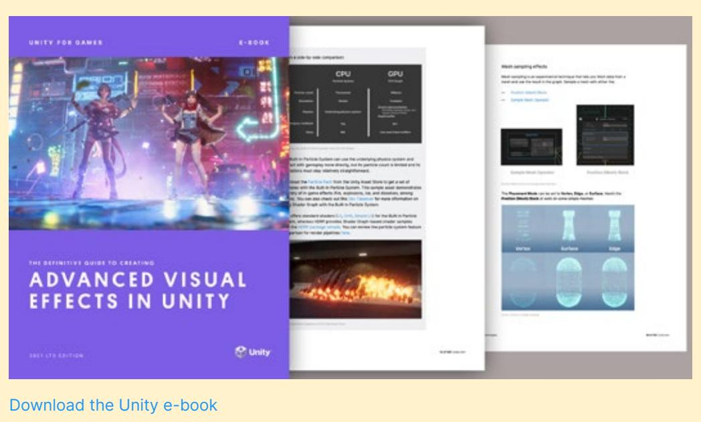

## <span id="page-149-0"></span>2D Renderer and 2D lights

There's no limit to how innovative today's 2D games can be. The evolution of hardware, graphics, and game development software makes it possible to create 2D games with real-time lights, highresolution textures, and an almost unlimited sprite count.

If you are working on a 2D game, you'll be pleased to know there is a dedicated URP 2D Renderer. The simplest way to get started is to use the 2D URP template from the Unity Hub. This template ensures that your project has a URP 2D Renderer assigned via Project Settings > Graphics > Scriptable Render Pipeline Settings. All verified and precompiled 2D packages are installed with the 2D URP template and the default settings optimized for 2D projects. This also ensures that the project loads faster than installing all the packages manually.

|                          | New project<br>Editor Version: 6000.0.411 = Silicen C |                                          |                                                                                                                                   |
|--------------------------|-------------------------------------------------------|------------------------------------------|-----------------------------------------------------------------------------------------------------------------------------------|
| 11<br>All templates      | Q Search all templates                                |                                          |                                                                                                                                   |
| Core<br>D<br>2<br>Sample | Universal 20<br>Core                                  |                                          | SRP                                                                                                                               |
| 0<br>Learning            | Universal 3D<br>200<br>Core                           |                                          |                                                                                                                                   |
|                          | High Definition 3D<br>Coro                            | Universal 2D                             | This is an empty project configured for 2D<br>apps. It uses Unity's Universal Render<br>Pipeline pre-configured with 2D Renderer. |
|                          | Universal 3D sample<br>్రవర్తి<br>Sample              | Read more<br>ার<br>0<br>PROJECT SETTINGS |                                                                                                                                   |
|                          | High Definition 3D sample<br>్ట్రఫర్తిన<br>Sample     | Project name<br>My project<br>0          |                                                                                                                                   |
|                          |                                                       |                                          | Cancel<br>Create project                                                                                                          |

The 2D URP template in the Unity Hub

If you're upgrading an existing project, then you need to find a suitable folder in your project's Assets folder. Right-click and select Create > Rendering > URP Asset (with 2D Renderer). Give it a name, and select it using Project Settings > Graphics > Scriptable Render Pipeline Settings. In the Scene view, be sure to select the 2D button when editing.

| Create<br>><br>Reveal in Finder<br>Open |     | 1941<br>Scene<br>Scene Template From Scene<br>Scene Template |   |                                                                     |
|-----------------------------------------|-----|--------------------------------------------------------------|---|---------------------------------------------------------------------|
| Delete<br>Rename<br>Copy Path           | CRC | Volume Profile<br>Scene Template Pipeline<br>Prefab          |   |                                                                     |
| Open Scene Additive                     |     | Prefab Variant                                               |   |                                                                     |
| View in Package Manager                 |     | Audio Mixer                                                  |   |                                                                     |
| Import New Asset<br>Import Package      |     | Rendering<br>Material                                        | > | URP Asset (with 2D Renderer)<br>URP Asset (with Universal Renderer) |

Creating a 2D Renderer and Settings Asset

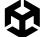

The appearance of the "classic" magenta color that indicates a rendering error might occur if you're switching an existing project to the URP 2D Renderer.


Updating an existing project with URP 2D Renderer can result in rendering errors in your scene.

Fortunately, the **Window > Rendering > Render Pipeline Converter** has got you covered. Select **Built-in to 2D (URP)** and click the Material and Material Reference Upgrade panel. Then click Initialize Converters, followed by Convert Assets to be able to deselect some items or Initialize And Convert to handle the process with one click. If you still see magenta-colored sprites, you might need to manually replace the shader in some of your materials. Choose one of the shaders in the following table.

| Shader               | Description                                 |  |
|----------------------|---------------------------------------------|--|
| Sprite-Lit-Default   | Uses 2D lights when rendering               |  |
| Sprite-Mask-Default  | Works with the stencil buffer               |  |
| Sprite-Unlit-Default | Uses only the texture colors when rendering |  |

#### **2D shaders available in URP**


Converting a Built-In Render Pipeline 2D project to URP 2D

2D lights are available with the URP 2D Renderer. These offer enhanced performance and flexibility. Using the new tools, you can create a more immersive experience and save time preparing different sprite variations by using baked lights to create new gameplay possibilities. If you have migrated an existing project, then you will have no URP 2D lights in your scene. If your sprites use the Sprite-Lit-Default shader, you might be surprised to see a lit render. But with no lights, you get a default Global Light assigned to the scene for an unlit appearance.

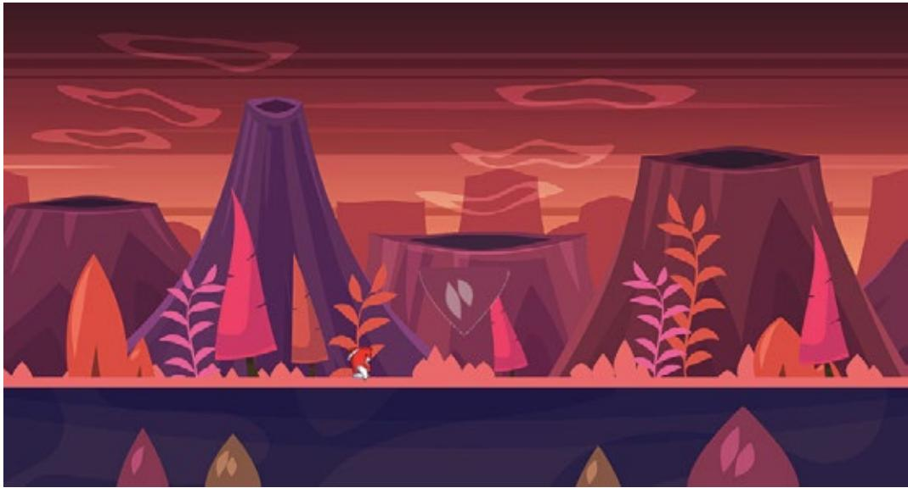

With no lights in the scene, the render defaults to Unlit.

## <span id="page-152-0"></span>2D game development resources from Unity

The e-book, *2D game art, animation, and lighting for artists* is our biggest, most comprehensive 2D development guide, created for Unity developers and artists who want to make a commercial 2D game.


[Download the Unity e-book](https://unity.com/resources/2d-game-art-animation-lighting-for-artists-ebook?isGated=false) about 2D graphics, tools, and animation

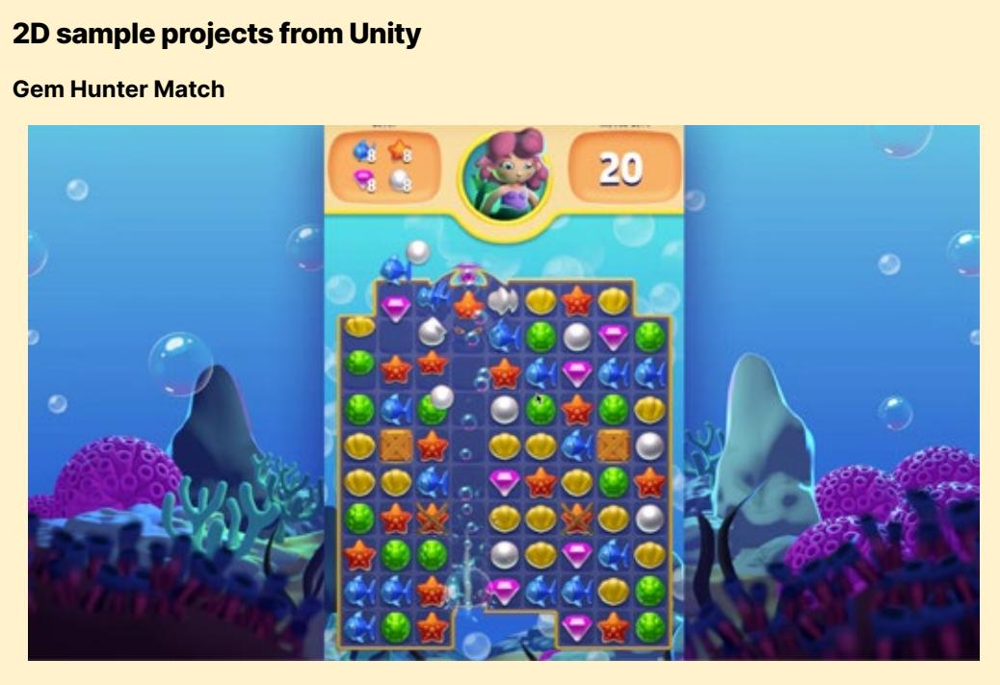


*Gem Hunter Match* shows you how a 2D puzzle/match-3 game can stand out from the competition with eye-catching lighting and visual effects created in URP. Among other techniques, you'll learn how to prepare and light 2D sprites to add depth, apply a Sprite Custom Lit shader for shimmer, and create glare and ripple effects.

- Download *[Gem Hunter Match](https://u3d.as/3fnH)*
- [Get an introduction to](https://unity.com/blog/engine-platform/2d-puzzle-match-3-sample-gem-hunter-match) *[Gem Hunter Match](https://unity.com/blog/engine-platform/2d-puzzle-match-3-sample-gem-hunter-match)*

#### **Happy Harvest**

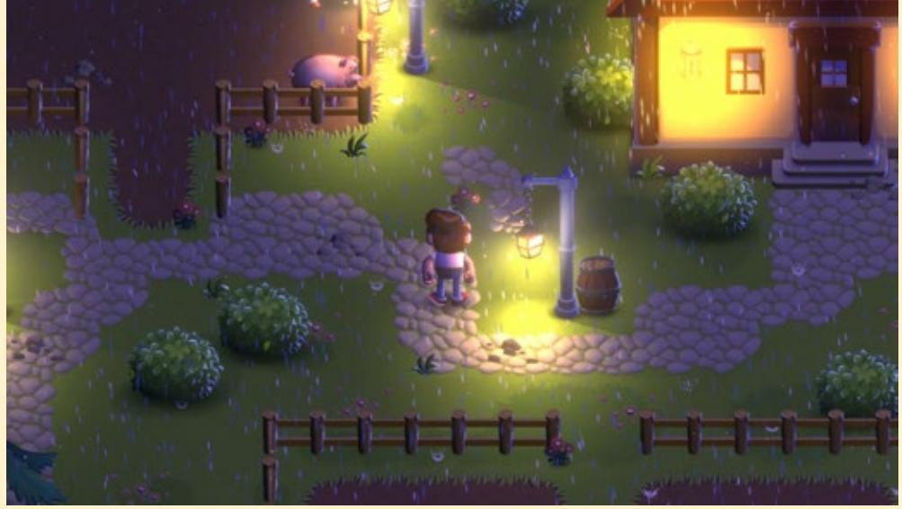

*Happy Harvest* shows developers how to harness the latest capabilities for creating 2D lights, shadows, and special effects with URP. It incorporates best practices any 2D creator can use, including not baking shadows into a sprite, keeping sprites flat, moving shadow and volume information to secondary textures, advanced Tilemap features, and much more.

- Download *[Happy Harvest](https://assetstore.unity.com/packages/essentials/tutorial-projects/happy-harvest-2d-sample-project-259218)*
- [Get an introduction to](https://unity.com/blog/games/happy-harvest-demo-latest-2d-techniques) *Happy Harvest*


This 2D sample project is a vertical slice of a side scrolling Idle RPG game that showcases how the suite of 2D tools can be combined with artwork to make your vision a reality. All of the content in this demo can be added into your own creative projects.

- Download *[UI Toolkit Dragon Crashers](https://assetstore.unity.com/packages/essentials/tutorial-projects/dragon-crashers-urp-2d-sample-project-190721)*
- Get an introduction to *[UI Toolkit Dragon Crasher](https://unity.com/blog/engine-platform/new-ui-toolkit-demos-for-programmers-artists)*s

## <span id="page-155-0"></span>More Unity 6 features for URP

This section highlights key features in URP in Unity 6 that can improve performance or fidelity on a wide variety of devices.

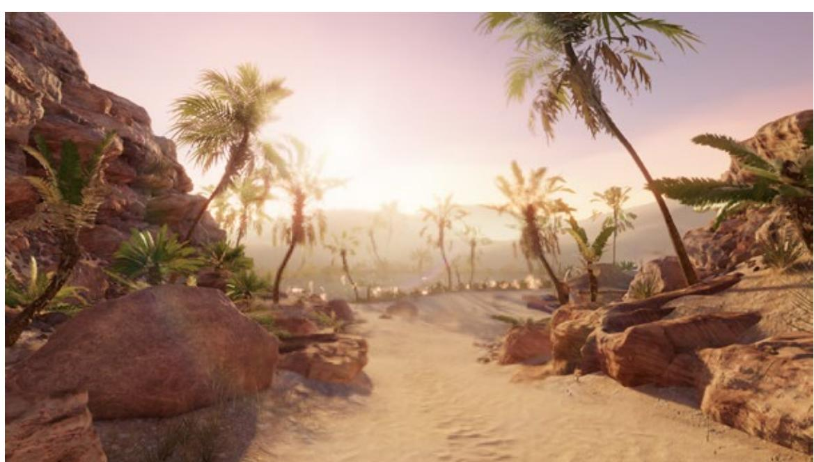

### Spatial-Temporal Post-Processing (STP)

The oasis environment from the URP 3D Sample rendered in three different ways: Render scale 1 at left, Render scale 0.25 in the middle, and Render scale 0.25 with STP enabled at right


The number of competing super resolution techniques is growing, and many of them are specific to a single hardware vendor. Along with this, these solutions are not designed for mobile.

[Spatial-Temporal Post-Processing](https://docs.unity3d.com/Packages/com.unity.render-pipelines.universal@17.0/manual/stp/stp-upscaler.html) (STP), is Unity's super resolution solution which works on all devices, from mobile to console, and delivers high quality results in URP while keeping overhead low. As you can see from the blended image above the results are high-quality. The left third shows the image with no STP and Render Scale 1. The middle third shows no STP and Render Scale 0.25, resulting in a blurry, low-fidelity image. The right third enables STP while keeping the Render Scale at 0.25, rendering 1/16 of the pixels yet with STP up scaling appearing sharp.

STP is a spatio-temporal anti-aliasing upscaling solution that should work on any device that supports shader model 5.0. It is designed with mobile in mind, aiming at delivering visual quality that's comparable to DLSS2, FSR2, or XeSS, with a lower performance cost.

Enable STP via the active URP Asset using **Quality > Upscaling Filter**. Then set the Render Scale.

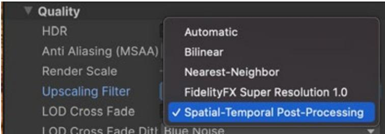

Enabling Spatial-Temporal Post-Processing

### <span id="page-157-0"></span>High Dynamic Range display output for PC and consoles


Rendering Debugger > Lighting > HDR Debug Mode > Gamut View

High Dynamic Range (HDR) displays are display devices capable of reproducing images in the higher range of difference in luminance closer to natural lighting conditions. [HDR Output](https://docs.unity3d.com/Packages/com.unity.render-pipelines.universal@17.0/manual/post-processing/hdr-output.html) allows for better preservation of the contrast and quality of the linear lighting renders and HDR images displayed on these devices.

You enable HDR in two places:

1. The URP Asset

| Quality               |   |  |
|-----------------------|---|--|
| HDR                   | V |  |
| HDR Precision 32 Bits |   |  |
|                       |   |  |

2. The Camera Inspector: Set **Output > HDR Rendering** to **Use settings from Render Pipeline Asset**.

<span id="page-158-0"></span>

| Output         |                                   |        | (2) |
|----------------|-----------------------------------|--------|-----|
| Output Texture | None (Render Texture)             | 0      |     |
| Target Display | Display 1                         |        |     |
| Target Eye     | Both                              |        |     |
| Viewport Rect  | X 0                               | Y<br>0 |     |
|                | W1                                | H 1    |     |
| HDR Rendering  | Use settings from Render Pipeli . |        |     |
| MSAA           | Use settings from Render Pipell ▼ |        |     |

With HDR you can turn on the option to take advantage of better quality image render outputs from URP on HDR displays. As a result, you can present final images with colors and contrasts that mimic natural lighting conditions better on these devices.

In addition to the existing desktop and console support that became available in Unity 2022, mobile support is introduced in Unity 6 for the following platforms:

- iOS players (iOS 16+, iPadOS 16+)
- Android players using Vulkan and GLES (Android 9+, depending on device capabilities)

Some common mobile devices that provide HDR display support include iPhone X and newer, Samsung Galaxy S10 and newer, Galaxy Note 10 and newer, and Galaxy Tab S6 and newer.

### Using a Pipeline State Object

Unity 6 introduces a new and powerful [Pipeline State Object \(PSO\)](https://discussions.unity.com/t/graphicsstatecollection-tracing-and-warmup-in-unity-6/951031) tracing and precooking workflow, unlocking a smoother and stutter-less player experience, when targeting modern platforms.

This set of APIs provides a significant upgrade from the "shader warmup" API, previously introduced in older Unity versions. While traditional shader warmup is sufficient for older graphics APIs (e.g. OpenGL, DirectX11), the new PSO workflow allows developers to better utilize modern graphics APIs, such as Vulkan, DirectX12 and Metal.

#### **PSO creation and caching**

When targeting modern graphics APIs, the GPU vendor's graphics drivers will perform runtime shader compilation (and other rendering state translation) as part of the PSO creation process. As a result, PSO creation is a lengthy process, which may lead to noticeable stutters in the runtime application. This overhead can be exacerbated for more complex projects, which require the application to compile a large amount of PSOs on the fly.

You can identify PSO creation stutters in the Unity Profiler, using the GraphicsPipelineImpl markers:

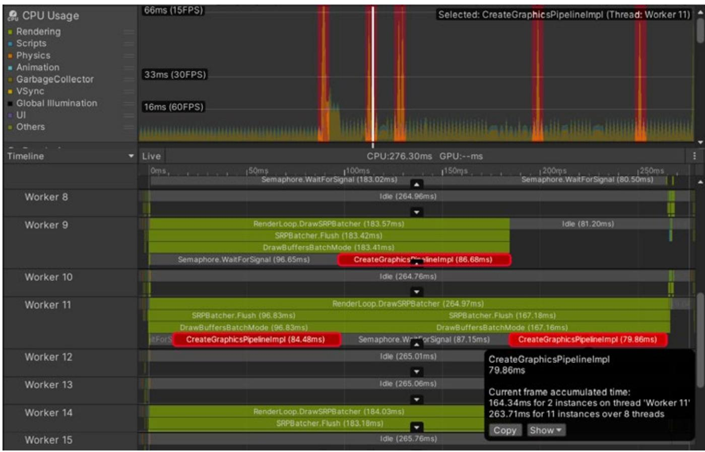

Profiling PSO creation

| [Additional tools compatible with URP](#page-137-0) | [More Unity 6 features for URP](#page-155-0) | [Performance](#page-162-0) |

In many cases, the GPU vendor's graphics drivers will automatically cache any compiled PSO to disk, in order to accelerate PSO creation for subsequent application runs. However, the application may still need to compile PSOs for newly encountered shader variants and materials. Furthermore, OS and driver updates will often invalidate the driver-managed PSO cache.

The ideal way to warm PSOs may vary depending on your application and use case. For example, you may choose to synchronously precook PSOs during level transitions and scene loading. This can be done progressively (time-sliced) in order to increase application responsiveness, creating a fixed amount of PSOs per frame.

Alternatively, you can choose to asynchronously precook PSOs in the application's background. This will not block the application, but may temporarily regress CPU performance for the duration of the warm up.

<span id="page-160-0"></span>

#### **Tracing a new PSO collection**

You should begin by tracing the PSOs created by the application during rendering:

- 1. In a C# script, create a new [GraphicsStateCollection.](https://docs.unity3d.com/6000.0/Documentation/ScriptReference/Experimental.Rendering.GraphicsStateCollection.html) This collection corresponds to your application's or scene's PSOs.
- 2. To begin tracing PSOs into your collection, call the [GraphicsStateCollection.BeginTrace](https://docs.unity3d.com/6000.0/Documentation/ScriptReference/Experimental.Rendering.GraphicsStateCollection.BeginTrace.html) method. Any new graphics pipelines created by the application will be added to the collection. In most cases, you should begin tracing during scene or application start up.
- 3. To finalize the tracing process, call the [GraphicsStateCollection.EndTrace](https://docs.unity3d.com/6000.0/Documentation/ScriptReference/Experimental.Rendering.GraphicsStateCollection.EndTrace.html) method. In most cases, you should end tracing during scene or application end.

Once tracing is complete, you can save the PSO collection to disk, using [GraphicsStateCollection.SaveToFile](https://docs.unity3d.com/6000.0/Documentation/ScriptReference/Experimental.Rendering.GraphicsStateCollection.SaveToFile.html).

For additional control, you can inspect the recorded PSOs and variant data, and modify the collection as needed. [GraphicsStateCollection.GetVariants](https://docs.unity3d.com/6000.0/Documentation/ScriptReference/Experimental.Rendering.GraphicsStateCollection.GetVariants.html) can be used to retrieve all shader variants recorded in a PSO collection. You can then read the graphics states used by each variant via [GraphicsStateCollection.GetGraphicsStatesForVariant](https://docs.unity3d.com/6000.0/Documentation/ScriptReference/Experimental.Rendering.GraphicsStateCollection.GetGraphicsStatesForVariant.html). Lastly, you can modify the graphics states associated with each variant using [AddGraphicsStateForVariant](https://docs.unity3d.com/6000.0/Documentation/ScriptReference/Experimental.Rendering.GraphicsStateCollection.AddGraphicsStateForVariant.html) / [RemoveGraphicsStatesForVariant](https://docs.unity3d.com/6000.0/Documentation/ScriptReference/Experimental.Rendering.GraphicsStateCollection.RemoveGraphicsStatesForVariant.html).

#### **Note:**

GPU representation of the PSO may vary across platforms. It is highly recommended to perform tracing in the Player, targeting the relevant graphics API, and to maintain separate collections per target.

When tracing on a target device using Player Connection, you can send the PSO collection to the Editor and save to disk, via [GraphicsStateCollection.SendToEditor.](https://docs.unity3d.com/6000.0/Documentation/ScriptReference/Experimental.Rendering.GraphicsStateCollection.SendToEditor.html) You can also query the platform used when tracing the PSO collection via [GraphicsStateCollection.runtimePlatform](https://docs.unity3d.com/6000.0/Documentation/ScriptReference/Experimental.Rendering.GraphicsStateCollection-runtimePlatform.html).

#### **Precooking a PSO collection**

Once tracing is completed, you can request Unity to precook PSO collection, ideally well ahead of drawing time. In most cases, the ideal time to perform warmup is during application or scene loading sequences.

You can perform PSO precooking using two warm up methods:

- [GraphicsStateCollection.WarmUp](https://docs.unity3d.com/6000.0/Documentation/ScriptReference/Experimental.Rendering.GraphicsStateCollection.WarmUp.html) will schedule the creation of all PSOs in the collection.
- [GraphicsStateCollection.WarmUpProgressively](https://docs.unity3d.com/6000.0/Documentation/ScriptReference/Experimental.Rendering.GraphicsStateCollection.WarmUpProgressively.html) will schedule the creation of a set number of PSOs in the collection.

<span id="page-161-0"></span>

Both methods will return a job handle, which can be used to determine whether PSO Warmup is performed synchronously or asynchronously.

Once the PSOs are created, the drivers will often cache those to disk. Next time the PSOs are precooked, they could be loaded directly from cache.

#### **Platform support**

The new PSO workflow is available as of Unity 6, for Players targeting Metal, Vulkan, and Direct3D 12. In coming versions, we will also provide compatibility for older graphics APIs such as OpenGLES and Direct3D 11, in the form of an implicit shader-warmup fallback.

## <span id="page-162-0"></span>Performance

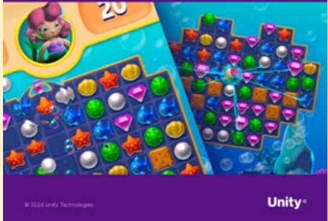

Get tips for using Unity's profiling tools, programming and code architecture, project configuration and assets, and more. Learn how to enhance your mobile game's performance. [Download](https://unity.com/resources/mobile-xr-web-game-performance-optimization-unity-6)


Pick up great tips for extensive profiling of your console and PC projects, programming code and architecture, optimizing assets and graphics, UI, physics, and animation optimizations. [Download](https://unity.com/resources/console-pc-game-performance-optimization-unity-6)


Performance is highly dependent on the project you're working on. Always [profile](https://docs.unity3d.com/Manual/Profiler.html?) and test your game throughout the development cycle. Open the Profiler via **Window > Analysis > Profiler**, and follow the suggestions in this chapter.


The Profiler window

This section looks at seven ways to improve the performance of your games:

- Managing your lighting
- Light probes
- Reflection probes
- Camera settings
- Pipeline settings
- Frame Debugger
- Profiler

These optimizations are also covered in this [tutorial](https://youtu.be/NFBr21V0zvU).

And see the following video tutorials for profiling tips:

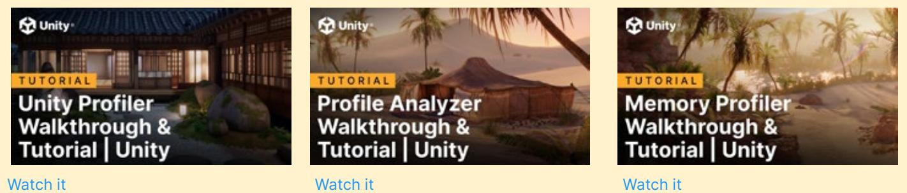

## <span id="page-164-0"></span>Optimizing lighting and rendering in URP

URP is built with optimized real-time lighting in mind. The URP Forward Renderer supports up to eight real-time lights per object and up to 256 real-time lights per camera for desktop games, plus 32 real-time lights per camera for mobile and untethered hardware. URP also allows for configurable per-object Light settings inside the Pipeline Asset for refined control over lighting.

As explained in th[e Lighting chapter,](#page-32-0) baked lighting is one of the best ways to improve the performance of your scene. Real-time lighting can be expensive, whereas baking lights can help you gain back performance, assuming the lights in your scene are static. The baked lighting textures are batched into a single draw call, without needing to be continuously calculated. This is especially useful if your scene uses multiple lights. Another great reason to bake your lighting is that it allows you to render bounced or indirect lighting in your scene and improve the visual quality of the render.

Global Illumination is similarly covered in the Lighting section. This process simulates rays of light bouncing around the environment and illuminating other nearby objects with the bounced light. The figure below shows three lighting setups for the same scene: with no baked light data, with baked lighting, and with post-processing applied.


From left to right: no lighting data, baked lighting, post-processing added

When baked, areas of shadow in a scene receive the bounced light and are illuminated. It can be subtle, but this technique spreads the light around a scene more realistically and improves its overall appearance.

In the previous image, you can see that the specular highlights on the ground are lost when baking. Baked lights only contain diffuse lighting. Whenever possible, compute the direct lighting contribution from real-time, and have Global Illumination come from Image Based Lighting (IBL)/shadow maps/Probes.


The effect of light baking on shadows: before baking on the left, and after baking on the right

Use the lowest possible **Lightmap Resolution** and **Lightmap Size** when baking your lights; Go to **Window > Rendering > Lighting > Scene**. This helps to lower the texture memory requirement.

| Lightmap Resolution | 10  | texels per unit |
|---------------------|-----|-----------------|
| Lightmap Padding    | 2   | texels          |
| Max Lightmap Size   | 512 |                 |

Setting the Lightmap Resolution and Max Lightmap Size

<span id="page-166-0"></span>

## Light probes

As explained in the [Lighting section,](#page-32-0) light probes sample the lighting data in the scene during baking and allow the bounced light information to be used by dynamic objects as they move or change. This helps them blend into and feel more natural in the baked lighting environment. (The Unity engine now has an alternative to Light Probes, see the [APV section](#page-61-0)).

Light probes add naturalism to a render without increasing the processing time for a rendered frame. This makes them suitable for all hardware, even low-end mobile devices.

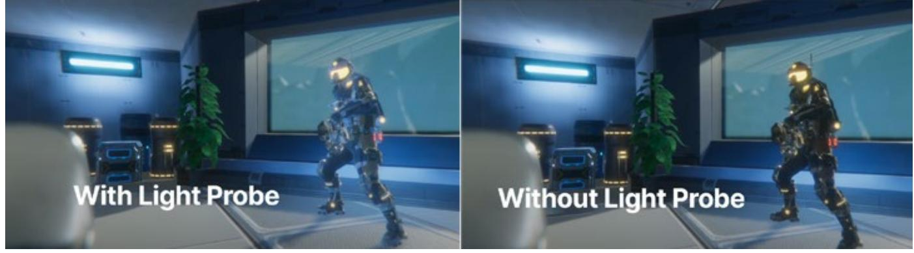

The effect of using light probes when rendering a dynamic object: with light probe on the left, and without on the right

### Reflection probes

You can also use reflection probes to optimize your scene. Reflection probes project parts of the environment onto nearby geometry to create more realistic reflections. By default, Unity uses the Skybox as the reflection map. But by using one or more reflection probes, the reflections will match their surroundings more closely.

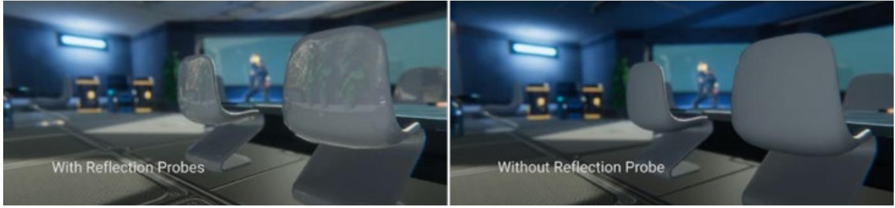

The effect of using reflection probes on smooth surfaces: with reflection probes on the left and without on the right

The size of the cubemap generated when baking the reflection probes depends on how close the camera gets to a reflective object. Always make sure to use the smallest map size that suits your needs to optimize your scene.

<span id="page-167-0"></span>

| Box Size                |       |      |  |  |  |  |
|-------------------------|-------|------|--|--|--|--|
| Box Offset              | 16    |      |  |  |  |  |
| Cubemap Capture Setting | 32    |      |  |  |  |  |
| Resolution              | 64    |      |  |  |  |  |
| HDR                     | V 128 |      |  |  |  |  |
| Shadow Distance         |       | 266  |  |  |  |  |
| Clear Flags             |       | 512  |  |  |  |  |
| Background              |       | 1024 |  |  |  |  |
| Culling Mask            |       | 2048 |  |  |  |  |
| Use Occlusion Culling   | V     |      |  |  |  |  |
| Clipping Planes         | Near  | 03   |  |  |  |  |
|                         | Far   | 1000 |  |  |  |  |

Adjusting the size of the reflection probe cubemap

### Camera settings

The URP enables you to disable unwanted renderer processes on your cameras for performance optimization. This is useful if you're targeting both high- and low-end devices in your project. Disabling expensive processes, such as post-processing, shadow rendering, or depth texture can reduce visual fidelity but improve performance on low-end devices.

## Occlusion culling

Another great way to optimize your Camera is with [occlusion culling.](https://docs.unity3d.com/6000.0/Documentation/Manual/OcclusionCulling.html?) By default, the Camera in Unity will always draw everything in the Camera's frustum, including geometry that might be hidden behind walls or other objects. There's no point in drawing geometry that the player can't see, and that takes up precious milliseconds. This is where occlusion culling comes in.

Occlusion culling is best suited to a scene where significant numbers of objects might be masked when another item appears between them and the Camera. A cellular corridor mazetype game is an ideal candidate for using occlusion culling, as seen in the images below.


Frustum culling in the image on left, and occlusion culling in the image on right

By baking occlusion data, Unity ignores the parts of your scene that are blocked. Reducing the geometry being drawn per frame provides a significant performance boost.

To enable occlusion culling in your scene, mark any geometry as either **Occluder Static** or **Occludee Static**. Occluders are medium to large objects that can occlude objects marked as Occludees. To be an Occulder, an object must be opaque, have a Terrain or Mesh Renderer component, and not move at runtime. Occludees can be any object with a Renderer component, including small and transparent objects that similarly do not move at runtime.

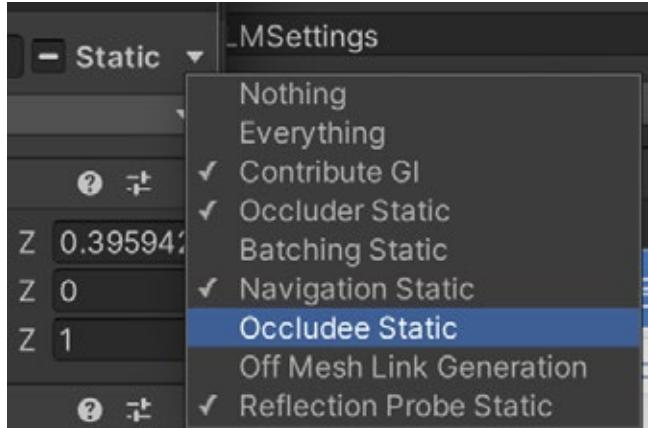

You set the static properties using the usual drop-down.

Settings for an object included in occlusion data

Open **Window > Rendering > Occlusion Culling**, and select the **Bake** tab. In the bottom-right corner of the **Inspector**, press **Bake**. Unity generates occlusion data, saving the data as an asset in your project and linking the asset to the current scene.

|                                                                                                                                                                                                                                                                                                                                                                                                                                               | Object | Bake | Visualization |  |  |  |  |
|-----------------------------------------------------------------------------------------------------------------------------------------------------------------------------------------------------------------------------------------------------------------------------------------------------------------------------------------------------------------------------------------------------------------------------------------------|--------|------|---------------|--|--|--|--|
| Set default parameters                                                                                                                                                                                                                                                                                                                                                                                                                        |        |      |               |  |  |  |  |
| The default parameters guarantee that any given scene computes fast and the<br>occlusion culling results are good. As the parameters are always scene specific,<br>better results will be achieved when fine tuning the parameters on a scene to scene<br>basis. All the parameters are dependent on the unit scale of the scene and it is<br>imperative that the unit scale parameter is set correctly before setting the default<br>values. |        |      |               |  |  |  |  |
| Smallest Occluder                                                                                                                                                                                                                                                                                                                                                                                                                             | 5      |      |               |  |  |  |  |
| Smallest Hole                                                                                                                                                                                                                                                                                                                                                                                                                                 |        | 0.25 |               |  |  |  |  |
| Backface Threshold                                                                                                                                                                                                                                                                                                                                                                                                                            |        |      | 100           |  |  |  |  |
|                                                                                                                                                                                                                                                                                                                                                                                                                                               |        |      |               |  |  |  |  |

Occlusion culling Bake tab

You can see occlusion culling in action using the **Visualization** tab. Select the **Camera** in the scene and use the **Occlusion Culling** pop-up window in the **Scene** view to configure the visualization. The pop-up might be hidden behind the small Camera view window. Right-click the double-line icon and choose **Collapse** if this is the case. Move the pop-up, then restore the Camera view using right-click expand.

<span id="page-169-0"></span>

Visualization tab and Occlusion Culling pop-up

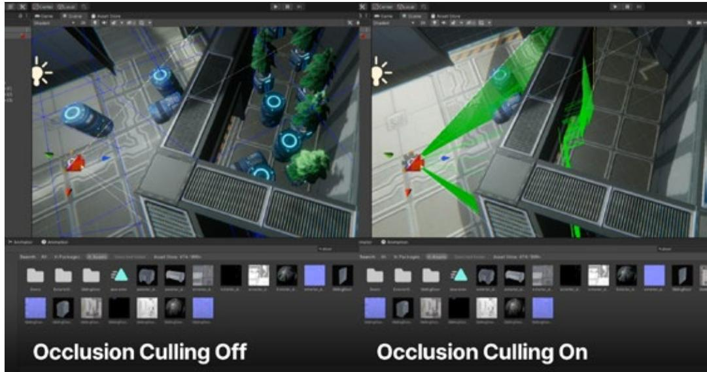

As you move the Camera, you should see objects popping on and off.

The effect of occlusion culling off in the left image, and on in the right image

If you are using [GPU Resident Drawer](#page-30-0) in Unity 6, then you can use GPU Occlusion Culling.

## Pipeline settings

While the effects of changing the settings for the URP Asset and using different Quality tiers were [previously covered](#page-21-0), here are some additional tips for experimenting with Quality tiers to get the best results for your project:

- Reduce Shadow Resolution and distance for performance gains.
- Disable features that your project does not require, such as depth texture and opaque texture.
- Enable the [SRP Batcher](https://docs.unity3d.com/6000.0/Documentation/Manual/SRPBatcher.html?) to use the new batching method. The SRP Batcher will automatically batch together meshes that use the same shader variant, thereby reducing draw calls. If you have numerous dynamic objects in your scene, this can be a useful way to gain performance. If the SRP Batcher checkbox is not visible, then click the three vertical dots icon (**⁝**) and select **Show Additional Properties**.

<span id="page-170-0"></span>


Enabling additional properties for the URP Asset Inspector

## Frame Debugger

Use the [Frame Debugger](https://docs.unity3d.com/6000.0/Documentation/Manual/FrameDebugger.html) to gain a better understanding of what's happening during rendering. To view additional information in the Frame Debugger window, adjust the **Debug Level** using the **URP Asset**. As with the SRP Batcher checkbox, this is only visible in the Inspector with **Show Additional Properties** enabled.

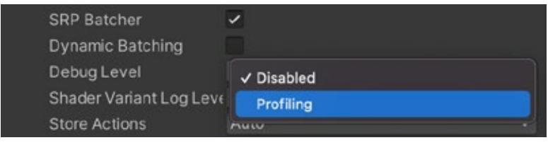

Setting the Debug Level

Adjusting the Debug Level can affect performance. Always turn it off when the Frame Debugger is not in use.

The Frame Debugger shows a list of all the draw calls made before rendering the final image and can help you pinpoint why certain frames are taking a long time to render. It can also identify why your scene's draw call count is so high.

Open the Frame Debugger by going to **Window > Analysis > Frame Debugger**. When your game is playing, select the **Enable** button. This will pause the game and let you examine the draw calls.

| Project                                                                                                                                                                                                                                                                                                                                                                                                                                                                                                                                                                                       | Console | Frame Debug                          |                                                                                                                                                                                   | Profiler         |                                                                                                                                                                |  |   |                       |                  |                                                 |                 |  |
|-----------------------------------------------------------------------------------------------------------------------------------------------------------------------------------------------------------------------------------------------------------------------------------------------------------------------------------------------------------------------------------------------------------------------------------------------------------------------------------------------------------------------------------------------------------------------------------------------|---------|--------------------------------------|-----------------------------------------------------------------------------------------------------------------------------------------------------------------------------------|------------------|----------------------------------------------------------------------------------------------------------------------------------------------------------------|--|---|-----------------------|------------------|-------------------------------------------------|-----------------|--|
|                                                                                                                                                                                                                                                                                                                                                                                                                                                                                                                                                                                               | Disable |                                      |                                                                                                                                                                                   | Editor           |                                                                                                                                                                |  |   |                       |                  |                                                 |                 |  |
| MeshSkinning.GPUSkinning<br>V MeshSkinning.SkinOnGPU<br>ComputeSkinningDispatch<br>UniversalRenderPipeline.RenderSingleCame 42<br>" ScriptableRenderer.Execute: MansionLigh 42<br>Clear (color+Z+stencil)<br>T MainLightShadow<br>Shadows DrawSRPBatcher<br>Clear (color+Z+stencil)<br>V Depth Normal Prepass<br>RenderLoop.DrawSRPBatcher<br>ColorGradingLUT<br>Draw Dynamic<br>T SSAO<br>Draw Mesh<br>Draw Mesh<br>Draw Mesh<br>Draw Mash<br>Clear (color+Z+stencil)<br>V DrawOpaqueObjects<br>RenderLoop.DrawSRPBatcher<br>SRP Batch<br>SRP Batch<br>SRP Batch<br>· DrawTransparentObjects |         | 8<br>6<br>6<br>3<br>3<br>3<br>3<br>4 | A<br>RenderTarget<br>RT 0<br>Channels All<br>2854x1340 B8G8R8A8_SRGB ()<br>Event #61: Draw Dynamic<br>Shader<br>Pass<br>Blend<br>ZClip<br>ZTest<br>ZWrite<br>Cull<br>Conservative |                  | <No name><br>ਜਿ<br>B<br>G<br>Levels @<br>A<br>Hidden/Universal Render Pipeline/Blit, SubShader #0<br>Bill<br>One Zero<br>True<br>Always<br>Off<br>Off<br>False |  |   |                       |                  |                                                 |                 |  |
|                                                                                                                                                                                                                                                                                                                                                                                                                                                                                                                                                                                               |         | 3<br>3                               | Preview<br>Textures<br>SourceTex<br>Matrices<br>unity_MatrixVP                                                                                                                    | ShaderProperties |                                                                                                                                                                |  | C | 3<br>2<br>0<br>0<br>0 | 0<br>2<br>0<br>0 | CameraColorAttachmentB<br>0<br>0<br>0.0099<br>0 | -1<br>0.99<br>1 |  |

Frame Debugger detail

<span id="page-171-0"></span>

Clicking a stage in the render pipeline (left pane) will show a preview of this stage in **Game** view.

The Frame Debugger shows every step of the rendering process in the Game View – in this case, the SSAO generation step.

## Unity Profiler

Like the Frame Debugger, the [Profiler](https://docs.unity3d.com/6000.0/Documentation/Manual/Profiler.html) is a great way to determine how long it takes to complete a frame cycle in your project. It provides an overview of rendering, memory, and scripting. You can identify scripts that take a long time to complete, helping you to pinpoint potential bottlenecks in your code.

Open the Profiler via **Window > Analysis > Profiler**. When in **Play Mode**, the window provides an overview of the overall performance of your game. You can also pause the live view and use the **Hierarchy Mode** to get a breakdown of the time taken to complete a single frame. The Profiler will show you each call Unity has made during the frame.

For an even more detailed analysis, use the [low-level native plug-in Profiler API](https://docs.unity3d.com/6000.0/Documentation/Manual/LowLevelNativePluginProfiler.html?). You can use this Profiler API to extend the Profiler, and profile the performance of native plug-in code, or to prepare profiling data to send to third-party profiling tools such as Razor for Sony Playstation, PIX for Microsoft (Windows and Xbox), as well as Chrome Tracing, ETW, ITT, VTune, or Telemetry.


| Project Console                                                                                   | Frame Debug @ Profiler                                 |       |        |                                          |        |                       |
|---------------------------------------------------------------------------------------------------|--------------------------------------------------------|-------|--------|------------------------------------------|--------|-----------------------|
| Profiler Modules                                                                                  | · Play Mode · ( ) 14 ) Frame: 4471 / 4471 / 4471 Clear |       |        | Clear on Play Deep Profile Call Stacks ▼ |        |                       |
| Chinese them<br>· Animation<br>GarbageCollector<br>VSync<br>· Global Illumination<br>UI<br>Others | 1ms (1000FPS)                                          |       |        |                                          |        |                       |
|                                                                                                   |                                                        |       |        |                                          |        |                       |
| Timeline                                                                                          | · Live                                                 | 0.0ms |        |                                          |        | CPU:65.26ms GPU .- ms |
|                                                                                                   |                                                        |       | 1.Orga | (1,5cps)                                 | 12.0ms | 12.5ms                |
|                                                                                                   |                                                        |       |        |                                          |        |                       |
| Render Thread                                                                                     |                                                        |       |        |                                          |        |                       |
|                                                                                                   |                                                        |       |        |                                          |        | ン                     |
| r Job                                                                                             |                                                        |       |        |                                          |        |                       |
| Worker 0                                                                                          | 1de (1.30mt)                                           |       |        |                                          |        |                       |
|                                                                                                   |                                                        |       |        |                                          |        |                       |
| Worker 1                                                                                          | 100 (1.31mm)                                           |       |        |                                          |        |                       |
|                                                                                                   | 104 (1,31mm                                            |       |        |                                          |        | W                     |
| Worker 2                                                                                          |                                                        |       |        |                                          |        |                       |
| Loading                                                                                           |                                                        |       |        |                                          |        |                       |
|                                                                                                   |                                                        |       |        |                                          |        |                       |

The Profiler window using the low-level native plug-in Profiler API

Here's an example of using the low-level native plug-in Profiler API:

```
#include <IUnityInterface.h>
#include <IUnityProfiler.h>
static IUnityProfiler* s_UnityProfiler = NULL;
static const UnityProfilerMarkerDesc* s_MyPluginMarker = NULL;
static bool s_IsDevelopmentBuild = false;
static void MyPluginWorkMethod()
{
      if (s_IsDevelopmentBuild)
 s_UnityProfiler->BeginSample(s_MyPluginMarker);
      // Code I want to see in Unity Profiler as "MyPluginMethod".
      // ...
      if (s_IsDevelopmentBuild)
 s_UnityProfiler->EndSample(s_MyPluginMarker);
}
extern "C" void UNITY_INTERFACE_EXPORT UNITY_INTERFACE_API UnityPluginLoad(IUnityInterfaces* 
unityInterfaces)
{
      s_UnityProfiler = unityInterfaces->Get<IUnityProfiler>();
      if (s_UnityProfiler == NULL)
 return;
```

```
s_IsDevelopmentBuild = s_UnityProfiler->IsAvailable() != 0;
```


s\_UnityProfiler->CreateMarker(&s\_MyPluginMarker, "MyPluginMethod", kUnityProfilerCategoryOther, kUnityProfilerMarkerFlagDefault, 0); } extern "C" void UNITY\_INTERFACE\_EXPORT UNITY\_INTERFACE\_API UnityPluginUnload() { s\_UnityProfiler = NULL; }

#### **Additional resources**

If you're interested in building advanced profiling skills in Unity, start by downloading the free e-book *[Ultimate guide to profiling Unity games](https://unity.com/resources/ultimate-guide-to-profiling-unity-games?isGated=false).* This guide brings together advanced advice and knowledge on how to profile an application in Unity, manage its memory, and optimize its power consumption from start to finish.

A couple of other useful resources include [Measuring Performance](https://catlikecoding.com/unity/tutorials/basics/measuring-performance/) by Catlike Coding, and [Unity Draw Call Batching](https://thegamedev.guru/unity-performance/draw-call-optimization/) by The Gamedev Guru.

## <span id="page-174-0"></span>The URP 3D sample

The URP 3D sample is available in the Unity Hub and features four environments, each with its own art style, rendering path, and scene complexity, to represent the variety of 3D projects built with URP.

The [URP 3D sample](https://unity.com/demos/urp-3d-sample) replaces the construction scene that will be familiar to many developers who have been using URP for a few years. The new sample project contains several miniscenes that illustrate the capabilities of URP.

Let's go through each scene.

## <span id="page-175-0"></span>The garden

This scene illustrates how you can efficiently scale your content with URP to suit multiple platforms, from mobile and console to high-end gaming desktops. It features stylized PBR rendering, customizable vegetation, and rendering numerous lights with the new Forward+ renderer that surpasses previous light count limits.


## The oasis

This is a photorealistic scene with highly detailed textures, VFX Graph effects, SpeedTree, and a custom water solution. It targets devices that support compute shaders.

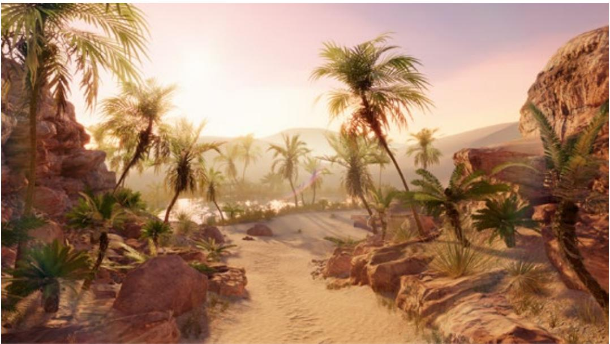

<span id="page-176-0"></span>

## The cockpit


This scene uses custom lighting code with Shader Graph. It's designed for untethered VR devices such as Meta Quest 2.

## The terminal


This scene is the link between the other sample scenes, providing a transition effect to move from one scene to the next.

<span id="page-177-0"></span>

## Moving between the scenes

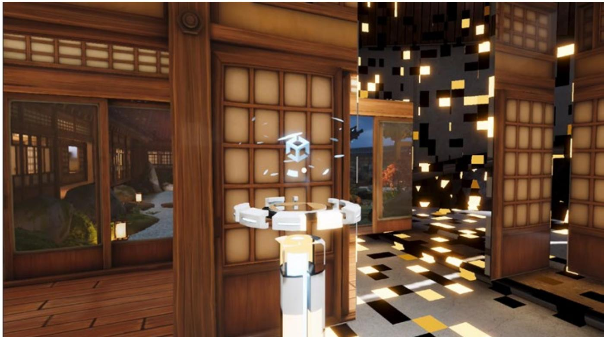

The sample project uses a transition effect to move between scenes. The transition effect uses an off-screen render target to render the incoming scene before the transition is complete. The incoming scene is then rendered to large monitors placed in the outgoing scene using a custom shader created with Shader Graph, and the full-screen swap is handled using a stencil via a Render Objects Renderer Feature.

| T > Screen Stencil (Render Objects) |                                                                                                                                                                               | 0 |
|-------------------------------------|-------------------------------------------------------------------------------------------------------------------------------------------------------------------------------|---|
| Name                                | ScreenStencil                                                                                                                                                                 |   |
| Event                               | AfterRenderingOpaques                                                                                                                                                         | D |
| V Filters                           |                                                                                                                                                                               |   |
| Queue                               | Opaque                                                                                                                                                                        | D |
| Layer Mask                          | Screen, Occluder                                                                                                                                                              | A |
| LightMode Tags<br>4                 |                                                                                                                                                                               | 0 |
| V Overrides                         |                                                                                                                                                                               |   |
| Override Mode                       | Material                                                                                                                                                                      | œ |
| Material                            | StencillOnly                                                                                                                                                                  | 0 |
| Pass Index                          | 0                                                                                                                                                                             |   |
| Depth                               |                                                                                                                                                                               |   |
| Stencil                             | V                                                                                                                                                                             |   |
| Value                               |                                                                                                                                                                               | 1 |
| Compare Function                    | Always                                                                                                                                                                        | A |
| Pass                                | Replace                                                                                                                                                                       | A |
| Fall                                | Кеер                                                                                                                                                                          | D |
| Z Fail                              | Keep                                                                                                                                                                          | A |
| Camera                              | ( ( ( ( ( ( ( ) ( ( ( ( ) ( ( ( ) ( ( ( ( ) ( ( ( ) ( ( ( ) ( ( ( ) ( ( ( ) ( ( ( ) ( ( ( ) ( ( ( ( ) ( ( ( ( ) ( ( ( ) ( ( ( ( ) ( ( ( ( ) ( ( ( ) ( ( ( ( ) ( ( ( ) ( ( ( ( |   |

Screen Stencil Renderer Feature


To see the effect in action, walk toward the pedestal until the Unity logo is displayed, then keep the logo in the center of the screen. This will trigger the transition.

All scene assets are loaded at load time, but only a single scene is enabled. The cameras used at runtime, when starting from The Terminal scene, are the same as those found in the FPS\_ Controller GameObject. **MainCamera** renders the active scene, and **ScreenCamera** the scene displayed on the monitors.

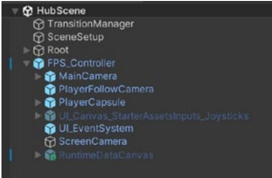

FPS\_Controller for The Terminal Scene

During a transition, the incoming scene camera is rendered to the render target. This creates a potential problem since URP only supports one main directional light. A script called **Scripts > SceneManagement > SceneTransitionManager.cs** runs before rendering, enabling the active scene's main light and disabling the other to keep to this restriction.

Take a look at the script below. In the **OnBeginCameraRendering** method, we first check whether we're rendering the main camera. If **isMainCamera** is true, then the **ToggleMainLight** calls activate the main directional light for the **currentScene** and disable the main directional light for the **screenScene**, the incoming scene. However, if **isMainCamera** is false, then the reverse will be the case.

The same script handles switching the fog, reflection, and skybox to suit the scene being rendered by adjusting the settings of the RenderSettings object.

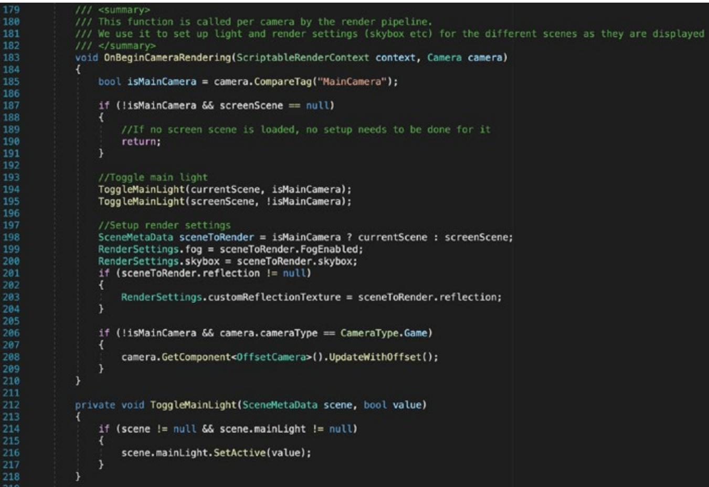

The transition between the incoming and outgoing scenes is handled using a **Render Objects Renderer Feature**. By writing a value to the stencil buffer, this can be checked in a subsequent pass. If the pixel being rendered has a certain stencil value, then you keep what is already in the color buffer; otherwise, you can freely overwrite it. **Renderer Features** are a highly flexible way to build a final render using combinations of passes.


| Renderer Features                               |                                          |   |   |  |  |
|-------------------------------------------------|------------------------------------------|---|---|--|--|
| V Decal<br>>                                    |                                          | 0 |   |  |  |
| Technique                                       | Automatic                                |   |   |  |  |
| Max Draw Distance                               | 1000                                     |   |   |  |  |
| Use Rendering Layers                            |                                          |   |   |  |  |
| V Global Volume Feature (Global Volume Feature) |                                          |   |   |  |  |
| Name                                            | Global Volume Feature                    |   |   |  |  |
| Base Profile                                    | LowQualityVolumeProfile (Volume Profile) |   | 0 |  |  |
|                                                 |                                          |   |   |  |  |
| T > Screen Stencil (Render Objects)             |                                          |   |   |  |  |
| Name                                            | ScreenStencil                            |   |   |  |  |
| Event                                           | AfterRenderingOpaques                    |   | 1 |  |  |
| ▼ Filters                                       |                                          |   |   |  |  |
| Queue                                           | Opaque                                   |   |   |  |  |
| Layer Mask                                      | Screen, Occluder                         |   |   |  |  |
| LightMode Tags                                  |                                          | 0 |   |  |  |
| Overides                                        |                                          |   |   |  |  |
| T / Temp Post (Render Objects)                  |                                          | 0 | 1 |  |  |
| Name                                            | TempPost                                 |   |   |  |  |
| Event                                           | AfterRenderingTransparents               |   |   |  |  |
| Filters                                         |                                          |   |   |  |  |
| Queue                                           | Opaque                                   |   |   |  |  |
| Layer Mask                                      | Temp_Post                                |   |   |  |  |
| LightMode Tags                                  |                                          | 0 |   |  |  |
| Overides                                        |                                          |   |   |  |  |

Renderer Features for the Mobile Foward+ Renderer

To match camera positions during a transition, the project has a **SceneMetaData** script for each scene that stores an offset Transform, while a **SceneTransitionManager** script handles the incoming and outgoing scenes during the transition. The **Update** method tracks the progress of the transition. When **ElapsedTimeInTransition** is greater than **m\_TransitionTime**, then **TriggerTeleport** is called, which in turn calls the **Teleport** method. This repositions and orientates the player to create a seamless switch from the outgoing scene to the incoming scene.

<span id="page-181-0"></span>

ScreenTransitionManager.cs Update method

## Scalability

URP supports a wide range of hardware, and there are several ways the new sample scenes illustrate how to work with different devices. You'll notice the different options in **Project Settings > Quality**.

| Quality           |   |    |   |
|-------------------|---|----|---|
| Levels            |   | == |   |
| Quest2            |   | P  | E |
| Low               |   | D  | E |
| Switch            |   | 2  | E |
| High              | 2 | 2  | E |
| Mobile Deferre    |   | V  | E |
| Mobile Forwa      |   | M  | E |
| Default           |   |    |   |
| Add Quality Level |   |    |   |

Quality levels


Each option uses a different **Render Pipeline Asset**. As explained in the [Quality](#page-26-0) section, URP handles Quality using a combination of this panel together with the settings of the Render Pipeline Asset.

Standalone VR headsets present a significant challenge when displaying real-time 3D graphics. They have high-resolution screens, and each eye must be handled separately, resulting in each rendered frame requiring twice the work. Additionally, with a minimum target fps of 72, you'll need a lot of pixels per second. A workaround for this challenge is to use stylized lighting. The Cockpit scene below uses a Toon Shaded lighting model.

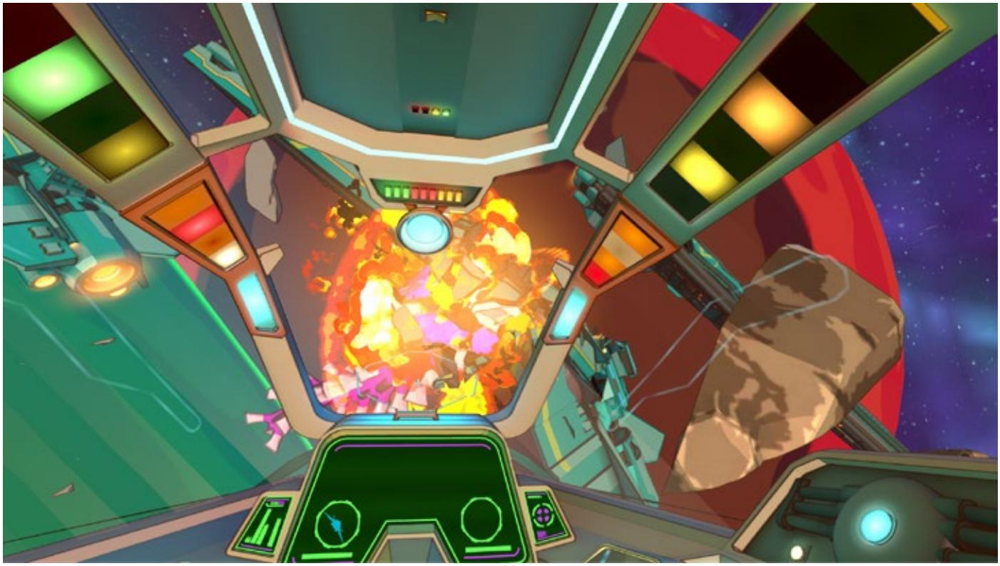

The cockpit environment from the URP 3D sample


The custom lighting is handled using Shader Graph, with minimal coding.

As usual for a Toon shader, it combines the normal vector and the Main light direction using a dot product to determine the lighting level. It then uses a ramp to set staged levels of light rather than smoothly changing values. The lighting model used in The Cockpit scene also uses Baked Global Illumination in the calculation and does some edge detection to add a subtle outline effect. Custom lighting is handled using Shader Graph.

See *[The Universal Render Pipeline cookbook](https://unity.com/resources/the-universal-render-pipeline-cookbook-unity-2022-lts-edition?isGated=false)* for a tutorial about creating Toon Shaders.

<span id="page-184-0"></span>

### Running the sample project on a mobile device

| Rendering                                               |                                                                        |           |
|---------------------------------------------------------|------------------------------------------------------------------------|-----------|
| Renderer List                                           |                                                                        |           |
|                                                         |                                                                        |           |
| 0 @ Mobile Foward+ Renderer (Universal Renderer Data) O | Default                                                                | the       |
|                                                         | Set Default<br>1 @Forward . Screen_Renderer (Universal Renderer Dat. © | 13        |
|                                                         |                                                                        | +         |
| Depth Texture                                           | >                                                                      |           |
| Opaque Texture<br>Opaque Downsampling                   | 2x Billinear                                                           |           |
| Terrain Holes                                           | >                                                                      |           |
|                                                         |                                                                        |           |
| Quality<br>HDR                                          | V                                                                      |           |
| HDR Precision                                           | 32 Bits                                                                | >         |
| Anti Aliasing (MSAA)                                    | Disabled                                                               | A         |
| Render Scale                                            |                                                                        | 0.7       |
| Upscaling Filter                                        | Automatic                                                              | A         |
| LOD Cross Fade                                          | V                                                                      |           |
| LOD Cross Fade Dithering Type Blue Noise                |                                                                        | D         |
| V Lighting                                              |                                                                        | ***       |
| Main Light                                              | Per Pixel                                                              | >         |
| Cast Shadows                                            |                                                                        |           |
| Shadow Resolution                                       | 2048                                                                   | >         |
| Additional Lights                                       | Per Pixel                                                              |           |
| Per Object Limit                                        |                                                                        | 4         |
| Cast Shadows                                            |                                                                        |           |
| Shadow Atlas Resolution                                 | 2048                                                                   | 2         |
| Shadow Resolution Tiers                                 | Low 256<br>Medium 512<br>High 1024                                     |           |
| Cookie Atlas Resolution                                 | 2048                                                                   | A         |
| Cookie Atlas Format                                     | Color High                                                             | A         |
| Reflection Probes                                       |                                                                        |           |
| Probe Blending                                          | V                                                                      |           |
| Box Projection                                          | 1                                                                      |           |
| Mixed Lighting                                          | 1                                                                      |           |
| Use Rendering Layers                                    |                                                                        |           |
| Light Cookies                                           | V                                                                      |           |
| SH Evaluation Mode                                      | Auto                                                                   | >         |
| V Shadows                                               |                                                                        | ***       |
| Max Distance                                            | 50                                                                     |           |
| Working Unit                                            | Metric                                                                 | >         |
| Cascade Count<br>Last Border                            |                                                                        | 1<br>10   |
|                                                         |                                                                        |           |
|                                                         | 0<br>40.0m                                                             | O->Falbac |
|                                                         | 0                                                                      | 10.0m     |
| Depth Bias                                              |                                                                        | 1         |
| Normal Bias                                             |                                                                        | 1         |
| Soft Shadows                                            |                                                                        |           |
| Conservative Enclosing Sphere ✔                         |                                                                        |           |
| Post-processing                                         |                                                                        |           |
| Grading Mode                                            | Low Dynamic Range                                                      | 4         |
| LUT size                                                | 32                                                                     |           |
| Fast sRGB/Linear conversions                            |                                                                        |           |
| Volume Update Mode                                      | Every Frame                                                            | P         |

A common problem for game developers is getting a game running smoothly on a mobile device. The new sample project includes a **Mobile Forward+** URP Asset in the **Settings** folder. Remember that the URP Asset is the principal way you can adjust quality settings. Forward+ relies on the CPU to do significant culling operations per frame and so is not necessarily the best option for a low-end mobile device. The best option for such devices is the Deferred renderer, which is used by a URP asset in the sample project.

The image to the left shows the settings for the Mobile Forward+ asset.

The Mobile Forward+ URP Asset

The **Renderer List** has two Universal Renderer Data assets: one for the active scene, **Mobile Forward+\_Renderer**, and the other for rendering the screen scene, **Forward+\_Screen\_ Renderer**. The Depth Texture is enabled. Note that Additional Lights do not cast shadows. This is a very expensive option and for mobile devices can often be mimicked using light cookies. The Garden scene in particular has lots of lights, and many use cookies to give a suggestion of shadows. Notice the lighting on the rocks in the bottom left of the image below with and without cookies.

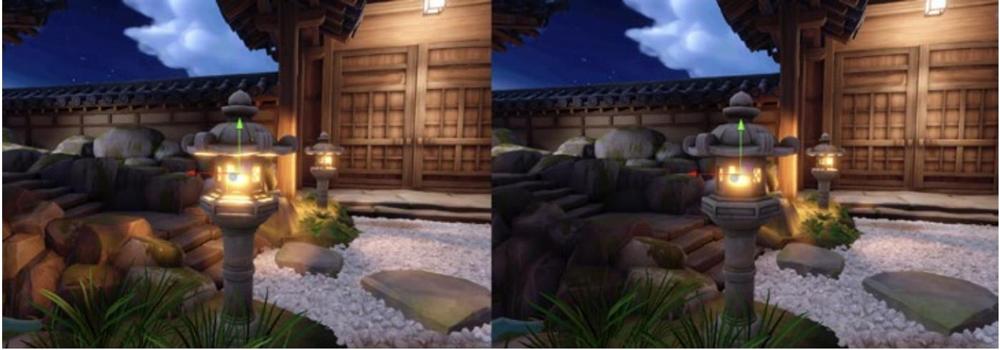

Garden environment point light with and without cookies

Here are three top tips when targeting mobile platforms.

- Reduce the number of pixels rendered. Most modern mobiles have a high DPI or dotsper-inch count. For most games, a DPI of 96 is sufficient. If Screen.DPI is 300, for example, then a render scale of 96/300 on a 2400 x 1200 screen would mean rendering 768 x 384 pixels, almost a tenth of the pixels, which is a massive performance boost. You can set the render scale in the URP Asset or adjust the value at runtime.
- Notice that the Mobile Forward+\_Renderer asset has a Decal renderer feature with its Technique option set to Automatic. This will switch to Screen Space on GPUs with hidden surface removal. This provides a performance boost by avoiding a depth prepass, which is a waste of resources on these devices.
- Use Deferred rendering on devices where the CPU overhead of Forward+ is too expensive.
- To enable more aggressive render pass merging by the Render Graph system, consider the following:
	- If not needed in your project, disable the Depth Texture and Opaque Texture setting in the URP Asset settings.
	- If using Opaque Texture, set Opaque Downsampling to "None". Downsampling the opaque texture will introduce a resolution change in the URP intermediate textures, preventing pass merging.


— If using Depth Texture, set Depth Texture Mode to "After Transparents". Doing so will avoid injecting a CopyDepth pass between the main render passes (Opaque, Sky, Transparents), and allow Render Graph to successfully merge those passes.

A careful study of these four scenes alongside their URP Asset settings and documentation will help you learn how to use the techniques on display in your own projects.

## <span id="page-187-0"></span>Conclusion

For developers and artists looking to switch to URP, be sure to check out the full [Unity](https://docs.unity3d.com/Packages/com.unity.render-pipelines.universal@14.0/manual/index.html?)  [Documentation](https://docs.unity3d.com/Packages/com.unity.render-pipelines.universal@14.0/manual/index.html?), as well as [Unity Learn](https://learn.unity.com/search?k=%5B%22q%3AURP%22%2C%22t%3Aall%22%5D?), the [Unity Blog,](https://blog.unity.com/?) and [Discussions](https://discussions.unity.com/lists/graphics).

The [Unity Product Board](https://portal.productboard.com/unity/1-unity-platform-rendering-visual-effects/tabs/3-universal-pipeline) provides an overview of current URP features being developed, in addition to what's coming up next. You can even add your own feature requests.

Good luck with your game development.


[unity.com](https://unity.com/)